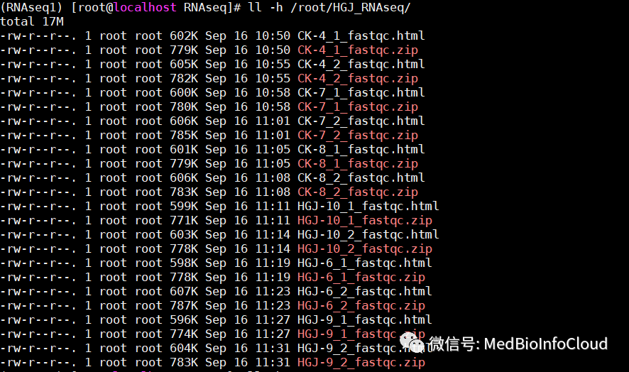
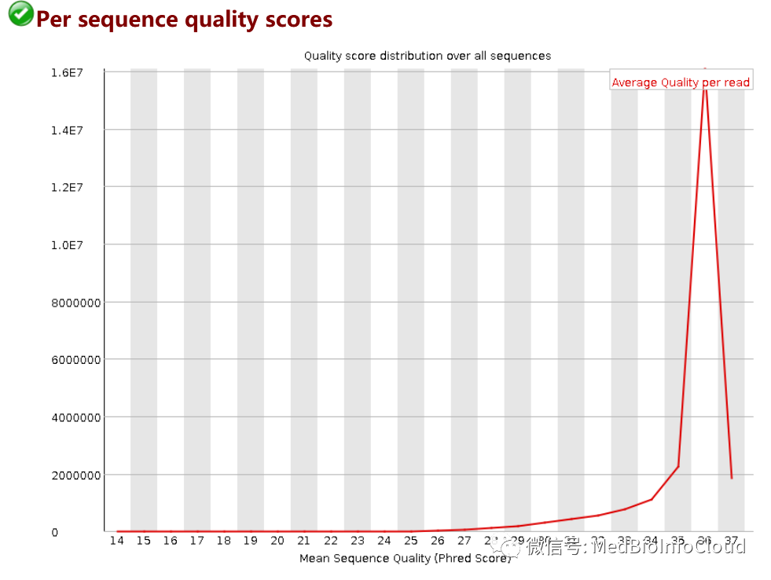
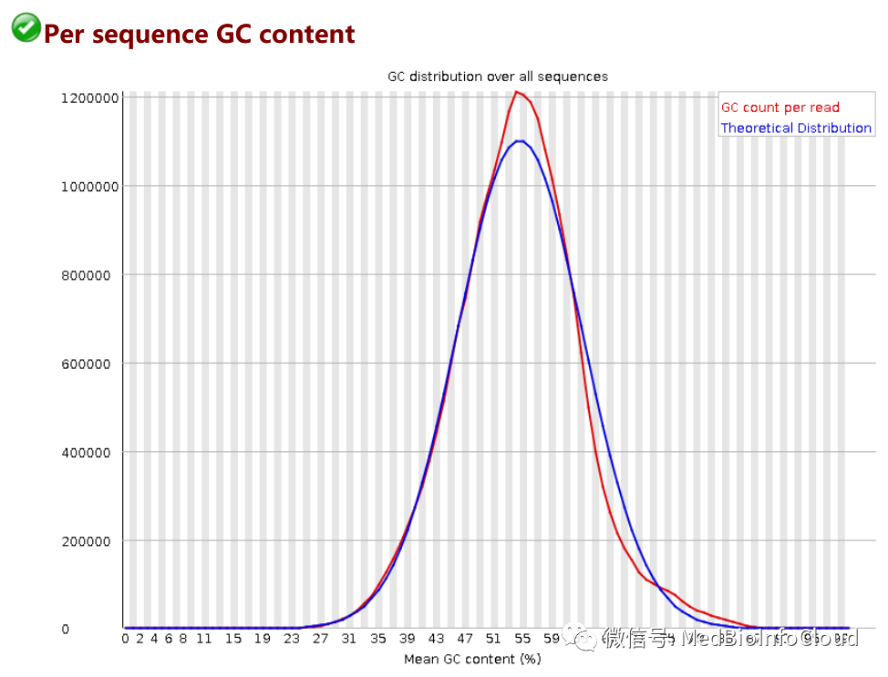
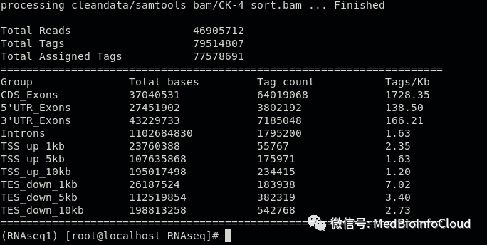

## 一. 使用fastqc质控

做转录组测序，通常公司是不给分析的，分析也要自己多花钱，当然不同公司收费不一样，有的可能带有简单的分析。之前测序的第一家公司给了简单的分析，后面换了一家测序公司，不给分析。所以我得自己分析啦，在分析的时候顺便写一下教程。分享给大家，要分析转录组数据，首先得知道测序原理【参考文章：[illumina、Sanger、第三代和第四代测序技术原理](http://mp.weixin.qq.com/s?__biz=MzA4NDAzODkzMA==&mid=2651272832&idx=1&sn=7d208df1a65e3696c41c666ef78f5881&chksm=841ed2fdb3695bebedbbc733b0bca112421a91647d2038266d0a24b8ce46ee19503a801fdd2b&scene=21#wechat_redirect)】，还有就是了解生信分析中一些文件格式【参考文章：[生信中常见的数据文件格式](http://mp.weixin.qq.com/s?__biz=MzA4NDAzODkzMA==&mid=2651272899&idx=1&sn=6779b2bd21f3b607a08227d31c7212c6&chksm=841ed2beb3695ba8bee23563c28caa005447b2298785719964732b16cafe3a15d7d4937b95c1&scene=21#wechat_redirect)】，当然，还有其他一些生物背景知识，除此以外，还需要会Linux，这个是一个漫长的学习过程。本文就介绍转录组数据分析的第一步分析：质控，主要就是fastqc这个软件的使用和结果解读。

### （一）fastqc介绍

拿到原始数据后我们首先采用fastqc程序进行质控，看原始数据质量情况，fastqc会生成一个html结果报告，根据图形化界面，我们可以判断下机数据情况是否符合分析要求。我们测序得到的是带有质量值的碱基序列fastq格式。

所以这里你需要先了解[生信中常见的数据文件格式 。](https://mp.weixin.qq.com/s?__biz=MzA4NDAzODkzMA==&mid=2651272899&idx=1&sn=6779b2bd21f3b607a08227d31c7212c6&scene=21#wechat_redirect)

FastQC的官网：[http://www.bioinformatics.babraham.ac.uk/projects/fastqc/](http://www.bioinformatics.babraham.ac.uk/projects/fastqc/)

FastQC的下载地址：[http://www.bioinformatics.babraham.ac.uk/projects/download.html#fastqc](http://www.bioinformatics.babraham.ac.uk/projects/download.html#fastqc)

但在Linux中，通常我们是搭建环境安装分析流程相关的软件的，具体参考文章：[Linux系统下Anaconda的安装和使用教程](http://mp.weixin.qq.com/s?__biz=MzA4NDAzODkzMA==&mid=2651273219&idx=1&sn=44ad6dfa492aa50f8360ab2bb161b28c&chksm=841edc7eb36955685650eaf067fbded8d3b1d427c1f5e52caf2aa5a25fb9a57250ea12a217a4&scene=21#wechat_redirect)。

将测序的数据上传到自己的服务器或者虚拟机中，我这里上传数据到目录：/data/RNAseq下。总共12个文件，27G。


首先，我介绍一下fastqc的用法：

```
   fastqc seqfile1 seqfile2 .. seqfileN
   fastqc [-o output dir] [--(no)extract] [-f fastq|bam|sam]
          [-c contaminant file] seqfile1 .. seqfileN
```
重要参数：
```
 -o --outdir 输出目录，需自己创建目录
 –(no)extract 是否解压输出文件，默认是自动解压缩zip文件。加上–noextract不解压文件。
 -f 指定输入文件的类型，支持fastq|bam|sam三种格式的文件，默认自动识别。
 -t --threads选择程序运行的线程数，即同时处理的文件数目。
 -c --contaminants，污染物选项，输入的是一个文件，格式是Name [Tab] Sequence，里面是可能的污染序列，如果有这个选项，FastQC会在计算时候评估污染的情况，并在统计的时候进行分析，一般用不到。
```
FastQC读取一组序列文件，并从每个文件生成质量控制报告，该报告由许多不同的模块组成，每个模块将帮助识别数据中可能存在的不同类型的问题。
如果命令行上没有指定要处理的文件，那么程序将作为交互式图形应用程序启动。如果在命令行上提供了文件，那么程序将运行而不需要用户交互。在这种模式下，它适合纳入一个标准化的分析管道。
更多参数可以查看帮助文档，我这里翻译了一部分。

-h --help ：打印此帮助文件并退出

-v --version：打印程序的版本并退出

-o --outdir：在指定的输出目录中创建所有输出文件。
请注意，这个目录必须存在，因为程序不会创建它。如果没有设置此选项，则在处理的序列文件所在的目录中创建每个序列文件的输出文件。
    

--casava：文件来自原始Casava输出。同一采样组中的文件(仅组号不同)将作为一组文件进行分析，而不是单独分析。在标题中设置了筛选器标志的序列将从分析中排除。文件必须与Casava为其指定的名称相同(包括被gzip压缩并以.gz结尾)，否则它们将无法正确分组在一起。
    

--nano ：文件来自nanopore序列并且是fast5格式。在这种模式下，您可以将目录传递给进程，程序将接收这些目录中的所有fast5文件，并根据所有文件中的序列生成单个输出文件。

--nofilter ：如果运行-casava，那么在执行QC分析时，不要删除由casava标记的不良质量。
    

--extract ：如果设置，则压缩后的输出文件将在创建后在同一目录中解压。默认情况下，fastqc在非交互模式下运行时将设置此选项。

-j --java：提供要用于启动fastqc的java二进制文件的完整路径。如果没有提供，则假定java在您的路径中。
    

--noextract：创建输出文件后，不要解压缩它。如果在非交互模式下运行时不希望解压缩输出，则应该设置此选项。  

--min_length：为报告中显示的序列长度设置一个人为的下限。只要您将其设置为大于或等于最长读取长度的值，那么这将是用于创建读取组的序列长度。这对于从读取长度可变的数据集中生成可直接分解的统计信息非常有用。

-f --format：绕过正常序列文件格式检测，并强制程序使用指定的格式。有效的格式是bam、sam、bam_mapped、sam_mapped和fastq。

-t --threads：指定可同时处理的文件数目。每个线程将被分配250MB的内存，所以您不应该运行超过可用内存应付的线程，并且在32位机器上不应该超过6个线程

-k --kmers ：指定要在Kmer内容模块中查找的Kmer的长度。指定的Kmer长度必须在2到10之间。如果未指定，默认长度为7。

-q --quiet：在标准输出上压缩所有进度消息，只报告错误。

-d --dir：选择要用于生成报表映像时写入的临时文件的目录。如果未指定，默认为系统临时目录。

### （二）fastqc质控

我这里将路径已经切换到了数据所在文件路径：data/RNAseq，数据在当前环境目录下，我打算输出结果路径：/root/HGJ_RNAseq/ ，你可以自定义，事先先创建好文件夹。质控只需要一行命令就搞定，注意，星号前面有一个空格，前面是定义的输出路径，后面是分析的文件名称。

```
fastqc -o /root/HGJ_RNAseq/ *.fq.gz
```

然后就开始一个文件一个文件处理，时间长短和文件大小、个数以及计算机配制有关，我这里的数据30分钟左右。
处理结束后，查看输出路径下的文件信息。

```
ll -h /root/HGJ_RNAseq/
```

我们可以看到，一个数据文件处理后会得到2个文件，一个html格式文件和一个zip的压缩文件，zip解压后和html格式文件内容是一样的，只需要下载html格式文件到本地，用浏览器打开查看。

### （三）结果解读

FastqC有3种结果：绿色代表PASS；黄色代表WARN；红色代表FAIL。当出现黄色时说明需要查看结果。当然，我这里没有黄色的结果。

#### **1.Basic Statistics**
Basic statistics是该fastq一些基本信息，主要有
Filename:文件名
File type: 文件类型
Encoding：测序平台的版本和相应的编码版本号，用于计算Phred反推error P时用
Total Sequences: 输入文本的reads的数量
Sequence length: 测序长度
%GC: GC含量，表示整体序列的GC含量，由于二代测序GC偏好性高，且深度越高，GC含量会越高。
                        

#### **2.Per base sequence quality**
横轴为read长度，纵轴为质量得分，Q = -10*log10（error P）。关于错误率计算，可参考文章【[生信中常见的数据文件格式](http://mp.weixin.qq.com/s?__biz=MzA4NDAzODkzMA==&mid=2651272899&idx=1&sn=6779b2bd21f3b607a08227d31c7212c6&chksm=841ed2beb3695ba8bee23563c28caa005447b2298785719964732b16cafe3a15d7d4937b95c1&scene=21#wechat_redirect)】。柱状表示该位置所有序列的测序质量的统计，柱状是25%~75%区间质量分布，error bar是10%~90%区间质量分布，蓝线表示平均数。一般要求所有位置的10%分位数大于20，即大于最多允许该位置10%的序列低于Q20。当任何碱基质量低于10，或者任何中位数低于25报WARN,需注意；当任何碱基质量低于5或者任何中位数低于20报FAIL。
                        

#### **3.Per tile sequence quality**
每个tail测序情况，横轴表示碱基位置，纵轴表示tail的index编号，这个图主要是为了防止在测序过程中某些tail受到不可控因素的影响而出现测序质量偏低，蓝色表示测序质量很高，暖色表示测序质量不高。当某些tail出现暖色，在后续的分析种把该tail测序结果全部去除。我这里的样本测序质量还是不错的。
                        

#### **4.Per sequence quality scores**
横轴表示Q值，纵轴表示每个值对应的read数目，当测序结果主要集中在高分中，证明测序质量良好。
                        

#### **5.Per base sequence content**
统计在序列中的每一个位置，四种不同碱基占总碱基数的比例，检测有无AT、GC分离的现象。横轴为位置，纵轴为百分比。正常情况下四种碱基出现的频率应是接近的，且没有位置差异，因此好的样品中四条线应该是平行且接近的，由于刚开始测序仪状态不稳定，造成前几个碱基有波动。在 reads 开头出现碱基组成偏离往往是我们的建库操作造成的，比如建 GBS 文库时在 reads 开头加了 barcode；barcode 的碱基组成不是均一的，酶切位点的碱基组成是固定不变的，这样会造成明显的碱基组成偏离；在 reads 结尾出现的碱基组成偏离，往往是测序接头的污染造成的。当所有位置的碱基比例一致现出偏差时，即四条线平行且分开，代表文库有偏差，或测序中的系统误差；当部分位置碱基的比例出现偏差时，即四条线在某些位置纷乱交织，则有overrepresented sequence的污染。当任一位置的A/T比例与G/C比例相差超过10%，报"WARN"；当任一位置的A/T比例与G/C比例相差超过20%，报"FAIL"。
                        

#### **6.Per sequence GC content**
横轴表示GC含量，纵轴表示不同GC含量对应的read数，蓝线是理论分布（正态分布，通过从所测数据计算并构建理论分布），红色是实际情况，两个比较接近判为好的。曲线形状的偏差往往是由于文库的污染或是部分reads构成的子集有偏差（overrepresented reads）；形状接近正态分布但偏离理论分布的情况提示我们可能有系统偏差；如果出现两个或多个峰值，表明测序数据里可能有其他来源的DNA序列污染，或者有接头序列的二聚体污染。偏离理论分布的reads超过15%时，报"WARN"；偏离理论分布的reads超过30%时，报"FAIL"。
                        

#### **7.Per base N content**
当出现测序仪不能分辨的碱基时会产生N，横轴为碱基分布，纵轴为N比率，当任一位置N的比率超过5%报WARN，超过20%报FAIL。我这里几乎没有。
                        

#### **8.Sequence Length Distribution**
理论上每次测序仪测出的read长度是一致的，但是由于建库等因素通常会导致一些小片段，如果报FAIL，表明此次测序过程中产生的数据不可信。
                        

#### **9.Sequence Duplication Levels**
统计序列完全一致的reads的频率，横轴表示重复的次数，纵轴表示重复的reads的数目。一般测序深度越高，越容易产生一定程度的重复序列。                        
#### **10.Overrepresented sequences**
当有某个序列大量出现时，超过总reads数的0.1%时报WARN，超过1%时报FAIL。
                        

#### **11.Adapter Content**
横轴表示碱基位置，纵轴表示百分比。当fastqc分析时没有选择参数-a adapter list时，默认使用图例中的4种通用adapter序列进行统计。若有adapter残留，后续必须去接头。
                        
以上就是一个完整的fastqC结果报告的简单说明，更多信息可参考：[http://www.bioinformatics.babraham.ac.uk/projects/fastqc/Help/](http://www.bioinformatics.babraham.ac.uk/projects/fastqc/Help/)
结果解读部分来自文章：[https://blog.csdn.net/gateswell/article/details/78858579](https://blog.csdn.net/gateswell/article/details/78858579)  ，对此感谢原作者。

## 二.使用trim-galore去除低质量的reads和adaptor
我前面已经介绍了转录组分析中利用fastqc这个软件来查看测序质量【文章：[转录组分析 | fastqc进行质控与结果解读](http://mp.weixin.qq.com/s?__biz=MzA4NDAzODkzMA==&mid=2651273374&idx=1&sn=dfac9e82a09fbb18cd8b2c8179afcad8&chksm=841edce3b36955f5ef17ae96b03c11b9d0052cd3490f1d6b91e3600a5d2eafa77ad79d4a40ff&scene=21#wechat_redirect)】，通过分析结果报告，我测序的数据还是可以的，但不管怎样，还是要清除一些不好的reads。这里我用trim-galore去除低质量的reads和adaptor。
### （一）Trim Galore介绍
Trim Galore是对FastQC和Cutadapt的包装。适用于所有高通量测序，包括RRBS(Reduced Representation Bisulfite-Seq ), Illumina、Nextera 和smallRNA测序平台的双端和单端数据。主要功能包括两步：
首先去除低质量碱基，然后去除3' 末端的adapter, 如果没有指定具体的adapter，程序会自动检测前1million的序列，然后对比前12-13bp的序列是否符合以下类型的adapter:

● Illumina:   AGATCGGAAGAGC

● Small RNA:  TGGAATTCTCGG

● Nextera:    CTGTCTCTTATA

---

当然，Trim Galore是可以自动检测adapter。
接下来我们看软件参数：
--quality：设定Phred quality score阈值，默认为20。我后面分析改成25，稍微严格一些。
--phred33：：选择-phred33或者-phred64，表示测序平台使用的Phred quality score。具体怎么选择，看你用什么测序平台，这个在上一篇文章中的报告中就有【[转录组分析 | fastqc进行质控与结果解读](http://mp.weixin.qq.com/s?__biz=MzA4NDAzODkzMA==&mid=2651273374&idx=1&sn=dfac9e82a09fbb18cd8b2c8179afcad8&chksm=841edce3b36955f5ef17ae96b03c11b9d0052cd3490f1d6b91e3600a5d2eafa77ad79d4a40ff&scene=21#wechat_redirect)】。


具体是-phred33还是-phred64我在文章【[生信中常见的数据文件格式](http://mp.weixin.qq.com/s?__biz=MzA4NDAzODkzMA==&mid=2651272899&idx=1&sn=6779b2bd21f3b607a08227d31c7212c6&chksm=841ed2beb3695ba8bee23563c28caa005447b2298785719964732b16cafe3a15d7d4937b95c1&scene=21#wechat_redirect)】中有提到。

重要参数如下：

--adapter：输入adapter序列。也可以不输入，Trim Galore!会自动寻找可能性最高的平台对应的adapter。自动搜选的平台三个，也直接显式输入这三种平台，即--illumina、--nextera和--small_rna。

--stringency：设定可以忍受的前后adapter重叠的碱基数，默认为1（非常苛刻)。可以适度放宽，因为后一个adapter几乎不可能被测序仪读到。

--length：设定输出reads长度阈值，小于设定值会被抛弃。

--paired：对于双端测序结果，一对reads中，如果有一个被剔除，那么另一个会被同样抛弃，而不管是否达到标准。

--retain_unpaired：对于双端测序结果，一对reads中，如果一个read达到标准，但是对应的另一个要被抛弃，达到标准的read会被单独保存为一个文件。

--gzip和--dont_gzip：清洗后的数据zip打包或者不打包。

--output_dir：输入目录。需要提前建立目录，否则运行会报错。

-- trim-n : 移除read一端的reads

### （二）使用trim-galore去除低质量的reads和adaptor
首先，创建保存输出数据的文件夹。
```
mkdir cleandata mkdir ./cleandata/trim_galoredata
```
然后接下来我们就可以处理数据了。下面命令是处理单个样本的案例，可以不先运行，只需要知道是什么意思。
```
trim_galore -q 25 --phred33 --stringency 3 --length 36  --paired CK-4_1.fq.gz CK-4_2.fq.gz --gzip -o ./cleandata/trim_galoredata/
```
参数解释前面已经介绍，这里提一下，我的测序是双端测序，我们前面12个文件对应6个样本，都是成对的。CK-4_1.fq.gz CK-4_2.fq.gz是一对，处理数据的时候就是一起处理。
  

但是我们有6个样本的数据，就需要写6个命令，好像有点不高效，所以我们可以写一个脚本，执行一次就行。
在当前路径下创建一个脚本文件trim_galore_batch.sh

```
vim trim_galore_batch.sh
```
 输入下面内容：
```
#!/bin/bash
# This is for trimming a batch data
for i in CK-4 CK-7 CK-8 HGJ-10 HGJ-6 HGJ-9
do
        trim_galore -q 25 --phred33 --length 36 --stringency 3 --paired /data/RNAseq/${i}_1.fq.gz /data/RNAseq/${i}_2.fq.gz --gzip -o /data/RNAseq/cleandata/trim_galoredata
done
```
其实就是一个for循环：CK-4 CK-7 CK-8 HGJ-10 HGJ-6 HGJ-9是文件名称的前部分，也就是样本名称，测序数据文件命名都是有规律的，认真看一下，就知道上面内容是什么意思。
          保存脚本，然后执行脚本。

```
bash trim_galore_batch.sh
```
  脚本没有问题的话，会看到类似下面的信息
```
(RNAseq1) [root@localhost RNAseq]# bash trim_galore_batch.sh
Multicore support not enabled. Proceeding with single-core trimming.
Path to Cutadapt set as: 'cutadapt' (default)
Cutadapt seems to be working fine (tested command 'cutadapt --version')
Cutadapt version: 1.18
single-core operation.
Output will be written into the directory: /data/RNAseq/cleandata/trim_galoredata/
AUTO-DETECTING ADAPTER TYPE
===========================
Attempting to auto-detect adapter type from the first 1 million sequences of the first file (>> /data/RNAseq/CK-4_1.fq.gz <<)

Found perfect matches for the following adapter sequences:
Adapter type    Count   Sequence        Sequences analysed      Percentage
Illumina        28671   AGATCGGAAGAGC   1000000 2.87
smallRNA        5       TGGAATTCTCGG    1000000 0.00
Nextera 4       CTGTCTCTTATA    1000000 0.00
Using Illumina adapter for trimming (count: 28671). Second best hit was smallRNA (count: 5)

Writing report to '/data/RNAseq/cleandata/trim_galoredata/CK-4_1.fq.gz_trimming_report.txt'

SUMMARISING RUN PARAMETERS
==========================
Input filename: /data/RNAseq/CK-4_1.fq.gz
Trimming mode: paired-end
Trim Galore version: 0.6.6
Cutadapt version: 1.18
Number of cores used for trimming: 1
Quality Phred score cutoff: 25
Quality encoding type selected: ASCII+33
Adapter sequence: 'AGATCGGAAGAGC' (Illumina TruSeq, Sanger iPCR; auto-detected)
Maximum trimming error rate: 0.1 (default)
Minimum required adapter overlap (stringency): 3 bp
Minimum required sequence length for both reads before a sequence pair gets removed: 36 bp
Output file(s) will be GZIP compressed

Cutadapt seems to be reasonably up-to-date. Setting -j 1
Writing final adapter and quality trimmed output to CK-4_1_trimmed.fq.gz


  >>> Now performing quality (cutoff '-q 25') and adapter trimming in a single pass for the adapter sequence: 'AGATCGGAAGAGC' from file /data/RNAseq/CK-4_1.fq.gz <<<
```


这个时间很长很长。一个文件1个小时左右。慢慢等..................
运行结束后查看文件：

```
ll -h /data/RNAseq/cleandata/trim_galoredata
```


fq.gz格式文件是处理后得到的数据，如果还记得的话，前面我们的数据是27G，现在质控后只有22G的数据。txt格式文件是样品处理的结果报告，也包括软件运行的参数信息。下面是其中一个的结果。

```shell
SUMMARISING RUN PARAMETERS
==========================
Input filename: /data/RNAseq/CK-4_1.fq.gz
Trimming mode: paired-end
Trim Galore version: 0.6.6
Cutadapt version: 1.18
Number of cores used for trimming: 1
Quality Phred score cutoff: 25
Quality encoding type selected: ASCII+33
Using Illumina adapter for trimming (count: 28671). Second best hit was smallRNA (count: 5)
Adapter sequence: 'AGATCGGAAGAGC' (Illumina TruSeq, Sanger iPCR; auto-detected)
Maximum trimming error rate: 0.1 (default)
Minimum required adapter overlap (stringency): 3 bp
Minimum required sequence length for both reads before a sequence pair gets removed: 36 bp
Output file will be GZIP compressed


This is cutadapt 1.18 with Python 2.7.15
Command line parameters: -j 1 -e 0.1 -q 25 -O 3 -a AGATCGGAAGAGC /data/RNAseq/CK-4_1.fq.gz
Processing reads on 1 core in single-end mode ...
Finished in 1496.55 s (62 us/read; 0.96 M reads/minute).

=== Summary ===

Total reads processed:              23,985,482
Reads with adapters:                 1,508,012 (6.3%)
Reads written (passing filters):    23,985,482 (100.0%)

Total basepairs processed: 3,597,822,300 bp
Quality-trimmed:               6,269,587 bp (0.2%)
Total written (filtered):  3,567,424,870 bp (99.2%)

=== Adapter 1 ===

Sequence: AGATCGGAAGAGC; Type: regular 3'; Length: 13; Trimmed: 1508012 times.

No. of allowed errors:
0-9 bp: 0; 10-13 bp: 1

Bases preceding removed adapters:
  A: 19.9%
  C: 34.7%
  G: 33.0%
  T: 12.4%
  none/other: 0.0%

Overview of removed sequences
length  count  expect  max.err  error counts
3  490193  374773.2  0  490193
4  129883  93693.3  0  129883
5  55548  23423.3  0  55548
6  30967  5855.8  0  30967
7  27693  1464.0  0  27693
8  27513  366.0  0  27513
9  25573  91.5  0  24770 803
10  24873  22.9  1  23690 1183
11  25827  5.7  1  24471 1356
12  25970  1.4  1  24553 1417
13  24143  0.4  1  23149 994
14  25530  0.4  1  24384 1146
15  24349  0.4  1  23344 1005
16  24383  0.4  1  23251 1132
17  24256  0.4  1  22978 1278
18  21920  0.4  1  21005 915
19  19694  0.4  1  18969 725
20  20484  0.4  1  19673 811
21  19751  0.4  1  18973 778
22  19049  0.4  1  18345 704
23  19704  0.4  1  18845 859
24  20170  0.4  1  19256 914
25  19510  0.4  1  18680 830
26  18750  0.4  1  18000 750
27  18256  0.4  1  17503 753
28  16883  0.4  1  16261 622
29  15923  0.4  1  15224 699
30  15198  0.4  1  14587 611
31  13894  0.4  1  13376 518
32  14121  0.4  1  13607 514
33  13453  0.4  1  12847 606
34  14484  0.4  1  13845 639
35  14362  0.4  1  13630 732
36  13907  0.4  1  13328 579
37  15268  0.4  1  14744 524
38  8918  0.4  1  8453 465
39  10640  0.4  1  10184 456
40  10771  0.4  1  10404 367
41  7766  0.4  1  7388 378
42  8181  0.4  1  7900 281
43  9762  0.4  1  9364 398
44  8479  0.4  1  8090 389
45  14727  0.4  1  14310 417
46  3156  0.4  1  2941 215
47  5179  0.4  1  4934 245
48  7148  0.4  1  6891 257
49  5975  0.4  1  5749 226
50  4647  0.4  1  4454 193
51  5267  0.4  1  5063 204
52  4253  0.4  1  4097 156
53  3958  0.4  1  3805 153
54  4345  0.4  1  4159 186
55  4843  0.4  1  4663 180
56  4152  0.4  1  3991 161
57  4613  0.4  1  4460 153
58  3645  0.4  1  3474 171
59  2935  0.4  1  2810 125
60  2315  0.4  1  2232 83
61  1453  0.4  1  1366 87
62  2271  0.4  1  2180 91
63  2382  0.4  1  2295 87
64  1702  0.4  1  1646 56
65  1394  0.4  1  1276 118
66  2765  0.4  1  2667 98
67  1689  0.4  1  1595 94
68  1880  0.4  1  1789 91
69  867  0.4  1  819 48
70  553  0.4  1  503 50
71  85  0.4  1  41 44
72  66  0.4  1  38 28
73  271  0.4  1  225 46
74  514  0.4  1  468 46
75  687  0.4  1  645 42
76  779  0.4  1  725 54
77  761  0.4  1  709 52
78  802  0.4  1  738 64
79  641  0.4  1  608 33
80  537  0.4  1  499 38
81  488  0.4  1  445 43
82  406  0.4  1  341 65
83  323  0.4  1  295 28
84  395  0.4  1  356 39
85  400  0.4  1  371 29
86  398  0.4  1  356 42
87  419  0.4  1  364 55
88  330  0.4  1  295 35
89  335  0.4  1  300 35
90  270  0.4  1  224 46
91  210  0.4  1  175 35
92  213  0.4  1  168 45
93  201  0.4  1  169 32
94  160  0.4  1  121 39
95  197  0.4  1  147 50
96  167  0.4  1  126 41
97  193  0.4  1  167 26
98  189  0.4  1  149 40
99  192  0.4  1  151 41
100  182  0.4  1  130 52
101  124  0.4  1  94 30
102  116  0.4  1  75 41
103  96  0.4  1  66 30
104  96  0.4  1  62 34
105  104  0.4  1  64 40
106  85  0.4  1  55 30
107  92  0.4  1  73 19
108  121  0.4  1  80 41
109  104  0.4  1  64 40
110  85  0.4  1  60 25
111  83  0.4  1  53 30
112  71  0.4  1  37 34
113  58  0.4  1  39 19
114  88  0.4  1  34 54
115  65  0.4  1  36 29
116  70  0.4  1  37 33
117  69  0.4  1  41 28
118  75  0.4  1  38 37
119  47  0.4  1  20 27
120  69  0.4  1  36 33
121  65  0.4  1  29 36
122  58  0.4  1  22 36
123  41  0.4  1  15 26
124  52  0.4  1  15 37
125  52  0.4  1  17 35
126  33  0.4  1  7 26
127  46  0.4  1  11 35
128  61  0.4  1  9 52
129  47  0.4  1  17 30
130  57  0.4  1  11 46
131  40  0.4  1  10 30
132  29  0.4  1  8 21
133  28  0.4  1  4 24
134  36  0.4  1  4 32
135  41  0.4  1  3 38
136  17  0.4  1  1 16
137  44  0.4  1  3 41
138  25  0.4  1  3 22
139  28  0.4  1  1 27
140  15  0.4  1  1 14
141  31  0.4  1  0 31
142  24  0.4  1  0 24
143  19  0.4  1  1 18
144  4  0.4  1  1 3
145  12  0.4  1  0 12
146  16  0.4  1  2 14
147  69  0.4  1  1 68
148  22  0.4  1  0 22
149  14  0.4  1  0 14
150  344  0.4  1  4 340


RUN STATISTICS FOR INPUT FILE: /data/RNAseq/CK-4_1.fq.gz
=============================================
23985482 sequences processed in total
```
这一部分就介绍到这里，本公众号文章目录可查看文章：[公众号文章目录](http://mp.weixin.qq.com/s?__biz=MzA4NDAzODkzMA==&mid=2651273306&idx=1&sn=d92056ee1fde1ff12b1506e02f8eb56f&chksm=841edc27b36955310bac7e1b4e5e4ab7e26e669c192926dbee3efc4f6d185cf3509a8fc87696&scene=21#wechat_redirect)，快速浏览相应文章。
## 三.使用Hisat2进行序列比对
我前面已经对数据进行了质控：

[**转录组分析 | fastqc进行质控与结果解读**](http://mp.weixin.qq.com/s?__biz=MzA4NDAzODkzMA==&mid=2651273374&idx=1&sn=dfac9e82a09fbb18cd8b2c8179afcad8&chksm=841edce3b36955f5ef17ae96b03c11b9d0052cd3490f1d6b91e3600a5d2eafa77ad79d4a40ff&scene=21#wechat_redirect)

[**转录组分析 | 使用trim-galore去除低质量的reads和adaptor**](http://mp.weixin.qq.com/s?__biz=MzA4NDAzODkzMA==&mid=2651273401&idx=1&sn=ff9e3478309d805950c40d0ebae74296&chksm=841edcc4b36955d2a5bf8c85429114b5b83ec4e5afe869378b42ec4f659d4953d5f6c8e9e379&scene=21#wechat_redirect)

接下来我们进行序列比对，利用的软件是Hisat2。

### （一）index文件下载
index文件直接去官网下载
([http://daehwankimlab.github.io/hisat2/download/](http://daehwankimlab.github.io/hisat2/download/))，我测序的组织来自小鼠，所以我这里下载的是小鼠的。


下载完后上传到Linux服务器，解压后就可以直接用了。
我上传到了： /data/mouse_genome/  ，就是mm10_genome.tar.gz这个文件。

解压文件，解压过程中会在当前文件夹下创建mm10文件，解压后的文件就在mm10文件夹中。

```
tar -zxvf /data/mouse_genome/mm10_genome_tar.gz
```


查看解压后的文件。

```
ll -h ./mm10
```


总共8个ht2格式文件，一个sh格式文件。

### （二）hisat2介绍
Hisat是一种高效的RNA-seq实验比对工具。它使用了基于BWT和Ferragina-manzini (Fm) index 两种算法的索引框架。使用了两类索引去比对，一类是全基因组范围的FM索引来锚定每一个比对，另一类是大量的局部索引对这些比对做快速的扩展。比对原理可阅读文献原文：HISAT: a fast spliced aligner with low memory requirements.
#### 1.背景
自2008年起，RNAseq已经成为研究基因表达、转录本结构、长链非编码RNA确定以及融合转录本的重要手段。随着测序深度的加深和read读长的延长，给比对工作带来很多困难。目前的工具如Tophat2和GSNAP等在对单个转录组实验的比对中耗时几天，而新型的STAR虽然很快，但是会吃掉大量的内存空间，如基于人类基因组的比对需要消耗28G左右，而hisat2是4.3G，小鼠3.8G左右。
#### 2.Hisat设计原则
**优化了索引建立策略**

hisat应用了基于bowtie2的方法去处理很多低水平的用于构建和查询FM索引的操作。但是与其它比对器不同的是，该软件应用了两类不同的索引类型：代表全基因组的全局FM索引和大量的局部小索引，每个索引代表64000bp。以人类基因组为例，创建了48000个局部索引，每一个覆盖1024bp，最终可以覆盖这个3 billion 的碱基的基因组。这种存在交叉（overlap）的边界可以轻松的比对那些跨区域的read（可变剪切体）。尽管有很多索引，但是hisat会把他们使用合适方法压缩，最终只占4gb左右的内存。

**采用了新的比对策略**

RNA-seq产生的reads可能跨长度比较大的内含子，哺乳动物中甚至最长能达到1MB，同时外显子比较短，read也比较短，会有很多read（模拟数据中大概34%）跨两个外显子的情况。为了更好的比对，将跨外显子的reads分成了三类：1）长锚定read，至少有16bp在两个外显子的每一个上 2）中间锚定read，有8-15bp在一个外显子上 3）短锚定read，只有1-7bp在一个外显子上。所以总的reads可以被划分为五类：1）不跨外显子的read 2）长锚定read 3）中间锚定read 4）短锚定read 5）跨两个外显子以上的read。在模拟的数据中，有25%左右的read是长锚定read，这种read在大多数情况下可以被唯一的定位到人的基因组上。5%为中间锚定read，对于这类，很多依赖于全局索引的算法就很难执行下去（需要比对很多次），而hisat，可以先将read中的长片段实现唯一比对，之后再使用局部索引对剩下的小片段进行比对（局部索引可以实现快速检索）。4.2%为短锚定read，因为这些序列特别短，因此只能通过在hisat比对其它read时发现的剪切位点或者用户自己提供的剪切位点来辅助比对。最后还有3%的是跨多个外显子的read，比对策略在hisat的online method中有介绍，文章中没有详解。比对过程中，中间锚定read、短锚定read、跨多个外显子read的比对占总比对时长的30%-60%，而且比对错误率很高！**【引用：1】**

---

官方手册：[https://daehwankimlab.github.io/hisat2/manual/](https://daehwankimlab.github.io/hisat2/manual/)
#### 3.HiSat2进行比对的参数设置 【引用：2】
```
HISAT2 version 2.1.0 by Daehwan Kim (infphilo@gmail.com, www.ccb.jhu.edu/people/infphilo)
Usage: 
  hisat2 [options]* -x <ht2-idx> {-1 <m1> -2 <m2> | -U <r>} [-S <sam>]

  <ht2-idx>  Index filename prefix (minus trailing .X.ht2).
             索引文件的前缀
  <m1>       Files with #1 mates, paired with files in <m2>.
             Could be gzip'ed (extension: .gz) or bzip2'ed (extension: .bz2).
             Paired-end测序的第一个文件，可以是压缩格式的（`.gz`或者`.bz2`）
  <m2>       Files with #2 mates, paired with files in <m1>.
             Could be gzip'ed (extension: .gz) or bzip2'ed (extension: .bz2).
             Paired-end测序的第二个文件
  <r>        Files with unpaired reads.
             Could be gzip'ed (extension: .gz) or bzip2'ed (extension: .bz2).
             single-end测序的文件
  <sam>      File for SAM output (default: stdout)
             输出比对的结果（`.sam`）

  <m1>, <m2>, <r> can be comma-separated lists (no whitespace) and can be
  specified many times.  E.g. '-U file1.fq,file2.fq -U file3.fq'.
  可以是多个序列文件用逗号分隔

Options (defaults in parentheses):

 Input:
  -q                 query input files are FASTQ .fq/.fastq (default)
                     输入检索序列为FASTQG格式
  --qseq             query input files are in Illumina's qseq format
                     输入检索序列是Illumina qseq格式
  -f                 query input files are (multi-)FASTA .fa/.mfa
                     输入文件是多个FASTA文件
  -r                 query input files are raw one-sequence-per-line
                     输入检索序列是每行一个原始序列
  -c                 <m1>, <m2>, <r> are sequences themselves, not files
                     直接输入序列，而不是文件
  -s/--skip <int>    skip the first <int> reads/pairs in the input (none)
                     忽略输入序列的前`<int>`个
  -u/--upto <int>    stop after first <int> reads/pairs (no limit)
                     只分析输入序列的前`<int>`个
  -5/--trim5 <int>   trim <int> bases from 5'/left end of reads (0)
                     剪去reads长度为`<int>`的5'端序列
  -3/--trim3 <int>   trim <int> bases from 3'/right end of reads (0)
                     剪去reads长度为`<int>`的3'端序列
  --phred33          qualities are Phred+33 (default)
                     序列质量打分为Phred+33
  --phred64          qualities are Phred+64
                     序列质量打分为Phred+64
  --int-quals        qualities encoded as space-delimited integers
                     序列质量打分为用空格分隔的整数

 Alignment:
  --n-ceil <func>    func for max # non-A/C/G/Ts permitted in aln (L,0,0.15)
                     允许在比对结果中出现的最多非ACTG的计算函数
  --ignore-quals     treat all quality values as 30 on Phred scale (off)
                     将所有质量分值设为30
  --nofw             do not align forward (original) version of read (off)
                     不比对前向的read
  --norc             do not align reverse-complement version of read (off)
                     不比对后向的read

 Spliced Alignment:
  --pen-cansplice <int>              penalty for a canonical splice site (0)
                                     对已知剪接位点的罚分
  --pen-noncansplice <int>           penalty for a non-canonical splice site (12)
                                     对新的剪接位点的罚分
  --pen-canintronlen <func>          penalty for long introns (G,-8,1) with canonical splice sites
                                     对已知剪接位点中长内含子的罚分
  --pen-noncanintronlen <func>       penalty for long introns (G,-8,1) with noncanonical splice sites
                                     对未知剪接位点中长内含子的罚分
  --min-intronlen <int>              minimum intron length (20)
                                     最小允许的内含子长度
  --max-intronlen <int>              maximum intron length (500000)
                                     最大允许的内含子长度
  --known-splicesite-infile <path>   provide a list of known splice sites
                                     提供一个已知的剪接位点列表
  --novel-splicesite-outfile <path>  report a list of splice sites
                                     报告新的剪接位点
  --novel-splicesite-infile <path>   provide a list of novel splice sites
                                     提供新的剪接位点
  --no-temp-splicesite               disable the use of splice sites found
                                     不使用发现的新剪接位点
  --no-spliced-alignment             disable spliced alignment
                                     不允许剪接比对
  --rna-strandness <string>          specify strand-specific information (unstranded)
                                     指定链特异性的信息
  --tmo                              reports only those alignments within known transcriptome
                                     报告只包含已知转录组信息的比对结果
  --dta                              reports alignments tailored for transcript assemblers
                                     结果适合用于stringtie进行转录本的拼接
  --dta-cufflinks                    reports alignments tailored specifically for cufflinks
                                     结果适合于cufflinks的应用
  --avoid-pseudogene                 tries to avoid aligning reads to pseudogenes (experimental option)
                                     避免与假基因的比对
  --no-templatelen-adjustment        disables template length adjustment for RNA-seq reads
                                     不允许对reads的模板长度进行调整

 Scoring:
  --mp <int>,<int>   max and min penalties for mismatch; lower qual = lower penalty <6,2>
                     不匹配的最大与最小罚分值，低质量对应低罚分
  --sp <int>,<int>   max and min penalties for soft-clipping; lower qual = lower penalty <2,1>
                     soft-clipping的最大与最小罚分
  --no-softclip      no soft-clipping
                     不考虑Soft-clipping
  --np <int>         penalty for non-A/C/G/Ts in read/ref (1)
                     对read或参考序列中出现的非ATCG的罚分
  --rdg <int>,<int>  read gap open, extend penalties (5,3)
                     对read的gap-open, gap-extension的罚分
  --rfg <int>,<int>  reference gap open, extend penalties (5,3)
                     对参考序列的gap-open,gap-extension的罚分
  --score-min <func> min acceptable alignment score w/r/t read length
                     (L,0.0,-0.2)
                     相对read长度的最小接受比对分值

 Reporting:
  -k <int> (default: 5) report up to <int> alns per read
                     对每个read只报告`<int>`个比对结果

 Paired-end:
  -I/--minins <int>  minimum fragment length (0), only valid with --no-spliced-alignment
                     paired-end的最小片段长度
  -X/--maxins <int>  maximum fragment length (500), only valid with --no-spliced-alignment
                     最大片段长度
  --fr/--rf/--ff     -1, -2 mates align fw/rev, rev/fw, fw/fw (--fr)
                     `--fr==fw/rev`，`--rf==rev/fw`, `--ff==fw/fw`
  --no-mixed         suppress unpaired alignments for paired reads
                     不输出paired reads的不能匹配的比对结果
  --no-discordant    suppress discordant alignments for paired reads
                     不输出paired-reads的不统一的比对结果

 Output:
  -t/--time          print wall-clock time taken by search phases
                     输出搜索阶段所花费的wall-clock时间
  --un <path>           write unpaired reads that didn't align to <path>
                        输出没有与`<path>`比对的unpaired reads
  --al <path>           write unpaired reads that aligned at least once to <path>
                        输出至少与`<path>`有一次比对的unpaired reads
  --un-conc <path>      write pairs that didn't align concordantly to <path>
  --al-conc <path>      write pairs that aligned concordantly at least once to <path>
  (Note: for --un, --al, --un-conc, or --al-conc, add '-gz' to the option name, e.g.
  --un-gz <path>, to gzip compress output, or add '-bz2' to bzip2 compress output.)
                    将输出结果进行`gz`或者`bz2`压缩
  --summary-file     print alignment summary to this file.
                     将比对的总结输出到文件中
  --new-summary      print alignment summary in a new style, which is more machine-friendly.
                     将比对总结以新的形式输出
  --quiet            print nothing to stderr except serious errors
                     除了严重错误以外，不将任何结果输出到stderr
  --met-file <path>  send metrics to file at <path> (off)
                     将度量值i输出到文件
  --met-stderr       send metrics to stderr (off)
                     将度量值输出到stderr
  --met <int>        report internal counters & metrics every <int> secs (1)
                     每隔`<int>`秒输出当前的内部计数器和度量值
  --no-head          supppress header lines, i.e. lines starting with @
                     不输出header行，也就是所有以`@`开始的行
  --no-sq            supppress @SQ header lines
                     不输出`@SQ`行
  --rg-id <text>     set read group id, reflected in @RG line and RG:Z: opt field
                     设置`@RG`
  --rg <text>        add <text> ("lab:value") to @RG line of SAM header.
                     Note: @RG line only printed when --rg-id is set.
                     将`<text>`加到SAM文件的`@RG`行
  --omit-sec-seq     put '*' in SEQ and QUAL fields for secondary alignments.
                     将"*"置于SEQ和QUAL两列中，进行二次比对

 Performance:
  -o/--offrate <int> override offrate of index; must be >= index's offrate
                     重置索引的`offrate`，该值必须大于原有的`offrate`
  -p/--threads <int> number of alignment threads to launch (1)
                     比对所用的线程数
  --reorder          force SAM output order to match order of input reads
                     强制要求SAM输出顺序比对与输入reads一致
  --mm               use memory-mapped I/O for index; many 'hisat2's can share
                     使用内存映射的I/O作为索引

 Other:
  --qc-filter        filter out reads that are bad according to QSEQ filter
                     根据QSEQ filter过滤输入的reads
  --seed <int>       seed for random number generator (0)
                     设置RNG seeds的值
  --non-deterministic seed rand. gen. arbitrarily instead of using read attributes
                     不根据reads的属性产生随机数
  --remove-chrname   remove 'chr' from reference names in alignment
                     比对结果中的参考序列名称中去除`chr`
  --add-chrname      add 'chr' to reference names in alignment
                     在比对结果的参考序列名称中加入`chr` 
  --version          print version information and quit
                     输出版本信息
  -h/--help          print this usage message
                     输出帮助信息
```
hisat2可以自己建立index文件，如果没有现成的index的话，那就得自己去建立了，这个就比较麻烦而且耗内存和时间，下面是建立index的一些参数介绍。因为我们的index文件是直接下载的，所以我后面不需要建立index文件，关于这部分，后面有机会介绍。
```
HISAT2 version 2.1.0 by Daehwan Kim (infphilo@gmail.com, http://www.ccb.jhu.edu/people/infphilo)
Usage: hisat2-build [options]* <reference_in> <ht2_index_base>
    reference_in            comma-separated list of files with ref sequences
                            以逗号分隔的参考序列文件的列表
    hisat2_index_base       write ht2 data to files with this dir/basename
                            输出的索引文件的`basename`
Options:
    -c                      reference sequences given on cmd line (as
                            <reference_in>)
                            输入的参考序列
    --large-index           force generated index to be 'large', even if ref
                            has fewer than 4 billion nucleotides
                            强制要求产生的索引为`large`
    -a/--noauto             disable automatic -p/--bmax/--dcv memory-fitting
                            关闭-p/--bmax/--dcv等自动内存匹配
    -p                      number of threads
                            线程数
    --bmax <int>            max bucket sz for blockwise suffix-array builder
                            逐块后缀数组建立采用的最大bucket size
    --bmaxdivn <int>        max bucket sz as divisor of ref len (default: 4)
    --dcv <int>             diff-cover period for blockwise (default: 1024)
    --nodc                  disable diff-cover (algorithm becomes quadratic)
    -r/--noref              don't build .3/.4.ht2 (packed reference) portion
    -3/--justref            just build .3/.4.ht2 (packed reference) portion
    -o/--offrate <int>      SA is sampled every 2^offRate BWT chars (default: 5)
    -t/--ftabchars <int>    # of chars consumed in initial lookup (default: 10)
    --localoffrate <int>    SA (local) is sampled every 2^offRate BWT chars (default: 3)
    --localftabchars <int>  # of chars consumed in initial lookup in a local index (default: 6)
    --snp <path>            SNP file name
    --haplotype <path>      haplotype file name
    --ss <path>             Splice site file name
    --exon <path>           Exon file name
    --seed <int>            seed for random number generator
    -q/--quiet              verbose output (for debugging)
    -h/--help               print detailed description of tool and its options
    --usage                 print this usage message
    --version               print version information and quit
```
### （三）使用Hisat2进行序列比对
创建输出数据的文件夹
```
mkdir cleandata/hisat2_mm10data
```
因为比对这一过程很耗内存，所以样本多话，计算机内存不够大，需要分批比对，我就先介绍一个样本比对的命令：
```
hisat2 --dta -t -x /data/RNAseq/mm10/genome -1 /data/RNAseq/cleandata/trim_galoredata/CK-4_1_val_1.fq.gz -2 /data/RNAseq/cleandata/trim_galoredata/CK-4_2_val_2.fq.gz -S cleandata/hisat2_mm10data/CK4.sam 
```
-1和-2分别表示双端测序的1个文件，后面跟的是文件路径，一定要注意 /data/RNAseq/mm10/genome文件的目录，genome这个不是文件夹，是index文件的前缀，我的mm10文件下并没有这个文件，如果不加genome就会发生如下报错：
```
## Could not locate a HISAT2 index corresponding to basename "/data/RNAseq/mm10/genome/" ##
```
另外一定要加上 --dta，后续用Stringtie处理会更容易一些，这是StringTie使用说明里面的一句话：【NOTE: be sure to run HISAT2 with the --dta
option for alignment, or your results will suffer.】后续再介绍。-S后面cleandata/hisat2_mm10data/CK4.sam 是输出文件路径，hisat2_mm10data这个文件夹如果没有建立，需要事先建立。
命令没有问题的话，出现下面提示表示程序正在执行，就去干其他的，等执行结束再往下：

```
Time loading forward index: 00:02:51
Time loading reference: 00:00:16
```

我这里，一个样本43分钟。
计算机内存足够大的话，我们可以像前文【[**转录组分析 | 使用trim-galore去除低质量的reads和adaptor**](http://mp.weixin.qq.com/s?__biz=MzA4NDAzODkzMA==&mid=2651273401&idx=1&sn=ff9e3478309d805950c40d0ebae74296&chksm=841edcc4b36955d2a5bf8c85429114b5b83ec4e5afe869378b42ec4f659d4953d5f6c8e9e379&scene=21#wechat_redirect)】一样，通过一个脚本一次执行。
创建脚本文件：hisat2_mm10_batch.sh

```
vim hisat2_mm10_batch.sh
```
输入下面内容：
```
#!/bin/bash
# This is for hisat2 batch aligne
for i in CK-7 CK-8 HGJ-10 HGJ-6 HGJ-9
do
hisat2 --dta -t -p 8 -x /data/RNAseq/mm10/genome \
-1 /data/RNAseq/cleandata/trim_galoredata/"$i"_1_val_1.fq.gz \
-2 /data/RNAseq/cleandata/trim_galoredata/"$i"_2_val_2.fq.gz \
-S /data/RNAseq/cleandata/hisat2_mm10data/"$i".sam
```


我这里由于CK-4这个样本前面单独处理了，批量处理就不需要处理。
保存脚本，然后执行脚本。

```
bash hisat2_mm10_batch.sh
```
脚本运行时间和计算机配制还有数据量的大小有关。运行结束后我们查看结果：
```
ll -h ./cleandata/hisat2_mm10data/
```
原本22G的数据，运行结束后155G，所以自己用本地计算机跑的话，数据多注意一下内存。


### **（四）结果解读**

我们比对后得到的是sam文件，关于sam文件是一个什么样的文件，参考文章：[**生信中常见的数据文件格式**](http://mp.weixin.qq.com/s?__biz=MzA4NDAzODkzMA==&mid=2651272899&idx=1&sn=6779b2bd21f3b607a08227d31c7212c6&chksm=841ed2beb3695ba8bee23563c28caa005447b2298785719964732b16cafe3a15d7d4937b95c1&scene=21#wechat_redirect)。

---

为了快速查看本公众号文章，可阅读文章：[**公众号文章目录**](http://mp.weixin.qq.com/s?__biz=MzA4NDAzODkzMA==&mid=2651273306&idx=1&sn=d92056ee1fde1ff12b1506e02f8eb56f&chksm=841edc27b36955310bac7e1b4e5e4ab7e26e669c192926dbee3efc4f6d185cf3509a8fc87696&scene=21#wechat_redirect)

---

**致谢：本文还参考了以下内容：**

【1】[https://www.jianshu.com/p/ce3f4afb9b60](https://www.jianshu.com/p/ce3f4afb9b60)。

【2】[https://github.com/ricket-sjtu/bioinformatics/wiki/HiSat2%E5%BA%94%E7%94%A8%E4%BB%8B%E7%BB%8D](https://github.com/ricket-sjtu/bioinformatics/wiki/HiSat2%25E5%25BA%2594%25E7%2594%25A8%25E4%25BB%258B%25E7%25BB%258D)

对原作者表示感谢！

## 四.使用SAMtools将SAM文件转换为BAM文件、排序、建立索引
[**转录组分析 | fastqc进行质控与结果解读**](http://mp.weixin.qq.com/s?__biz=MzA4NDAzODkzMA==&mid=2651273374&idx=1&sn=dfac9e82a09fbb18cd8b2c8179afcad8&chksm=841edce3b36955f5ef17ae96b03c11b9d0052cd3490f1d6b91e3600a5d2eafa77ad79d4a40ff&scene=21#wechat_redirect)

[**转录组分析 | 使用trim-galore去除低质量的reads和adaptor**](http://mp.weixin.qq.com/s?__biz=MzA4NDAzODkzMA==&mid=2651273401&idx=1&sn=ff9e3478309d805950c40d0ebae74296&chksm=841edcc4b36955d2a5bf8c85429114b5b83ec4e5afe869378b42ec4f659d4953d5f6c8e9e379&scene=21#wechat_redirect)

[**转录组分析 | 使用Hisat2进行序列比对**](http://mp.weixin.qq.com/s?__biz=MzA4NDAzODkzMA==&mid=2651273450&idx=1&sn=efab631b255e12cf5ffd259dd53fb2b3&chksm=841edc97b3695581de924856b0e6901c67b87648f85bd491729eaa2ee0592271d84042b9eb76&scene=21#wechat_redirect)

我们前面经过质控，比对得到sam文件，接下来为什么要进行格式转换？为了让计算机好处理。SAM（sequence Alignment/mapping)数据格式是目前高通量测序中存放比对数据的标准格式。bam是sam的二进制格式，减少了sam文件的储存量。这在我之前的文章【[**生信中常见的数据文件格式**](http://mp.weixin.qq.com/s?__biz=MzA4NDAzODkzMA==&mid=2651272899&idx=1&sn=6779b2bd21f3b607a08227d31c7212c6&chksm=841ed2beb3695ba8bee23563c28caa005447b2298785719964732b16cafe3a15d7d4937b95c1&scene=21#wechat_redirect)】中也有介绍。
接下来，我们要做的事情就是使用SAMtools将SAM文件转换为BAM文件、排序、建立索引。

### （一）SAMtools介绍
SAMtools是一个用于操作sam和bam文件的工具合集。能够实现二进制查看、格式转换、排序及合并等功能，结合sam格式中的flag、tag等信息，还可以完成比对结果的统计汇总。同时利用linux中的grep、awk等操作命令，还可以大大扩展samtools的使用范围与功能。包含有许多命令。我这里主要介绍几个，重点是samtools view。
samtools更多信息：**[http://www.htslib.org/](http://www.htslib.org/)**

#### **1.samtools view**

samtools view主要用来转换SAM/BAM/CRAM文件。将sam文件与bam文件互换；然后对bam文件进行各种操作，比如数据的排序(sort)和提取(这些操作 是对bam文件进行的，因而当输入为sam文件的时候，不能进行该操作)；最后将排序或提取得到的数据输出为bam或sam（默认的）格式。如果没有指定选项或区域，则将指定的输入对齐文件(SAM、BAM或CRAM格式)中的所有对齐打印到SAM格式的标准输出(没有标头)。可以在输入文件名后指定一个或多个空格分隔的区域规范，以将输出限制为仅覆盖指定区域的那些对齐。使用区域规范需要一个协调排序和索引的输入文件(BAM或CRAM格式)。samtools view的参数很多，-b、-C、-1、-u、-h、-H和-C选项将更改缺省的无header SAM的输出格式，而-o和-u选项将设置输出文件名。-t和-T选项提供了额外的参考数据。当SAM输入不包含@SQ headers时，这两个选项中的一个是必需的，当编写CRAM输出时，-T选项是必需的。-L、-M、-r、-R、-d、-D、-s、-q、-L、-M、-f、-F和-G选项过滤将包含在输出中的对齐，只筛选那些匹配特定条件的对齐。-x和-B选项修改包含在每次对齐中的数据。如果数据文件夹不包含任何索引文件，可以使用-X选项允许用户指定定制的索引文件位置。

```
samtools view [options] <in.bam>|<in.sam>|<in.cram> [region ...]
```
参数介绍：
```
# samtools view 使用说明：
 -b output BAM
  默认下输出是 SAM 格式文件，该参数设置输出 BAM 格式
 -h print header for the SAM output
  默认下输出的 sam 格式文件不带 header，该参数设定输出sam文件时带 header 信息
 -H print header only (no alignments)
  仅仅输出文件的头
 -S input is SAM
  默认下输入是 BAM 文件，若是输入是 SAM 文件，则最好加该参数，否则有时候会报错。
 -u uncompressed BAM output (force -b)
  该参数的使用需要有-b参数，能节约时间，但是需要更多磁盘空间。
 -c Instead of printing the alignments, only count them and print the 
  total number. All filter options, such as ‘-f’, ‘-F’ and ‘-q’ ,   are taken into account.
  过滤功统计功能
 -c print only the count of matching records
 -L FILE  output alignments overlapping the input BED FILE [null]
 -t FILE  list of reference names and lengths (force -S) [null]
  使用一个list文件来作为header的输入
 -T FILE  reference sequence file (force -S) [null]
  使用序列fasta文件作为header的输入
 -o FILE  output file name [stdout]
 -F INT   filtering flag, 0 for unset [0] 
  Skip alignments with bits present in INT [0]
  数字4代表该序列没有比对到参考序列上
  数字8代表该序列的mate序列没有比对到参考序列上
  过滤功能。如F12过滤只有双端map的
 -q INT   minimum mapping quality [0]
    比对的最低质量值，一般认为20就为unique比对了，可以结合上述-bF参数使用使用提取特定的比对结果
```
其他更多参数介绍，阅读：[http://www.htslib.org/doc/samtools-view.html](http://www.htslib.org/doc/samtools-view.html)

#### **2.samtools sort**

samtools sort用来对SAM/BAM/CRAM文件进行排序，按最左坐标排序，或使用-n时按读取名称排序。默认情况下，排序后的输出被写到标准输出，或者在使用-o时写到指定的文件(out.bam)。此命令还将创建临时文件tmpprefixv .%d。当整个对齐数据无法装入内存时(通过-m选项控制)，根据需要使用bam。

```
samtools sort [-l level] [-m maxMem] [-o out.bam] [-O format] [-n] [-T tmpprefix] [-@ threads] [in.sam|in.bam|in.cram]
```
重要参数：
```
-l INT 设置输出文件压缩等级。0-9，0是不压缩，9是压缩等级最高。不设置此参数时，使用默认压缩等级；
-m INT 设置每个线程运行时的内存大小，可以使用K，M和G表示内存大小。
-n 设置按照read名称进行排序；
-o FILE 设置最终排序后的输出文件名；
-O FORMAT 设置最终输出的文件格式，可以是bam，sam或者cram，默认为bam；
-T PREFIX 设置临时文件的前缀；
-@ INT 设置排序和压缩是的线程数量，默认是单线程。
```
**3.samtools index**

必须对bam文件进行默认情况下的排序后，才能进行index。否则会报错。建立索引后将产生后缀为.bai的文件，用于快速的随机处理。很多情况下需要有bai文件的存在，特别是显示序列比对情况下。比如samtool的tview命令就需要；gbrowse2显示reads的比对图形的时候也需要。IGV显示比对情况也需要。

```
samtools index [-bc] [-m INT] aln.sam|aln.bam|aln.cram [out.index]
```
参数：
```
-b 创建一个BAI索引。当不使用格式选项时，这是当前的默认设置。
-c 创建CSI索引。默认情况下，索引的最小间隔大小为2^14，与BAI格式使用的固定值相同。
-m INT 创建CSI索引，最小间隔大小为2^INT。
-@, --threads INT
    除了主线程[0]之外，要使用的输入/输出压缩线程数。
```
samtools sort命令按默认染色体位置排序，顺利建立Index，如果前面排序有出入，可能不能正确建立索引。
参考：[http://www.htslib.org/doc/samtools-index.html](http://www.htslib.org/doc/samtools-index.html)

#### **4.samtools flagstat**

samtools flagstat用于给出BAM文件的比对结果。

```
samtools flagstat in.sam|in.bam|in.cram
```
参数：
```
-@ INT 设置读取文件时要使用的额外线程数。
-O FORMAT 设置输出格式。FORMAT可以设置为'default'， 'json'或'tsv'来选择默认的，json或标签分隔值输出格式。如果不使用此选项，将选择默认格式。
```
参考：[http://www.htslib.org/doc/samtools-flagstat.html](http://www.htslib.org/doc/samtools-flagstat.html)

---

关于SAMtools工具的用法还很多，我就介绍上面几个，其他更多用法，阅读：[http://www.htslib.org/doc/samtools.html](http://www.htslib.org/doc/samtools.html)
参考：[https://blog.csdn.net/sinat_38163598/article/details/72910115](https://blog.csdn.net/sinat_38163598/article/details/72910115)
### （二）SAMtools实战
#### **1.格式转换(samtools view)**

我们先查看一下上一篇文章【[**转录组分析 | 使用Hisat2进行序列比对**](http://mp.weixin.qq.com/s?__biz=MzA4NDAzODkzMA==&mid=2651273450&idx=1&sn=efab631b255e12cf5ffd259dd53fb2b3&chksm=841edc97b3695581de924856b0e6901c67b87648f85bd491729eaa2ee0592271d84042b9eb76&scene=21#wechat_redirect)】中产生的sam文件。

```
ll -h ./cleandata/hisat2_mm10data/
```


先建立一个输出数据的文件夹。

```
mkdir ./cleandata/samtools_bam
```
同样的，我们可以单个转换，也可以写一个脚本批量转换，首先，我先介绍单个转换。
```
samtools view -S ./cleandata/hisat2_mm10data/CK4.sam -b > ./cleandata/samtools_bam/CK4.bam
```
这个过程的时间也是挺长的。
批量转换，创建脚本文件
```
vim samtools_view_batch.sh
```
输入下面内容：
```
for i in CK-7 CK-8 HGJ-10 HGJ-6 HGJ-9
do
  samtools view -S ./cleandata/hisat2_mm10data/${i}.sam -b -o ./cleandata/samtools_bam/${i}.bam
done
```

保存，然后执行脚本。

```
bash samtools_view_batch.sh
```
运行结束后我么你查看一下输入的数据：
```
ll -h ./cleandata/samtools_bam/
```


我们可以看到，转换后的数据只有32G，原来可是155G。相差5倍左右。

#### **2 排序(samtools sort)**

单个排序:

```
samtools sort -l 4 -o ./cleandata/samtools_bam/CK-4_sort.bam ./cleandata/samtools_bam/CK4.bam
```
批量排序：创建脚本文件
```
vim samtools_sort.sh
```
输入下面内容：
```
#!/bin/bash
# This is for samtools_sort
for i in CK-7 CK-8 HGJ-10 HGJ-6 HGJ-9
do
samtools sort -l 4 -o ./cleandata/samtools_bam/${i}_sort.bam ./cleandata/samtools_bam/${i}.bam
done
```

保存并执行脚本。

```
bash samtools_sort.sh
```
执行结束后，我们查看一下文件：
```
ll -h cleandata/samtools_bam/*sort.bam
```

sort后文件几乎小了2倍。

#### **3. 建立索引(samtools index)**

samtools sort命令时，按默认染色体位置排序，顺利建立Index，如果前面排序有出入，可能不能正确建立索引。
这里我就一次建立索引了。

```
for i in CK-4 CK-7 CK-8 HGJ-10 HGJ-6 HGJ-9;do samtools index ./cleandata/samtools_bam/${i}_sort.bam ./cleandata/samtools_bam/${i}_sort.bam.bai;done
```
#### **4.查看reads比对情况(samtools flagstat)**

```
samtools flagstat cleandata/samtools_bam/CK-4_sort.bam
```

```
(RNAseq1) [root@localhost RNAseq]# samtools flagstat cleandata/samtools_bam/CK-4_sort.bam
51977802 + 0 in total (QC-passed reads + QC-failed reads)
#总共的reads数
4063860 + 0 secondary
0 + 0 supplementary
0 + 0 duplicates
50969572 + 0 mapped (98.06% : N/A)
#总体上reads的匹配率
47913942 + 0 paired in sequencing
#有多少reads是属于paired reads
23956971 + 0 read1 
#reads1中的reads数
23956971 + 0 read2
#reads2中的reads数
45980036 + 0 properly paired (95.96% : N/A)
#完美匹配的reads数：比对到同一条参考序列，并且两条reads之间的距离符合设置的阈值
46308722 + 0 with itself and mate mapped
#paired reads中两条都比对到参考序列上的reads数
596990 + 0 singletons (1.25% : N/A)
#单独一条匹配到参考序列上的reads数，和上一个相加，则是总的匹配上的reads数。
232008 + 0 with mate mapped to a different chr
#paired reads中两条分别比对到两条不同的参考序列的reads数
210169 + 0 with mate mapped to a different chr (mapQ>=5)
#同上一个，只是其中比对质量>=5的reads的数量
```
参考：

【1】[https://blog.csdn.net/sinat_38163598/article/details/72910115](https://blog.csdn.net/sinat_38163598/article/details/72910115)

【2】[http://www.htslib.org/doc/samtools.html](http://www.htslib.org/doc/samtools.html)

这一部分就介绍到这里，本公众号文章目录可查看文章：[**公众号文章目录**](http://mp.weixin.qq.com/s?__biz=MzA4NDAzODkzMA==&mid=2651273306&idx=1&sn=d92056ee1fde1ff12b1506e02f8eb56f&chksm=841edc27b36955310bac7e1b4e5e4ab7e26e669c192926dbee3efc4f6d185cf3509a8fc87696&scene=21#wechat_redirect)，快速浏览相应文章。

## 五.使用RSeQC软件对生成的BAM文件进行质控

接前面文章：

[转录组分析 | fastqc进行质控与结果解读](http://mp.weixin.qq.com/s?__biz=MzA4NDAzODkzMA==&mid=2651273374&idx=1&sn=dfac9e82a09fbb18cd8b2c8179afcad8&chksm=841edce3b36955f5ef17ae96b03c11b9d0052cd3490f1d6b91e3600a5d2eafa77ad79d4a40ff&scene=21#wechat_redirect)

[转录组分析 | 使用trim-galore去除低质量的reads和adaptor](http://mp.weixin.qq.com/s?__biz=MzA4NDAzODkzMA==&mid=2651273401&idx=1&sn=ff9e3478309d805950c40d0ebae74296&chksm=841edcc4b36955d2a5bf8c85429114b5b83ec4e5afe869378b42ec4f659d4953d5f6c8e9e379&scene=21#wechat_redirect)

[转录组分析 | 使用Hisat2进行序列比对](http://mp.weixin.qq.com/s?__biz=MzA4NDAzODkzMA==&mid=2651273450&idx=1&sn=efab631b255e12cf5ffd259dd53fb2b3&chksm=841edc97b3695581de924856b0e6901c67b87648f85bd491729eaa2ee0592271d84042b9eb76&scene=21#wechat_redirect)

[转录组分析 | 使用SAMtools将SAM文件转换为BAM文件、排序、建立索引](http://mp.weixin.qq.com/s?__biz=MzA4NDAzODkzMA==&mid=2651273488&idx=1&sn=f5ed53f20164b19720d31f0a2cfcd268&chksm=841edd6db369547bc04ae15a2a8a7661fefa1193cabbe05d7e2f9e2fa986211603537cf8fbd0&scene=21#wechat_redirect)

本文接着介绍：使用RSeQC软件对生成的BAM文件进行质控。也就是看看前面数据的质量怎么样。

首先介绍一下RSeQC这个软件。

### （一）RSeQC介绍
RSeQC是发表于2012年的一个RNA-Seq质控工具，属于python包。它提供了一系列有用的小工具能够评估高通量测序尤其是RNA-seq数据，比如一些基本模块，检查序列质量, 核酸组分偏性, PCR偏性, GC含量偏性,还有RNA-seq特异性模块: 评估测序饱和度， 映射读数分布， 覆盖均匀性， 链特异性， 转录水平RNA完整性等。该软件的使用命令非常多，但很多功能并不是用来诊断转录组测序的，所以不在我们的考虑范围内。你可以参考官方教程文档：
[https://pythonhosted.org/RSeQC/#bam2fq-py](https://pythonhosted.org/RSeQC/#bam2fq-py)
RSeQC接受4种文件格式:

- BED 格式: Tab 分割, 12列的表示基因模型的纯文本文件

- SAM 或BAM 格式: 用来存储reads 比对结果信息.

- 染色体大小文件: 只有两列的纯文本文

- Fasta文件的参考基因组

### （二）使用bam_stat.py命令查看比对的总体情况
用 bam_stat.py来统计总比对记录, PCR重复数, Non Primary Hits表示多匹配位点, 不匹配的reads数, 比对到+链的reads, 比对到-链的reads, 有剪切位点的reads等。


我们查看前面产生的文件CK-4_sort.bam【文章:[转录组分析 | 使用SAMtools将SAM文件转换为BAM文件、排序、建立索引](http://mp.weixin.qq.com/s?__biz=MzA4NDAzODkzMA==&mid=2651273488&idx=1&sn=f5ed53f20164b19720d31f0a2cfcd268&chksm=841edd6db369547bc04ae15a2a8a7661fefa1193cabbe05d7e2f9e2fa986211603537cf8fbd0&scene=21#wechat_redirect)】。

```
bam_stat.py -i cleandata/samtools_bam/CK-4_sort.bam
```


### **（三）使用read_distribution.py命令查看基因组覆盖率**

该命令需要输入两个文件， -i为BAM或SAM文件；-r为参考的bed文件。


bed文件参考文章：[生信中常见的数据文件格式](http://mp.weixin.qq.com/s?__biz=MzA4NDAzODkzMA==&mid=2651272899&idx=1&sn=6779b2bd21f3b607a08227d31c7212c6&chksm=841ed2beb3695ba8bee23563c28caa005447b2298785719964732b16cafe3a15d7d4937b95c1&scene=21#wechat_redirect)。

bed文件下载地址RSeQC官网：[https://sourceforge.net/projects/rseqc/files/BED/](https://sourceforge.net/projects/rseqc/files/BED/)，

我这里下载的是小鼠的：[https://sourceforge.net/projects/rseqc/files/BED/Mouse_Mus_musculus/](https://sourceforge.net/projects/rseqc/files/BED/Mouse_Mus_musculus/)

下载后解压上传到Linux服务器中，我的bed文件在 /data/mouse_RefSeq/  这个目录下。

```
ll -h /data/mouse_RefSeq/
```

```
read_distribution.py -i cleandata/samtools_bam/CK-4_sort.bam -r /data/mouse_RefSeq/mm10_RefSeq.bed
```


组学分析流程的每一个步骤都很重要，实验设计，质控，read比对，表达定量，可视化，差异表达，识别可变剪切，功能注释，融合基因检测，eQTL定位等都需要考虑。我们后面介绍：使用Stringtie对数据进行下游处理。
为了快速查看本公众号文章，可阅读文章：[公众号文章目录](http://mp.weixin.qq.com/s?__biz=MzA4NDAzODkzMA==&mid=2651273306&idx=1&sn=d92056ee1fde1ff12b1506e02f8eb56f&chksm=841edc27b36955310bac7e1b4e5e4ab7e26e669c192926dbee3efc4f6d185cf3509a8fc87696&scene=21#wechat_redirect)

---

参考：[https://mp.weixin.qq.com/s/KpQwwDm_aIvIbxXHiaNrLg](https://mp.weixin.qq.com/s/KpQwwDm_aIvIbxXHiaNrLg)
## 六.使用Stringtie对数据进行下游处理
接前文：

[转录组分析 | fastqc进行质控与结果解读](http://mp.weixin.qq.com/s?__biz=MzA4NDAzODkzMA==&mid=2651273374&idx=1&sn=dfac9e82a09fbb18cd8b2c8179afcad8&chksm=841edce3b36955f5ef17ae96b03c11b9d0052cd3490f1d6b91e3600a5d2eafa77ad79d4a40ff&scene=21#wechat_redirect)

[转录组分析 | 使用trim-galore去除低质量的reads和adaptor](http://mp.weixin.qq.com/s?__biz=MzA4NDAzODkzMA==&mid=2651273401&idx=1&sn=ff9e3478309d805950c40d0ebae74296&chksm=841edcc4b36955d2a5bf8c85429114b5b83ec4e5afe869378b42ec4f659d4953d5f6c8e9e379&scene=21#wechat_redirect)

[转录组分析 | 使用Hisat2进行序列比对](http://mp.weixin.qq.com/s?__biz=MzA4NDAzODkzMA==&mid=2651273450&idx=1&sn=efab631b255e12cf5ffd259dd53fb2b3&chksm=841edc97b3695581de924856b0e6901c67b87648f85bd491729eaa2ee0592271d84042b9eb76&scene=21#wechat_redirect)

[转录组分析 | 使用SAMtools将SAM文件转换为BAM文件、排序、建立索引](http://mp.weixin.qq.com/s?__biz=MzA4NDAzODkzMA==&mid=2651273488&idx=1&sn=f5ed53f20164b19720d31f0a2cfcd268&chksm=841edd6db369547bc04ae15a2a8a7661fefa1193cabbe05d7e2f9e2fa986211603537cf8fbd0&scene=21#wechat_redirect)

[转录组分析 | 使用RSeQC软件对生成的BAM文件进行质控](http://mp.weixin.qq.com/s?__biz=MzA4NDAzODkzMA==&mid=2651273531&idx=1&sn=8a9b12fe030f6c0f8bb1d6c8abbf622d&chksm=841edd46b36954501a57801f8149301d1bbb7b2d62a6f0d73b8a4795071e2aace94e02c2f392&scene=21#wechat_redirect)

我们接下来使用Stringtie对数据进行下游处理。

### （一）StringTie介绍
StringTie 是用于 RNA-seq 的转录本组装和定量软件，StringTie 可以看做是cufflinks软件的升级版本，其功能和Cufflinks是一样的，包括下面两个主要功能：转录本组装和定量；相比Cuffinks, 其运行速度更快。

该软件的官网：[https://ccb.jhu.edu/software/stringtie/index.shtml](https://ccb.jhu.edu/software/stringtie/index.shtml)。

1、Stringtie通过使用genome指导的组装的方法与从头组装的概念结合的新方法来改善转录组组装。

2、Stringtie的输入不仅可以是经过比对的结果，也可以是Stringtie通过从头组装read所得到的contig，当这两种输入都用到的时候，我们下面称之为stringtie+SR。

3、对于很多使用参考基因组辅助组装的方法，组装的的策略都是先对read进行cluter，然后建立一个graph model来推测每个基因所有可能的isoform，最终通过不同的graph的解析方法得到对转录本的组装结果。

4、有名的cufflinks用的是overlap graph，该模型中nodes代表fragment，如果两个fragment存在overlap并存在兼容的剪切模式，则对应的node连接起来。其解析方法为一种保守的算法，可以产生能够解释所有read的最少的转录本，尽管这种方法很吸引人，但是它没有考虑到转录本的丰度并且对于某些isoform来说该方法没有办法组装！

5、stringtie采用了组装转录本和估计表达量同步进行的方法，这不同于cufflinks的先组装后定量的策略。

6、首先，stringtie将read聚成cluster，然后采用了splice graph，其中node代表外显子或外显子的一部分，path将graph中可能 的剪切现象都连起来，最终对每个转录本通过创建一个网络流的方法，利用最大流算法（maximum flow algorithm）估计转录本的表达量。

7、最大流的问题是最优理论中的经典问题，但是目前还没有应用到转录本定量中。

8、与其它组装软件相比，stringtie具有很高的准确性和新型isoform的发现能力，其优势在于使用了网络流算法，同时stringtie也支持将read从头组装成更长的片段，这进一步提高了其组装的正确性。

9、其另一个优势在于它的最优化策略，它平衡了每次组装中每条转录本的覆盖度，这样可以对组装算法产生一定的限制，因为在组装基因组时，覆盖度是很重要的一个参数因为它需要被用来限制算法，否则组装器可能将重复的片段错误地堆叠到一起，相似地转录组装也是如此，在isoform中的每一个外显子需要有相似的覆盖度，如果忽略这个参数可能会产生一些保守但是错误的转录本，其中含有大量剪切位点的基因组装起来尤其困难。
常用的参数及描述：


```
-o [<path/>]<out.gtf>  #设置StringTie组装转录本的输出GTF文件的路径和文件名。此处可指定完整路径，在这种情况下，将根据需要创建目录。默认情况下，StringTie将GTF写入标准输出。
-p <int>               #指定组装转录本的线程数（CPU）。默认值是1
-G <ref_ann.gff>       #使用参考注释基因文件指导组装过程，格式GTF/GFF3。输出文件中既包含已知表达的转录本，也包含新的转录本。选项-B，-b，-e，-C需要此选项（详情如下）
-l <label>             #将<label>设置为输出转录本名称的前缀。默认：STRG
-A <gene_abund.tab>    #输出基因丰度的文件（制表符分隔格式）
-C <cov_refs.gtf>      #输出所有转录本对应的reads覆盖度的文件，此处的转录本是指参考注释基因文件中提供的转录本。(需要参数 -G).
-B                     #应用该选项，则会输出Ballgown输入表文件（* .ctab），其中包含用-G选项给出的参考转录本的覆盖率数据。（有关这些文件的说明，请参阅Ballgown文档。）如果选项-o 给出输出转录文件的完整路径，则* .ctab文件与输出GTF文件在相同的目录下。
-b <path>              #指定 *.ctab 文件的输出路径, 而非由-o选项指定的目录。注意: 建议在使用-B/-b选项中同时使用-e选项，除非StringTie GTF输出文件中仍需要新的转录本,-B和-b选一个使用就行。
-e                     #限制reads比对的处理，仅估计和输出与用-G选项给出的参考转录本匹配的组装转录本。使用该选项，则会跳过处理与参考转录本不匹配的组装转录本，这将大大的提升了处理速度。
--merge                #转录本合并模式。在合并模式下，StringTie将所有样品的GTF/GFF文件列表作为输入，并将这些转录本合并/组装成非冗余的转录本集合。这种模式被用于新的差异分析流程中，用以生成一个跨多个RNA-Seq样品的全局的、统一的转录本。如果提供了-G选项（参考注释基因组文件），则StringTie将从输入的GTF文件中将参考转录本组装到transfrags中。(个人理解：transfrags可能指的是拼接成更大的转录本片段，tanscript fragments)。在此模式下可以使用以下附加选项：
-G <guide_gff>         #参考注释基因组文件(GTF/GFF3)
-o <out_gtf>           #指定输出合并的GTF文件的路径和名称 (默认值：标准输出)
-m <min_len>           #合并文件中，指定允许最小输入转录本的长度 (默认值: 50)
-c <min_cov>           #合并文件中，指定允许最低输入转录本的覆盖度(默认值: 0)
-F <min_fpkm>          #合并文件中，指定允许最低输入转录本的FPKM值 (默认值: 0)
-T <min_tpm>           #合并文件中，指定允许最低输入转录本的TPM值 (默认值: 0)
-f <min_iso>           #minimum isoform fraction (默认值: 0.01)
-i                     #合并后，保留含retained introns的转录本 (默认值: 除非有强有力的证据，否则不予保留)
-l <label>             #输出转录本的名称前缀 (默认值: MSTRG)
```
### （二）StringTie应用
#### **1.单样本转录本组装**

输入文档是BAM格式的比对结果文档，该文档必需经过排序。这些文档可以是来源于Tophat比对的结果文档，也可以是hisat2的结果文档经过转换和排序的文档(使用samtools)。我们前面使用的就是hisat2比对后用samtools排序后的bam文件。除此以外，我们还需要gtf注释文件。关于gtf注释文件格式参考文章：[生信中常见的数据文件格式](http://mp.weixin.qq.com/s?__biz=MzA4NDAzODkzMA==&mid=2651272899&idx=1&sn=6779b2bd21f3b607a08227d31c7212c6&chksm=841ed2beb3695ba8bee23563c28caa005447b2298785719964732b16cafe3a15d7d4937b95c1&scene=21#wechat_redirect)。
gtf注释文件可以去genecode下载你需要的gtf文件，我这里下载的是小鼠的。
genecode官网：[https://www.gencodegenes.org/](https://www.gencodegenes.org/)
我的gtf文件在/data/mouse_annotation/ 目录下：


单样本组装：

```
stringtie -p 8 -G /data/mouse_annotation/gencode.mouse.annotation.gtf -o cleandata/stringtiedata/CK-4.gtf cleandata/samtools_bam/CK-4_sort.bam
```
批量处理：
```
for i in CK-7 CK-8 HGJ-10 HGJ-6 HGJ-9;do stringtie -p 8 -G /data/mouse_annotation/gencode.mouse.annotation.gtf -o cleandata/stringtiedata/${i}.gtf cleandata/samtools_bam/${i}_sort.bam;done
```
查看输出结果：
```
ll -h cleandata/stringtiedata/
```


#### **2.多样本转录本整合**

stringtie --merge [options] gtf.list :转录组merge模式，在该模式下，Stringtie可以利用输入的一个gtf list并将他们中的转录本进行非冗余的整理。可以在处理多个RNA-seq样本的时候，由于转录组存在时空特异性，可以将每个样本各自的转录组进行非冗余的整合，如果-G提供了参考gtf文件，可以将其一起整合到一个文件中,最终输出成一个完整的gtf文件。
将文件名的完整路径输入到一个文件中：

```
find /data/RNAseq/cleandata/stringtiedata/ -name *.gtf > /data/RNAseq/cleandata/stringtiedata/merglist.txt
```
查看一下merglist.txt文件中的内容：
```
cat /data/RNAseq/cleandata/stringtiedata/merglist.txt
```

```
stringtie --merge -p 8 -G /data/mouse_annotation/gencode.mouse.annotation.gtf -o cleandata/stringtiedata/stringtie_merged.gtf cleandata/stringtiedata/merglist.txt
```


#### **3. 使用gffcompare检验数据比对到基因组上的情况(可选)**

程序gffcompare可用于比较、合并、注释和估计一个或多个GFF文件(“查询”文件)的准确性。

```
gffcompare [options]* {-i <input_gtf_list> | <input1.gtf> [<input2.gtf> .. <inputN.gtf>]}
```
参数：
```
-i  provide a text file with a list of (query) GTF files to process instead of expecting them as command-line arguments (useful when a large number of GTF files should be processed).
-h/-help  Prints the help message and exits
-v/--version  Prints the version number and exits
-o <outprefix>  All output files created by gffcompare will have this prefix (e.g. .loci, .tracking, etc.). If this option is not provided the default output prefix being used is: “gffcmp”
-r  An optional “reference” annotation GFF file. Each sample is matched against this file, and sample isoforms are tagged as overlapping, matching, or novel where appropriate. See the .refmap and .tmap output file descriptions below.
-R  If -r was specified, this option causes gffcompare to ignore reference transcripts that are not overlapped by any transcript in one of input1.gtf,…,inputN.gtf. Useful for ignoring annotated transcripts that are not present in your RNA-Seq samples and thus adjusting the “sensitivity” calculation in the accuracy report written in the file.
-Q  If -r was specified, this option causes gffcompare to ignore input transcripts that are not overlapped by any transcript in the reference. Useful for adjusting the “precision” calculation in the accuracy report written in the file.
-M  discard (ignore) single-exon transfrags and reference transcripts (i.e. consider only multi-exon transcripts)
-N  discard (ignore) single-exon reference transcripts; single-exon transfrags are still considered, but they will never find an exact match
-D  discard "duplicate" (redundant) query transfrags (i.e. those with the same intron chain) within a single sample (and thus disable "annotation" mode)
-s <genome_path>  path to genome sequences (optional); this will enable the "repeat" ('r') classcode assessment; <genome_path> should be a full path to a multi-FASTA file, preferrably indexed with samtools faidx; repeats must be soft-masked (lower case) in the genomic sequence
-e <dist>  Maximum distance (range) allowed from free ends of terminal exons of reference transcripts when assessing exon accuracy. By default, this is 100.
-d <dist>  Maximum distance (range) for grouping transcript start sites, by default 100.
-p <tprefix>  The name prefix to use for consensus/combined transcripts in the <outprefix>.combined.gtf file (default: 'TCONS')
-C  Discard the “contained” transfrags from the .combined.gtf output. By default, without this option, gffcompare writes in that file isoforms that were found to be fully contained/covered (with the same compatible intron structure) by other transfrags in the same locus, with the attribute “contained_in” showing the first container transfrag found. (Note: this behavior is the opposite of Cuffcompare's -C option).
-A  Like -C but will not discard intron-redundant transfrags if they start on a different 5' exon (keep alternate transcript start sites)
-X  Like -C but also discard contained transfrags if transfrag ends stick out within the container's introns
-K  For -C/-A/-X, do NOT discard any redundant transfrag matching a reference
-T  Do not generate .tmap and .refmap files for each input file
-V  Gffcompare is a little more verbose about what it's doing, printing messages to stderr, and it will also show warning messages about any inconsistencies or potential issues found while reading the given GFF file(s).
--debug  Enables debug mode, which enables -V and generates additional files: <outprefix>.Q_discarded.lst, <outprefix>.missed_introns.gtf and <outprefix>.R_missed.lst
```
参考：[http://ccb.jhu.edu/software/stringtie/gffcompare.shtml](http://ccb.jhu.edu/software/stringtie/gffcompare.shtml)
我们将前面我们整合的转录本文件检验数据比对到基因组上的情况。

```
gffcompare -r /data/mouse_annotation/gencode.mouse.annotation.gtf -G cleandata/stringtiedata/stringtie_merged.gtf
```
会在输入的文件所在文件夹下产生几个文件：

其中gffcompare.annotated.gtf存储的是StringTie组装的转录本与注释文件内的转录本的差别信息，通过class_code来表示：

```
head cleandata/stringtiedata/gffcompare.annotated.gtf |grep  class_code | cut -d ";" -f 5-8
```

```
(RNAseq1) [root@localhost RNAseq]# head cleandata/stringtiedata/gffcompare.annotated.gtf |grep  class_code | cut -d ";" -f 5-8
 ref_gene_id "ENSMUSG00000116111.1"; cmp_ref "ENSMUST00000229069.1"; class_code "="; tss_id "TSS1"
 ref_gene_id "ENSMUSG00000115879.1"; cmp_ref "ENSMUST00000229227.1"; class_code "="; tss_id "TSS2"
 ref_gene_id "ENSMUSG00000116214.1"; contained_in "ENSMUST00000229087.1"; cmp_ref "ENSMUST00000229989.1"; class_code "="
```
对照表如下：

gffcmp.stats文件存储比对结果的准确性和预测率。

```
cat cleandata/stringtiedata/gffcompare.stats
```

```
# gffcompare v0.11.2 | Command line was:
#gffcompare -r /data/mouse_annotation/gencode.mouse.annotation.gtf -G cleandata/stringtiedata/stringtie_merged.gtf -o cleandata/stringtiedata/gffcompare
#

#= Summary for dataset: cleandata/stringtiedata/stringtie_merged.gtf 
#     Query mRNAs :  155156 in   54744 loci  (127176 multi-exon transcripts)
#            (20889 multi-transcript loci, ~2.8 transcripts per locus)
# Reference mRNAs :  143543 in   54276 loci  (116302 multi-exon)
# Super-loci w/ reference transcripts:    53940
#-----------------| Sensitivity | Precision  |
        Base level:   100.0     |    97.3    |
        Exon level:    94.0     |    96.1    |
      Intron level:   100.0     |    97.7    |
Intron chain level:   100.0     |    91.4    |
  Transcript level:    99.5     |    92.1    |
       Locus level:    99.7     |    98.3    |

     Matching intron chains:  116302
       Matching transcripts:  142855
              Matching loci:   54117

          Missed exons:       0/451928  (  0.0%)
           Novel exons:    3037/433435  (  0.7%)
        Missed introns:       6/288208  (  0.0%)
         Novel introns:    2186/295137  (  0.7%)
           Missed loci:       0/54276  (  0.0%)
            Novel loci:     804/54744  (  1.5%)

 Total union super-loci across all input datasets: 54744 
155156 out of 155156 consensus transcripts written in cleandata/stringtiedata/gffcompare.annotated.gtf (0 discarded as redundant)
```
#### **4.重新组装转录本并估算基因表达丰度**

利用merge得到的gtf重新对各个样本做定量，并创建ballgown可读取文件。

```
mkdir cleandata/ballgown
for i in CK-4 CK-7 CK-8 HGJ-10 HGJ-6 HGJ-9; do stringtie -e -B -p 8 -G cleandata/stringtiedata/stringtie_merged.gtf  -o cleandata/ballgown/${i}/${i}.gtf cleandata/samtools_bam/${i}_sort.bam; done
```
查看ballgown目录下生成的文件:


每一个样本对应一个文件夹。
查看其中一个：


#### **5.read count数据输出**

这里需要prepDE.py这个脚本。

```
prepDE.py -i cleandata/ballgown/
```
会在当前文件夹下产生2个csv文件。


分别查看一下：


基础的转录组分析大概流程就是这样，当然，分析流程很多，我这里只是其中一个分析流程，可以参考文献，这里面涉及的软件也要不断应用，才知道那里出问题怎么解决，后续的分析算是下游分析，比如利用edgR包或DESeq2进行差异表达分析，这里得到的gene_count_matrix.csv数据就可以用于后续的下游分析了，比如差异表达分析，可参考TCGA序列的文章【[**TCGA**](https://mp.weixin.qq.com/mp/appmsgalbum?action=getalbum&album_id=1338047035672526848&__biz=MzA4NDAzODkzMA==#wechat_redirect)】，本公众号文章目录可通过文章浏览：[**公众号文章目录**](http://mp.weixin.qq.com/s?__biz=MzA4NDAzODkzMA==&mid=2651273306&idx=1&sn=d92056ee1fde1ff12b1506e02f8eb56f&chksm=841edc27b36955310bac7e1b4e5e4ab7e26e669c192926dbee3efc4f6d185cf3509a8fc87696&scene=21#wechat_redirect)。

