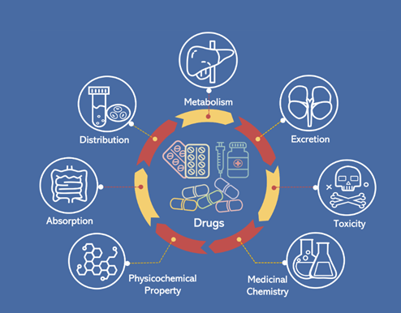
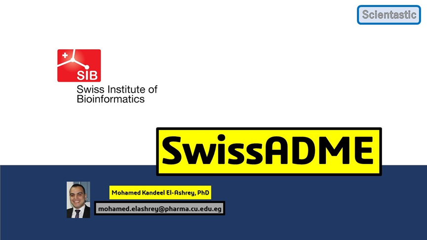
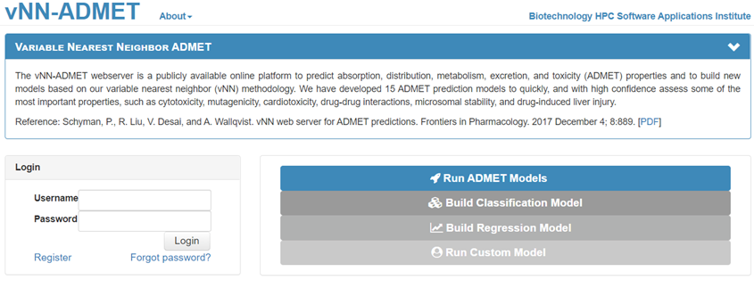
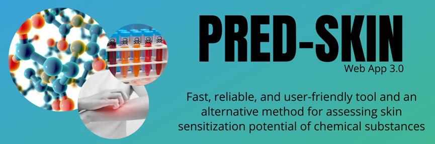
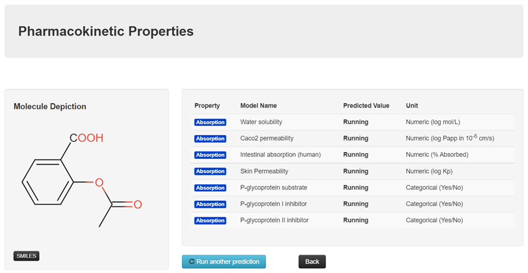
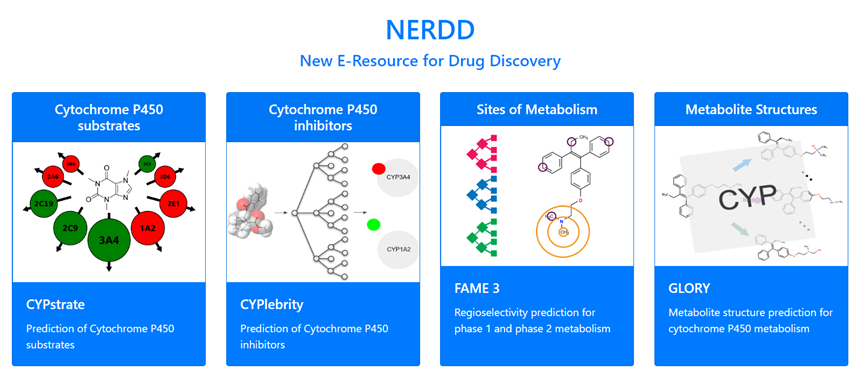
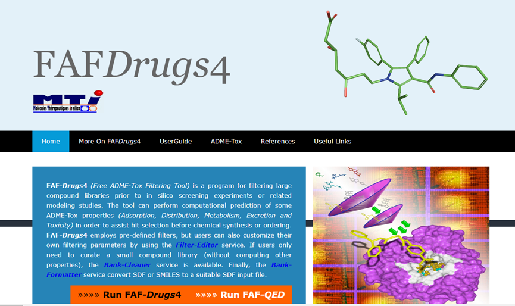
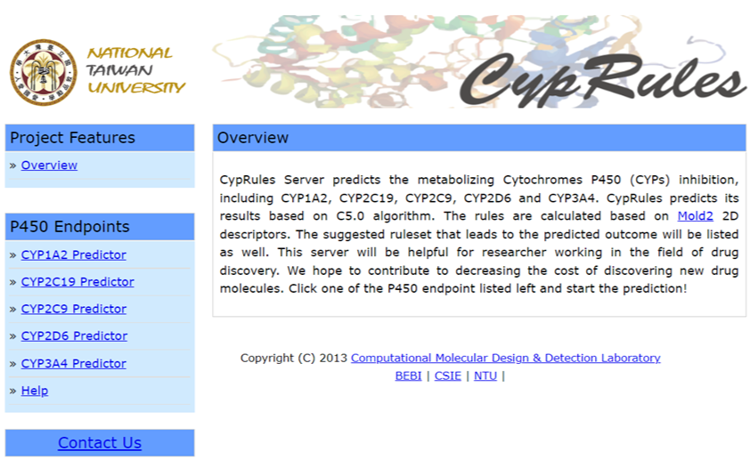

候选化合物的不良药代动力学和毒性是药物开发失败的重要原因之一，尽早评估吸收、分布、代谢、排泄和毒性(ADMET)属性，可以及早规避失败风险。计算机ADMET预测模型可以辅助药物化学家设计和优化先导物，下面这10个目前可以开放获取的ADMET预测工具值得收藏!

**1. ADMETlab**

ADMETlab用于系统评价ADMET的性质，随着功能模块、预测模型、解释和用户界面的重大更新，ADMETlab 2.0具有更大的能力来帮助药物化学家加速药物研发过程。它基于288,967个化合物信息和31个优化的QSAR模型，准确性高，性质分析全面。

```
https://admetmesh.scbdd.com/docs/#/
```



```

```

**2. SwissADME**

SwissAMDE是使用最为广泛的药代动力学属性预测工具，它允许用户计算物理化学描述符，并预测一个或多个小分子的ADME参数、药代动力学性质、类药性。预测数据包括理化性质(分子量、摩尔折射率、氢键给体和受体、重原子数目、Csp3的比例)、药代动力学(GI吸收、血脑屏障通透性、CYP酶抑制剂、P-gp底物、皮肤渗透性)、亲脂性、水溶性、类药性等。

```
http://www.swissadme.ch/
```




**3. XenoSite Web**

XenoSite Web提供小分子生物化学预测Web服务。XenoSite Web可以被药物化学家和生物学家用来预测人体的体内代谢和小分子的反应性。它可以详细预测CYP代谢酶的代谢位点和代谢产物。

```
https://swami.wustl.edu/xenosite
```


**4. VNN-ADMET**

VNN-ADMET网络服务器是一个公开的在线平台，用于预测ADMET特性，并根据可变最近邻(VNN)方法建立新的模型,开发了15个ADMET预测模型，可以快速、高置信度地评估一些最重要的性质，如细胞毒性、致突变性、心脏毒性、药物-药物相互作用、微粒体稳定性和药物性肝损伤。

```
https://vnnadmet.bhsai.org/vnnadmet/login.xhtml
```



**5. Pred-Skin**

Pred-Skin是一个能够预测化学诱导皮肤致敏的Web应用程序，是在ADMET分析下检查的一个重要参数。它使用QSAR模型研究了109种化合物对人类的皮肤致敏潜能和515种化合物对小鼠的局部淋巴结检测(LLNA)数据。

```
http://predskin.labmol.com.br/
```



**6 PkCSM**

PkCSM是一个可自由访问的基于图形的ADMET属性预测工具。该集成平台只需以形式提供查询分子SMILES作为输入，即可快速评估类药性和生物利用度所需的主要药代动力学和毒性特性。

```
https://biosig.lab.uq.edu.au/pkcsm/
```




**7. Hit Dexter**

Hit Dexter基于机器学习方法，采集了实验确定的至少250，000种化学物质的和50种不同蛋白质组的活性。Hit Dexter是指评估一个有机小分子在生物化学测试中触发正性反应或假阳性读数的可能性。Hit Dexter 是一个开放访问的Web服务，它为用户提供访问模型以及基于相似性的方法来预测化合物的各种性质。主要集成了代谢位点和毒性预测。

```
https://nerdd.univie.ac.at/
```




**8. FAFDrugs**

FAF-Drugs是一个基于Frowns (化学信息学工具包) 的在线服务工具，允许用户通过简单的ADMET过滤规则，如分子量、极性表面积、logP或可旋转键的数量来处理自己的化合物集合。需要SMILES或者SDF文件作为输入。

```
https://fafdrugs4.rpbs.univ-paris-diderot.fr/
```




**9. DrugMint**

DrugMint是为预测化合物的药物可能性而开发的Web服务器。所有模型都在一个包含1347个已批准药物的数据集上进行了训练、测试和评估，这些药物来自Drugbank数据库。所有QSAR模型均采用PaDEL、WEKA、SVM _ Light等开源软件包开发。该服务器的总体目标是为药物开发社区提供预测、筛选和设计类药分子的服务。

```
http://crdd.osdd.net/oscadd/drugmint/
```


**10. CypRules**

CypRules 预测CYP450 (细胞色素P450)代谢抑制，包括CYP1A2、CYP2C19、CYP2C9、CYP2D6和CYP3A4。这些规则是基于Mold2 2D描述符计算的，导致预测结果的建议规则集也将被列出。该服务器将对药物发现领域的研究人员有所帮助。

```
https://cyprules.cmdm.tw/
```

