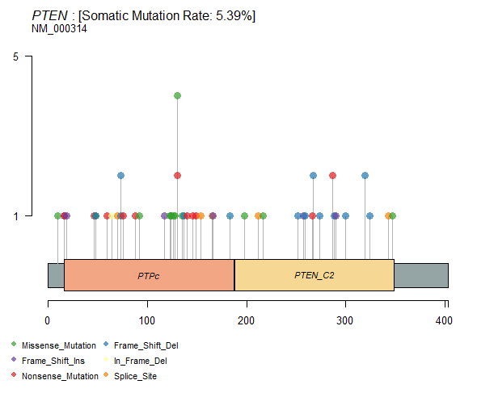
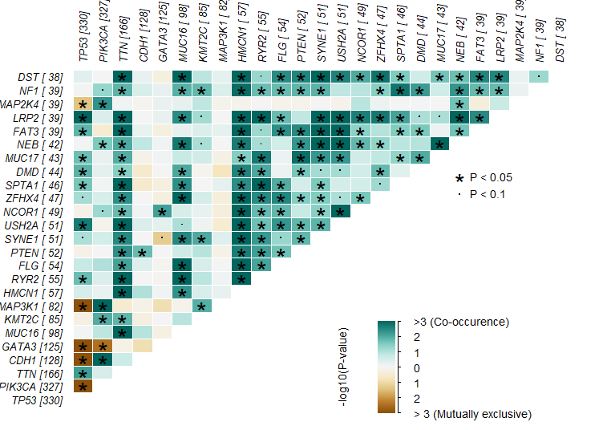
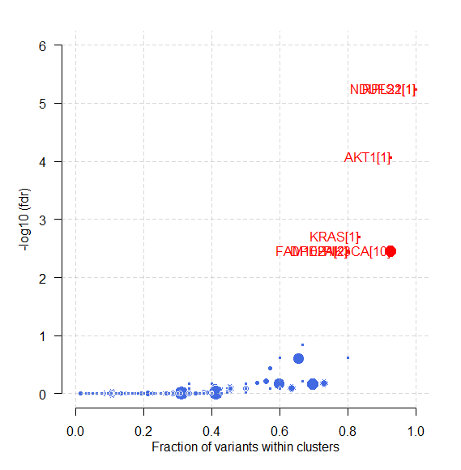
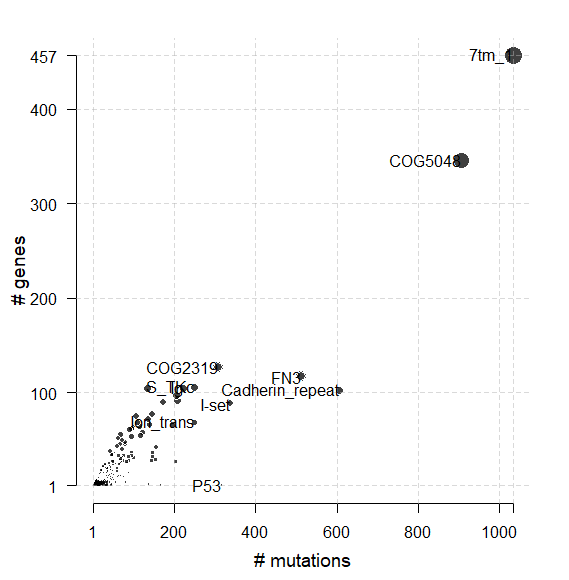
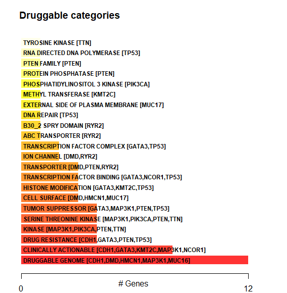
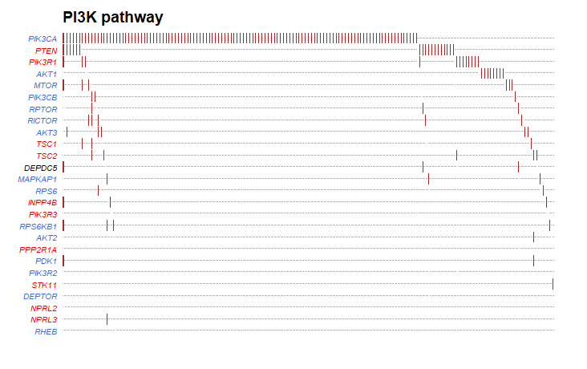
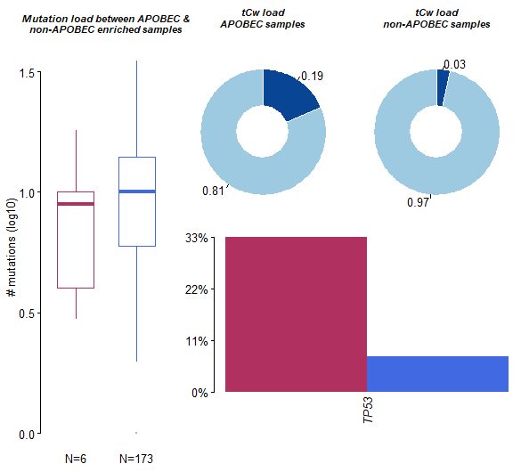

# TCGA数据库SNV数据探索

## 1.背景知识

### **1.1. SNP (single-nucleotide polymorphism) 单核苷酸多态性**

单核苷酸多态性，通常简称为 SNP，是在基因组的特定位置发生的一个单核苷酸的替代，在这个位置，每个变异都在一个种群中有一定程度的存在。从以上定义，特别要注意这几点：

(1) SNP本身是针对“群体”而言的（within a population）。

(2) SNP应该在群体中占一定的比例，比如至少是1%（当然，这个数字并不绝对）。

此外，SNP一定是碱基间的替换。如果是碱基的插入或丢失，我们有另外一个术语来形容：**INDEL（=INsertion+DELetion）**。

所以，可以想象，SNP这个概念被提出时，是为了描述一个群体内不那么罕见的碱基突变。

### **1.1.2 SNV (single-nucleotide variant) 单核苷酸变异**

SNV 是一种单核苷酸的变异，没有任何频率限制，可能出现在体细胞中。体细胞单核苷酸变异(例如，由癌症引起)也可称为单核苷酸改变。

随着癌症基因组学的进步，突变注释格式 (Mutation Annotation Format, **MAF**) 被广泛接受，并用于存储检测到的体细胞变异。

癌症基因组图谱项目 (The Cancer Genome Atlas, **TCGA**) 已对 **30** 多种不同的癌症进行了测序，每种癌症类型的样本量超过 **200** 个。**TCGA**的数据收录在**GDC** (Genomic data commons) 库中，由体细胞变异组成的结果数据以 **MAF** 文件格式存储。

## 2.数据下载

参考文章：[TCGA数据库中SNV和CNV数据的下载](https://mp.weixin.qq.com/s/4UPr9ZaYZh0Y44qQlgPE2w)

```R
library(TCGAbiolinks)
proj <- "TCGA-BRCA"
query_SNV <-GDCquery(project = proj,
                       data.category = "Simple Nucleotide Variation",
                       data.type = "Masked Somatic Mutation",
                       workflow.type = "Aliquot Ensemble Somatic Variant Merging and Masking")
  GDCdownload(query_SNV)
  snv <- GDCprepare(query_SNV)
  opfn = paste0("processedTCGAdata/TCGA-SNV/",proj,"_SNV.Rdata")
```

## 3.加载数据

```
load("H:/MedBioInfoCloud/analysis/TCGA/new/processedTCGAdata/TCGA-SNV/TCGA-BRCA_SNV.Rdata")#
library(maftools)
maf <- read.maf(snv,isTCGA=TRUE)
```

## 4.转换和颠换变异分布

titv函数将 SNP 分类为转换和转换，并以各种方式返回汇总表列表。还可以将汇总数据可视化为显示六种不同转化的总体分布的箱线图和显示每个样本中转化分数的堆叠条形图。

```
###转换和颠换变异分布
###转换和颠换图 (Transition and transversion plot, Ti/Tv)显示了样本队列中SNV的分布
laml.titv = titv(maf = maf, plot = FALSE, useSyn = TRUE)# useSyn参数设置是否包含同义突变
plotTiTv(res = laml.titv)
```


## 5.氨基酸变化的棒棒糖图

lollipopPlot函数要求我们在maf文件中有氨基酸变化信息。然而，MAF 文件对于命名氨基酸变化的字段没有明确的指导方针，不同的研究对氨基酸变化有不同的字段（或列）名称。默认情况下，lollipopPlot查找 column AAChange，如果在 MAF 文件中找不到它，它会打印所有可用字段并显示警告消息。

```
# 突变及结构域在蛋白上的分布
# 棒棒糖图 (Lollipop plot) 显示了样本队列中某个基因的 突变在蛋白上的分布，以及蛋白结构域。
# lollipop plot for one gene, which is one of the most frequent mutated gene in tumor
lollipopPlot(maf = maf,  gene = 'PTEN', 
             showMutationRate = TRUE)
```



一般蛋白质结构域可以用函数绘制plotProtein：

```
plotProtein(gene = "PTEN", refSeqID = "NM_000314")
```


癌症基因组，尤其是实体瘤的特征在于具有局部超突变的基因组位点。这种超突变基因组区域可以通过在线性基因组尺度上绘制变体间距离来可视化。这些图通常称为降雨图，我们可以使用rainfallPlot。如果detectChangePoints设置为 TRUE，rainfall绘图还会突出显示潜在变化所在的区域的事件间的距离（regions where potential changes in inter-event distances are located）。

```
rainfallPlot(maf = maf, detectChangePoints = TRUE, pointSize = 0.4)
```

## 6. 与 TCGA 队列比较突变负荷

tcgaCompare使用来自 TCGA MC3的突变负荷来数据，来比较与 33 个 TCGA 队列的突变负荷.（tcgaCompare uses mutation load from TCGA MC3 for comparing muttaion burden against 33 TCGA cohorts）

```
dat.mutload = tcgaCompare(maf = maf,
                          logscale = TRUE, 
                          capture_size = 50)
```


## 7. VAF分布图

此函数将变异等位基因频率绘制为箱线图，可快速帮助估计顶级突变基因的克隆状态（假设纯样本，克隆基因的平均等位基因频率通常约为 50%）

```R
# 基因的等位基因变异频率分布
# 基因的 VAF (Variant Allele Frequency, 等位基因变异频率) 分布
# Plots vaf distribution of genes as a boxplot. Each dot in the jitter is a variant.
plotVaf(maf = maf, genes = c("TP53","CDH1","GATA3"))
plotVaf(maf = maf, top = 10)
```


## 8.体细胞突变相互作用（Somatic Interactions）

可以使用somaticInteractions函数，通过成对的Fisher精确检验分析，检测互斥（exclusive）或共现性（Co-occurrence）的一组基因。

```
#exclusive/co-occurance event analysis on top 10 mutated genes. 
somaticInteractions(maf = maf, 
                    genes = c("TP53","CDH1","GATA3"), 
                    pvalue = c(0.05, 0.1))
somaticInteractions(maf = maf, top = 25, pvalue = c(0.05, 0.1))
```



## 9.基于位置聚类检测癌症驱动基因

maftools 可与从给定 MAF 中识别癌症驱动基因。oncodrive是基于oncodriveCLUST算法的，最初是用 Python 实现的。概念基于这样一个事实：即致癌基因中的大多数变体都在少数特定位点（few specific loci，又名热点，hot-spots）富集。该方法利用这些位置来识别癌症基因。

plotOncodrive将结果绘制为散点图，点的大小与基因中发现的簇数成正比。X 轴显示在这些簇中观察到的突变数量（或突变比例）。

```

dat.sig = oncodrive(maf = maf, 
                    # AACol = 'Protein_Change', 
                    minMut = 5, 
                    pvalMethod = 'zscore')
plotOncodrive(res = dat.sig, 
              fdrCutOff = 0.1, 
              useFraction = TRUE, 
              labelSize = 1)
```



## 10. 添加和汇总 pfam 域

maftools 自带功能pfamDomains，可以将 pfam 结构域信息添加到氨基酸变化中。pfamDomain还根据受影响的结构域总结了氨基酸变化。这有助于了解给定癌症队列中的哪个结构域最常受到影响。

```
dat.pfam = pfamDomains(maf = maf, top = 10)
dat.pfam$proteinSummary[,1:7, with = FALSE]
dat.pfam$domainSummary[,1:3, with = FALSE]
```



## 11.药物-基因相互作用

drugInteractions函数从药物基因相互作用数据库（Drug Gene Interaction database， https://www.dgidb.org/）检查编译的药物-基因相互作用和基因成药性信息。

```R
dgi = drugInteractions(maf = maf, fontSize = 0.75)
```



上图显示了潜在的可成药基因类别以及其中涉及的前 5 个基因。还可以提取有关药物-基因相互作用的信息。例如，下面是已知/报告的药物与 DNMT3A 相互作用的结果。

```
dnmt3a.dgi = drugInteractions(genes = "EGFR", drugs = TRUE)
dnmt3a.dgi[,.(Gene, interaction_types, drug_name, drug_claim_name)]
```

## 12.致癌信号通路

OncogenicPathways功能检查 TCGA 队列中已知致癌信号通路的富集。

```
OncogenicPathways(maf = maf)
```


也可以可视化完整的路径：

```R
PlotOncogenicPathways(maf = maf, pathways = "PI3K")#肿瘤抑制基因为红色，癌基因为蓝色字体。
```



## 13.变异信号特征（Mutational Signatures）

每种癌症在发展过程中都会留下以特定核苷酸取代模式为特征的特征。Alexandrov等人已经展示了来自 7000 多个癌症样本的此类突变特征。可以通过分解核苷酸替换矩阵来提取此类特征，该矩阵根据突变碱基周围的直接碱基分为 96 个替换类别。提取的信号特征也可以与那些经过验证的信号特征进行比较。

特征分析的第一步是获取突变碱基周围的相邻碱基并形成突变矩阵。注意：早期版本的 maftools 需要一个 fasta 文件作为输入。但从 1.8.0 开始，BSgenome 对象用于更快的序列提取。

```R
library("BSgenome.Hsapiens.UCSC.hg38", quietly = TRUE)
laml.maf <- system.file("extdata", "tcga_laml.maf.gz", package = "maftools")
laml <- read.maf(maf = laml.maf)
laml.tnm <- trinucleotideMatrix(maf = laml , ref_genome = 'BSgenome.Hsapiens.UCSC.hg38',
                                prefix = 'chr', add = F, useSyn = TRUE)
plotApobecDiff(tnm = laml.tnm , maf = laml, pVal = 0.2)
```



`trinucleotideMatrix`函数执行两个步骤：

- 估计 APOBEC 富集分数

- 为特征分析准备一个突变矩阵

**APOBEC 富集估计（APOBEC Enrichment estimation）：**
APOBEC 诱导的突变在实体瘤中更为常见，主要与发生在 TCW 基序中的 C>T 转换事件有关。上述命令中的 APOBEC 富集分数是使用 Roberts 等人描述的方法估算的。简而言之，将给定样品中所有 C>T 突变中发生在 TCW motif 内的 C>T 突变的富集与发生在 20bp 突变碱基内的背景胞嘧啶（background Cytosine）和 TCW 进行比较。

**APOBEC 富集和非富集样本之间的差异（Differences between APOBEC enriched and non-enriched samples）：**
还可以分析 APOBEC 富集和非 APOBEC 富集样本之间突变模式的差异。plotApobecDiff是一个函数，它采用由 trinucleotideMatrix 估计的 APOBEC 富集分数，并将样本分类为 APOBEC 富集和非 APOBEC 富集。分层后，它会比较这两组，以识别差异改变的基因。请注意，没有 APOBEC 富集的 LAML 不是此类分析的理想群组，因此下图仅用于演示目的。


## 14.信号分析（Signature analysis）

信号分析包括以下步骤：

- estimateSignatures- 它在一系列值上运行 NMF 并测量拟合优度 - 根据Cophenetic 相关性。

- plotCophenetic- 绘制肘部图并帮助您确定最佳信号数量。最佳可能信号是 Cophenetic 相关性显着下降的值。

- extractSignatures- 使用非负矩阵分解将矩阵分解为n个信号。n根据以上两步选择。如果您已经有一个很好的n估值，您可以跳过以上两个步骤。

- compareSignatures- 从上述步骤中提取的信号可以与 COSMIC 数据库中的已知信号进行比较，并计算余弦相似度以识别最佳匹配。

- plotSignatures- 绘制信号

  ```R
  library('NMF')
  dat.sign = estimateSignatures(mat = laml.tnm , nTry = 6)
  ```