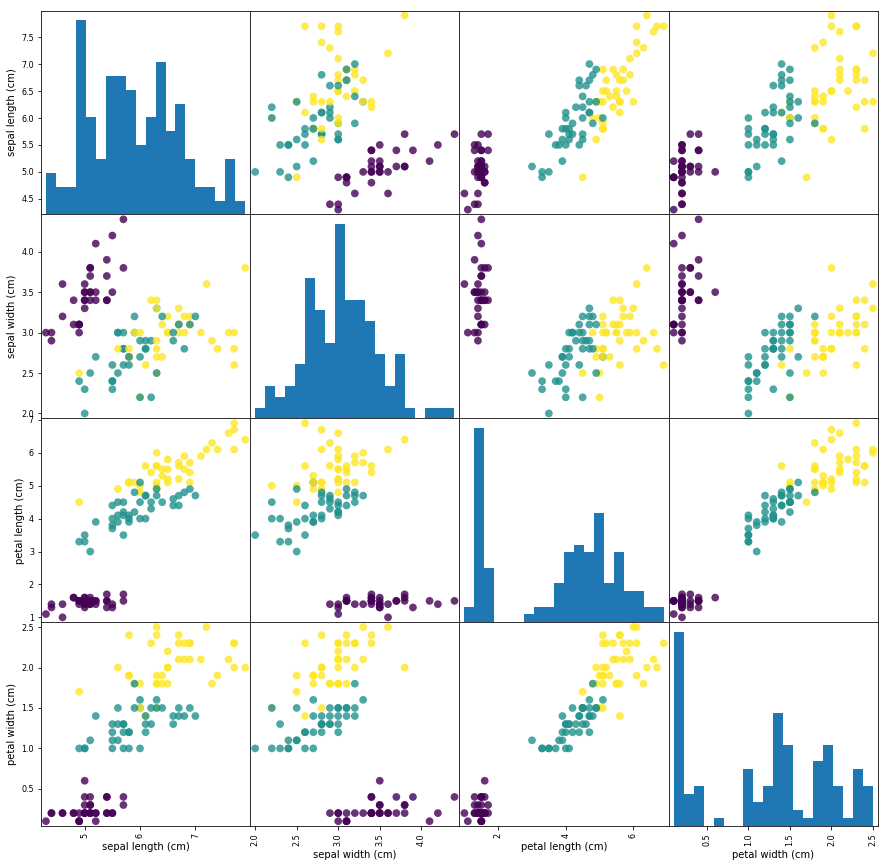

## 一、鸢尾花数据集预测

### （1）查看鸢尾花iris数据集


```python
#对鸢尾花iris数据集进行调用，查看数据的各方面特征。
from sklearn.datasets import load_iris
iris_dataset = load_iris()
#下面是查看数据的各项属性
print("数据集的Keys:\n",iris_dataset.keys())     #查看数据集的keys。
print("特征名:\n",iris_dataset['feature_names'])  #查看数据集的特征名称
print("数据类型:\n",type(iris_dataset['data']))    #查看数据类型
print("数据维度:\n",iris_dataset['data'].shape)    #查看数据的结构
print("前五条数据:\n{}".format(iris_dataset['data'][:5]))  #查看前5条数据
#查看分类信息
print("标记名:\n",iris_dataset['target_names']) 
print("标记类型:\n",type(iris_dataset['target']))
print("标记维度:\n",iris_dataset['target'].shape)
print("标记值:\n",iris_dataset['target'])
#查看数据集的简介
print('数据集简介：\n',iris_dataset['DESCR'][:20] + "\n.......")  #数据集简介前20个字符
```

    数据集的Keys:
     dict_keys(['data', 'target', 'frame', 'target_names', 'DESCR', 'feature_names', 'filename', 'data_module'])
    特征名:
     ['sepal length (cm)', 'sepal width (cm)', 'petal length (cm)', 'petal width (cm)']
    数据类型:
     <class 'numpy.ndarray'>
    数据维度:
     (150, 4)
    前五条数据:
    [[5.1 3.5 1.4 0.2]
     [4.9 3.  1.4 0.2]
     [4.7 3.2 1.3 0.2]
     [4.6 3.1 1.5 0.2]
     [5.  3.6 1.4 0.2]]
    标记名:
     ['setosa' 'versicolor' 'virginica']
    标记类型:
     <class 'numpy.ndarray'>
    标记维度:
     (150,)
    标记值:
     [0 0 0 0 0 0 0 0 0 0 0 0 0 0 0 0 0 0 0 0 0 0 0 0 0 0 0 0 0 0 0 0 0 0 0 0 0
     0 0 0 0 0 0 0 0 0 0 0 0 0 1 1 1 1 1 1 1 1 1 1 1 1 1 1 1 1 1 1 1 1 1 1 1 1
     1 1 1 1 1 1 1 1 1 1 1 1 1 1 1 1 1 1 1 1 1 1 1 1 1 1 2 2 2 2 2 2 2 2 2 2 2
     2 2 2 2 2 2 2 2 2 2 2 2 2 2 2 2 2 2 2 2 2 2 2 2 2 2 2 2 2 2 2 2 2 2 2 2 2
     2 2]
    数据集简介：
     .. _iris_dataset:
    
    I
    .......


```python
#对iris数据集进行拆分，并查看拆分结果。
from sklearn.datasets import load_iris
from sklearn.model_selection import train_test_split
iris_dataset = load_iris()
X_train, X_test, y_train, y_test = train_test_split( iris_dataset['data'], iris_dataset['target'], random_state=2)
print("X_train",X_train)
print("y_train",y_train)
print("X_test",X_test)
print("y_test",y_test)
print("X_train shape: {}".format(X_train.shape))
print("X_test shape: {}".format(X_test.shape))

```

    X_train [[5.5 2.3 4.  1.3]
     [6.9 3.1 5.1 2.3]
     [6.  2.9 4.5 1.5]
     [6.2 2.9 4.3 1.3]
     [6.8 3.2 5.9 2.3]
     [5.  2.3 3.3 1. ]
     [4.8 3.4 1.6 0.2]
     [6.1 2.6 5.6 1.4]
     [5.2 3.4 1.4 0.2]
     [6.7 3.1 4.4 1.4]
     [5.1 3.5 1.4 0.2]
     [5.2 3.5 1.5 0.2]
     [5.5 3.5 1.3 0.2]
     [4.9 2.5 4.5 1.7]
     [6.2 3.4 5.4 2.3]
     [7.9 3.8 6.4 2. ]
     [5.4 3.4 1.7 0.2]
     [6.7 3.1 5.6 2.4]
     [6.3 3.4 5.6 2.4]
     [7.6 3.  6.6 2.1]
     [6.  2.2 5.  1.5]
     [4.3 3.  1.1 0.1]
     [4.8 3.1 1.6 0.2]
     [5.8 2.7 5.1 1.9]
     [5.7 2.8 4.1 1.3]
     [5.2 2.7 3.9 1.4]
     [7.7 3.  6.1 2.3]
     [6.3 2.7 4.9 1.8]
     [6.1 2.8 4.  1.3]
     [5.1 3.7 1.5 0.4]
     [5.7 2.8 4.5 1.3]
     [5.4 3.9 1.3 0.4]
     [5.8 2.8 5.1 2.4]
     [5.8 2.6 4.  1.2]
     [5.1 2.5 3.  1.1]
     [5.7 3.8 1.7 0.3]
     [5.5 2.4 3.7 1. ]
     [5.9 3.  4.2 1.5]
     [6.7 3.1 4.7 1.5]
     [7.7 2.8 6.7 2. ]
     [4.9 3.  1.4 0.2]
     [6.3 3.3 4.7 1.6]
     [5.1 3.8 1.5 0.3]
     [5.8 2.7 3.9 1.2]
     [6.9 3.2 5.7 2.3]
     [4.9 3.1 1.5 0.1]
     [5.  2.  3.5 1. ]
     [4.9 3.1 1.5 0.1]
     [5.  3.5 1.3 0.3]
     [5.4 3.7 1.5 0.2]
     [6.8 3.  5.5 2.1]
     [6.3 3.3 6.  2.5]
     [5.  3.4 1.6 0.4]
     [5.2 4.1 1.5 0.1]
     [6.3 2.5 5.  1.9]
     [7.7 2.6 6.9 2.3]
     [6.  2.2 4.  1. ]
     [7.2 3.6 6.1 2.5]
     [4.9 2.4 3.3 1. ]
     [6.1 2.8 4.7 1.2]
     [6.5 3.  5.2 2. ]
     [5.1 3.5 1.4 0.3]
     [7.4 2.8 6.1 1.9]
     [5.9 3.  5.1 1.8]
     [6.4 2.7 5.3 1.9]
     [4.4 2.9 1.4 0.2]
     [5.6 2.8 4.9 2. ]
     [5.1 3.4 1.5 0.2]
     [5.  3.3 1.4 0.2]
     [5.7 2.6 3.5 1. ]
     [6.9 3.1 5.4 2.1]
     [5.5 2.6 4.4 1.2]
     [6.3 2.8 5.1 1.5]
     [7.  3.2 4.7 1.4]
     [6.8 2.8 4.8 1.4]
     [6.5 3.2 5.1 2. ]
     [6.9 3.1 4.9 1.5]
     [5.5 2.4 3.8 1.1]
     [5.6 3.  4.5 1.5]
     [6.  3.  4.8 1.8]
     [6.  2.7 5.1 1.6]
     [5.8 2.7 5.1 1.9]
     [5.9 3.2 4.8 1.8]
     [5.1 3.8 1.6 0.2]
     [6.2 2.2 4.5 1.5]
     [5.6 3.  4.1 1.3]
     [5.6 2.5 3.9 1.1]
     [5.8 2.7 4.1 1. ]
     [6.4 3.1 5.5 1.8]
     [6.6 2.9 4.6 1.3]
     [5.5 4.2 1.4 0.2]
     [4.4 3.  1.3 0.2]
     [6.3 2.9 5.6 1.8]
     [6.4 3.2 4.5 1.5]
     [7.3 2.9 6.3 1.8]
     [5.  3.6 1.4 0.2]
     [7.1 3.  5.9 2.1]
     [4.9 3.1 1.5 0.1]
     [6.5 3.  5.5 1.8]
     [6.7 3.3 5.7 2.1]
     [5.4 3.4 1.5 0.4]
     [6.1 2.9 4.7 1.4]
     [4.6 3.2 1.4 0.2]
     [6.7 3.  5.2 2.3]
     [5.7 3.  4.2 1.2]
     [5.  3.4 1.5 0.2]
     [6.5 3.  5.8 2.2]
     [6.6 3.  4.4 1.4]
     [5.  3.5 1.6 0.6]
     [4.6 3.6 1.  0.2]
     [6.3 2.5 4.9 1.5]
     [5.7 4.4 1.5 0.4]]
    y_train [1 2 1 1 2 1 0 2 0 1 0 0 0 2 2 2 0 2 2 2 2 0 0 2 1 1 2 2 1 0 1 0 2 1 1 0 1
     1 1 2 0 1 0 1 2 0 1 0 0 0 2 2 0 0 2 2 1 2 1 1 2 0 2 2 2 0 2 0 0 1 2 1 2 1
     1 2 1 1 1 2 1 2 1 0 1 1 1 1 2 1 0 0 2 1 2 0 2 0 2 2 0 1 0 2 1 0 2 1 0 0 1
     0]
    X_test [[4.6 3.4 1.4 0.3]
     [4.6 3.1 1.5 0.2]
     [5.7 2.5 5.  2. ]
     [4.8 3.  1.4 0.1]
     [4.8 3.4 1.9 0.2]
     [7.2 3.  5.8 1.6]
     [5.  3.  1.6 0.2]
     [6.7 2.5 5.8 1.8]
     [6.4 2.8 5.6 2.1]
     [4.8 3.  1.4 0.3]
     [5.3 3.7 1.5 0.2]
     [4.4 3.2 1.3 0.2]
     [5.  3.2 1.2 0.2]
     [5.4 3.9 1.7 0.4]
     [6.  3.4 4.5 1.6]
     [6.5 2.8 4.6 1.5]
     [4.5 2.3 1.3 0.3]
     [5.7 2.9 4.2 1.3]
     [6.7 3.3 5.7 2.5]
     [5.5 2.5 4.  1.3]
     [6.7 3.  5.  1.7]
     [6.4 2.9 4.3 1.3]
     [6.4 3.2 5.3 2.3]
     [5.6 2.7 4.2 1.3]
     [6.3 2.3 4.4 1.3]
     [4.7 3.2 1.6 0.2]
     [4.7 3.2 1.3 0.2]
     [6.1 3.  4.9 1.8]
     [5.1 3.8 1.9 0.4]
     [7.2 3.2 6.  1.8]
     [6.2 2.8 4.8 1.8]
     [5.1 3.3 1.7 0.5]
     [5.6 2.9 3.6 1.3]
     [7.7 3.8 6.7 2.2]
     [5.4 3.  4.5 1.5]
     [5.8 4.  1.2 0.2]
     [6.4 2.8 5.6 2.2]
     [6.1 3.  4.6 1.4]]
    y_test [0 0 2 0 0 2 0 2 2 0 0 0 0 0 1 1 0 1 2 1 1 1 2 1 1 0 0 2 0 2 2 0 1 2 1 0 2
     1]
    X_train shape: (112, 4)
    X_test shape: (38, 4)


```python
# 使用scatter_matrix显示训练集与测试集。
import pandas as pd
iris_dataframe = pd.DataFrame(X_train, columns=iris_dataset.feature_names)
# 创建一个scatter matrix，颜色值来自y_train
pd.plotting.scatter_matrix(iris_dataframe, c=y_train, figsize=(15, 15), marker='o', hist_kwds={'bins': 20}, s=60, alpha=.8)

```


    array([[<matplotlib.axes._subplots.AxesSubplot object at 0x0000020790084860>,
            <matplotlib.axes._subplots.AxesSubplot object at 0x00000207900A3E10>,
            <matplotlib.axes._subplots.AxesSubplot object at 0x00000207900D3470>,
            <matplotlib.axes._subplots.AxesSubplot object at 0x00000207900FCB00>],
           [<matplotlib.axes._subplots.AxesSubplot object at 0x000002079012C160>,
            <matplotlib.axes._subplots.AxesSubplot object at 0x000002079012C198>,
            <matplotlib.axes._subplots.AxesSubplot object at 0x000002079017DE80>,
            <matplotlib.axes._subplots.AxesSubplot object at 0x00000207901B0518>],
           [<matplotlib.axes._subplots.AxesSubplot object at 0x00000207901D7BA8>,
            <matplotlib.axes._subplots.AxesSubplot object at 0x000002079020A278>,
            <matplotlib.axes._subplots.AxesSubplot object at 0x0000020790230908>,
            <matplotlib.axes._subplots.AxesSubplot object at 0x000002079025AF98>],
           [<matplotlib.axes._subplots.AxesSubplot object at 0x000002079028C668>,
            <matplotlib.axes._subplots.AxesSubplot object at 0x00000207902B3CF8>,
            <matplotlib.axes._subplots.AxesSubplot object at 0x00000207902E63C8>,
            <matplotlib.axes._subplots.AxesSubplot object at 0x000002079030DA58>]],
          dtype=object)


​    

​    


### （2）使用KNN对鸢尾花iris数据集进行分类。


```python
from sklearn import datasets
from sklearn.neighbors import KNeighborsClassifier
from sklearn.model_selection import train_test_split
#导入鸢尾花数据并查看数据特征
iris = datasets.load_iris()
print('数据集结构：',iris.data.shape)
# 获取属性
iris_X = iris.data
# 获取类别
iris_y = iris.target
# 划分成测试集和训练集
iris_train_X,iris_test_X,iris_train_y,iris_test_y=train_test_split(iris_X,iris_y,test_size=0.2, random_state=0)
#分类器初始化
knn = KNeighborsClassifier()
#对训练集进行训练
knn.fit(iris_train_X, iris_train_y)
#对测试集数据的鸢尾花类型进行预测
predict_result = knn.predict(iris_test_X)
print('测试集大小：',iris_test_X.shape)
print('真实结果：',iris_test_y)
print('预测结果：',predict_result)
#显示预测精确率
print('预测精确率：',knn.score(iris_test_X, iris_test_y))
```

    数据集结构： (150, 4)
    测试集大小： (30, 4)
    真实结果： [2 1 0 2 0 2 0 1 1 1 2 1 1 1 1 0 1 1 0 0 2 1 0 0 2 0 0 1 1 0]
    预测结果： [2 1 0 2 0 2 0 1 1 1 2 1 1 1 2 0 1 1 0 0 2 1 0 0 2 0 0 1 1 0]
    预测精确率： 0.9666666666666667


### （3）使用KNN方法实现手写数字识别。


```python
#coding=utf-8
import numpy as np
from os import listdir

def loadDataSet():   #加载数据集
    #获取训练数据集
    print("1.Loading trainSet...")    
    trainFileList = listdir('HWdigits/trainSet') 
    trainNum = len(trainFileList)

    trainX = np.zeros((trainNum, 32*32))    
    trainY = []    
    for i in range(trainNum):
        trainFile = trainFileList[i]
        #将训练数据集向量化
        trainX[i, :] = img2vector('HWdigits/trainSet/%s' % trainFile,32,32)
        label = int(trainFile.split('_')[0]) #读取文件名的第一位作为标记
        trainY.append(label)
    #获取测试数据集
    print("2.Loadng testSet...")
    testFileList = listdir('HWdigits/testSet')
    testNum = len(testFileList)
    testX = np.zeros((testNum, 32*32))
    testY = []    
    for i in range(testNum):
        testFile = testFileList[i]
        #将测试数据集向量化
        testX[i, :] = img2vector('HWdigits/testSet/%s' % testFile,32,32)
        label = int(testFile.split('_')[0])  #读取文件名的第一位作为标记
        testY.append(label)
    return trainX, trainY, testX, testY
def img2vector(filename,h,w):      # 将32*32的文本转化为向量
    imgVector = np.zeros((1, h * w))
    fileIn = open(filename)
    for row in range(h):
        lineStr = fileIn.readline()
        for col in range(w):
            imgVector[0, row * 32 + col] = int(lineStr[col])
    return imgVector
def myKNN(testDigit, trainX, trainY, k):  
    numSamples = trainX.shape[0]  #shape[0]代表行，每行一个图片，得到样本个数    
    #1.计算欧式距离    
    diff=[]
    for n in range(numSamples):        
        diff.append(testDigit-trainX[n])  #每个个体差
    diff=np.array(diff)                 #转变为ndarray
    #对差求平方和，然后取和的平方根
    squaredDiff = diff ** 2  
    squaredDist = np.sum(squaredDiff, axis = 1)
    distance = squaredDist ** 0.5
    #2.按距离进行排序    
    sortedDistIndices = np.argsort(distance)
    classCount = {}                   #存放各类别的个体数量 
    for i in range(k):
        #3.按顺序读取标签
        voteLabel = trainY[sortedDistIndices[i]]
        #4.计算该标签次数        
        classCount[voteLabel] = classCount.get(voteLabel, 0) + 1
    
    #5.查找出现次数最多的类别，作为分类结果
    maxCount = 0
    for key, value in classCount.items():
        if value > maxCount:
            maxCount = value
            maxIndex = key
    return maxIndex

train_x, train_y, test_x, test_y = loadDataSet()
numTestSamples = test_x.shape[0]
matchCount = 0
print("3.Find the most frequent label in k-nearest...")
print("4.Show the result...")
for i in range(numTestSamples):
    predict = myKNN(test_x[i], train_x, train_y, 3)    
    print("result is: %d, real answer is: %d" % (predict,test_y[i]))
    if predict == test_y[i]:
        matchCount += 1        
accuracy = float(matchCount) / numTestSamples
# 5.输出结果
print("5.Show the accuracy...")
print("  The total number of errors is: %d" % (numTestSamples-matchCount))
print('  The classify accuracy is: %.2f%%' % (accuracy * 100))
```

    1.Loading trainSet...
    2.Loadng testSet...
    3.Find the most frequent label in k-nearest...
    4.Show the result...
    result is: 0, real answer is: 0
    result is: 0, real answer is: 0
    result is: 0, real answer is: 0
    result is: 0, real answer is: 0
    result is: 0, real answer is: 0
    result is: 0, real answer is: 0
    result is: 0, real answer is: 0
    result is: 0, real answer is: 0
    result is: 0, real answer is: 0
    result is: 0, real answer is: 0
    result is: 0, real answer is: 0
    result is: 0, real answer is: 0
    result is: 0, real answer is: 0
    result is: 0, real answer is: 0
    result is: 0, real answer is: 0
    result is: 0, real answer is: 0
    result is: 0, real answer is: 0
    result is: 0, real answer is: 0
    result is: 0, real answer is: 0
    result is: 0, real answer is: 0
    result is: 0, real answer is: 0
    result is: 0, real answer is: 0
    result is: 0, real answer is: 0
    result is: 0, real answer is: 0
    result is: 0, real answer is: 0
    result is: 0, real answer is: 0
    result is: 0, real answer is: 0
    result is: 0, real answer is: 0
    result is: 0, real answer is: 0
    result is: 0, real answer is: 0
    result is: 0, real answer is: 0
    result is: 0, real answer is: 0
    result is: 0, real answer is: 0
    result is: 0, real answer is: 0
    result is: 0, real answer is: 0
    result is: 0, real answer is: 0
    result is: 0, real answer is: 0
    result is: 0, real answer is: 0
    result is: 0, real answer is: 0
    result is: 0, real answer is: 0
    result is: 0, real answer is: 0
    result is: 0, real answer is: 0
    result is: 0, real answer is: 0
    result is: 0, real answer is: 0
    result is: 0, real answer is: 0
    result is: 0, real answer is: 0
    result is: 0, real answer is: 0
    result is: 0, real answer is: 0
    result is: 0, real answer is: 0
    result is: 0, real answer is: 0
    result is: 0, real answer is: 0
    result is: 0, real answer is: 0
    result is: 0, real answer is: 0
    result is: 1, real answer is: 1
    result is: 1, real answer is: 1
    result is: 1, real answer is: 1
    result is: 1, real answer is: 1
    result is: 1, real answer is: 1
    result is: 1, real answer is: 1
    result is: 1, real answer is: 1
    result is: 1, real answer is: 1
    result is: 1, real answer is: 1
    result is: 1, real answer is: 1
    result is: 1, real answer is: 1
    result is: 1, real answer is: 1
    result is: 1, real answer is: 1
    result is: 1, real answer is: 1
    result is: 1, real answer is: 1
    result is: 1, real answer is: 1
    result is: 1, real answer is: 1
    result is: 1, real answer is: 1
    result is: 1, real answer is: 1
    result is: 1, real answer is: 1
    result is: 1, real answer is: 1
    result is: 1, real answer is: 1
    result is: 1, real answer is: 1
    result is: 1, real answer is: 1
    result is: 1, real answer is: 1
    result is: 1, real answer is: 1
    result is: 1, real answer is: 1
    result is: 1, real answer is: 1
    result is: 1, real answer is: 1
    result is: 1, real answer is: 1
    result is: 1, real answer is: 1
    result is: 1, real answer is: 1
    result is: 1, real answer is: 1
    result is: 1, real answer is: 1
    result is: 1, real answer is: 1
    result is: 1, real answer is: 1
    result is: 1, real answer is: 1
    result is: 1, real answer is: 1
    result is: 1, real answer is: 1
    result is: 1, real answer is: 1
    result is: 1, real answer is: 1
    result is: 2, real answer is: 2
    result is: 2, real answer is: 2
    result is: 2, real answer is: 2
    result is: 2, real answer is: 2
    result is: 2, real answer is: 2
    result is: 2, real answer is: 2
    result is: 2, real answer is: 2
    result is: 2, real answer is: 2
    result is: 2, real answer is: 2
    result is: 2, real answer is: 2
    result is: 2, real answer is: 2
    result is: 2, real answer is: 2
    result is: 2, real answer is: 2
    result is: 2, real answer is: 2
    result is: 2, real answer is: 2
    result is: 2, real answer is: 2
    result is: 2, real answer is: 2
    result is: 2, real answer is: 2
    result is: 2, real answer is: 2
    result is: 2, real answer is: 2
    result is: 2, real answer is: 2
    result is: 2, real answer is: 2
    result is: 2, real answer is: 2
    result is: 2, real answer is: 2
    result is: 2, real answer is: 2
    result is: 2, real answer is: 2
    result is: 2, real answer is: 2
    result is: 2, real answer is: 2
    result is: 2, real answer is: 2
    result is: 2, real answer is: 2
    result is: 2, real answer is: 2
    result is: 2, real answer is: 2
    result is: 2, real answer is: 2
    result is: 2, real answer is: 2
    result is: 2, real answer is: 2
    result is: 2, real answer is: 2
    result is: 2, real answer is: 2
    result is: 2, real answer is: 2
    result is: 2, real answer is: 2
    result is: 2, real answer is: 2
    result is: 2, real answer is: 2
    result is: 2, real answer is: 2
    result is: 2, real answer is: 2
    result is: 2, real answer is: 2
    result is: 2, real answer is: 2
    result is: 2, real answer is: 2
    result is: 2, real answer is: 2
    result is: 2, real answer is: 2
    result is: 2, real answer is: 2
    result is: 2, real answer is: 2
    result is: 2, real answer is: 2
    result is: 3, real answer is: 3
    result is: 3, real answer is: 3
    result is: 2, real answer is: 3
    result is: 9, real answer is: 3
    result is: 3, real answer is: 3
    result is: 3, real answer is: 3
    result is: 3, real answer is: 3
    result is: 3, real answer is: 3
    result is: 3, real answer is: 3
    result is: 3, real answer is: 3
    result is: 3, real answer is: 3
    result is: 3, real answer is: 3
    result is: 3, real answer is: 3
    result is: 3, real answer is: 3
    result is: 3, real answer is: 3
    result is: 3, real answer is: 3
    result is: 3, real answer is: 3
    result is: 3, real answer is: 3
    result is: 3, real answer is: 3
    result is: 3, real answer is: 3
    result is: 3, real answer is: 3
    result is: 3, real answer is: 3
    result is: 3, real answer is: 3
    result is: 3, real answer is: 3
    result is: 3, real answer is: 3
    result is: 3, real answer is: 3
    result is: 3, real answer is: 3
    result is: 3, real answer is: 3
    result is: 3, real answer is: 3
    result is: 3, real answer is: 3
    result is: 3, real answer is: 3
    result is: 3, real answer is: 3
    result is: 3, real answer is: 3
    result is: 3, real answer is: 3
    result is: 3, real answer is: 3
    result is: 3, real answer is: 3
    result is: 3, real answer is: 3
    result is: 3, real answer is: 3
    result is: 3, real answer is: 3
    result is: 3, real answer is: 3
    result is: 3, real answer is: 3
    result is: 3, real answer is: 3
    result is: 3, real answer is: 3
    result is: 3, real answer is: 3
    result is: 3, real answer is: 3
    result is: 3, real answer is: 3
    result is: 3, real answer is: 3
    result is: 3, real answer is: 3
    result is: 3, real answer is: 3
    result is: 3, real answer is: 3
    result is: 3, real answer is: 3
    result is: 4, real answer is: 4
    result is: 4, real answer is: 4
    result is: 4, real answer is: 4
    result is: 4, real answer is: 4
    result is: 4, real answer is: 4
    result is: 4, real answer is: 4
    result is: 4, real answer is: 4
    result is: 4, real answer is: 4
    result is: 4, real answer is: 4
    result is: 4, real answer is: 4
    result is: 4, real answer is: 4
    result is: 4, real answer is: 4
    result is: 4, real answer is: 4
    result is: 4, real answer is: 4
    result is: 4, real answer is: 4
    result is: 4, real answer is: 4
    result is: 4, real answer is: 4
    result is: 4, real answer is: 4
    result is: 4, real answer is: 4
    result is: 4, real answer is: 4
    result is: 4, real answer is: 4
    result is: 4, real answer is: 4
    result is: 4, real answer is: 4
    result is: 4, real answer is: 4
    result is: 4, real answer is: 4
    result is: 4, real answer is: 4
    result is: 4, real answer is: 4
    result is: 4, real answer is: 4
    result is: 4, real answer is: 4
    result is: 4, real answer is: 4
    result is: 4, real answer is: 4
    result is: 4, real answer is: 4
    result is: 4, real answer is: 4
    result is: 4, real answer is: 4
    result is: 4, real answer is: 4
    result is: 4, real answer is: 4
    result is: 4, real answer is: 4
    result is: 4, real answer is: 4
    result is: 4, real answer is: 4
    result is: 4, real answer is: 4
    result is: 4, real answer is: 4
    result is: 4, real answer is: 4
    result is: 4, real answer is: 4
    result is: 4, real answer is: 4
    result is: 4, real answer is: 4
    result is: 4, real answer is: 4
    result is: 4, real answer is: 4
    result is: 4, real answer is: 4
    result is: 4, real answer is: 4
    result is: 4, real answer is: 4
    result is: 4, real answer is: 4
    result is: 4, real answer is: 4
    result is: 4, real answer is: 4
    result is: 4, real answer is: 4
    result is: 4, real answer is: 4
    result is: 4, real answer is: 4
    result is: 4, real answer is: 4
    result is: 4, real answer is: 4
    result is: 4, real answer is: 4
    result is: 4, real answer is: 4
    result is: 4, real answer is: 4
    result is: 4, real answer is: 4
    result is: 4, real answer is: 4
    result is: 4, real answer is: 4
    result is: 5, real answer is: 5
    result is: 5, real answer is: 5
    result is: 5, real answer is: 5
    result is: 5, real answer is: 5
    result is: 5, real answer is: 5
    result is: 5, real answer is: 5
    result is: 5, real answer is: 5
    result is: 5, real answer is: 5
    result is: 5, real answer is: 5
    result is: 5, real answer is: 5
    result is: 5, real answer is: 5
    result is: 5, real answer is: 5
    result is: 5, real answer is: 5
    result is: 5, real answer is: 5
    result is: 5, real answer is: 5
    result is: 5, real answer is: 5
    result is: 5, real answer is: 5
    result is: 5, real answer is: 5
    result is: 5, real answer is: 5
    result is: 5, real answer is: 5
    result is: 5, real answer is: 5
    result is: 5, real answer is: 5
    result is: 5, real answer is: 5
    result is: 5, real answer is: 5
    result is: 5, real answer is: 5
    result is: 5, real answer is: 5
    result is: 5, real answer is: 5
    result is: 9, real answer is: 5
    result is: 5, real answer is: 5
    result is: 5, real answer is: 5
    result is: 5, real answer is: 5
    result is: 5, real answer is: 5
    result is: 5, real answer is: 5
    result is: 5, real answer is: 5
    result is: 5, real answer is: 5
    result is: 5, real answer is: 5
    result is: 5, real answer is: 5
    result is: 3, real answer is: 5
    result is: 6, real answer is: 5
    result is: 5, real answer is: 5
    result is: 5, real answer is: 5
    result is: 5, real answer is: 5
    result is: 5, real answer is: 5
    result is: 5, real answer is: 5
    result is: 5, real answer is: 5
    result is: 5, real answer is: 5
    result is: 5, real answer is: 5
    result is: 5, real answer is: 5
    result is: 5, real answer is: 5
    result is: 5, real answer is: 5
    result is: 5, real answer is: 5
    result is: 5, real answer is: 5
    result is: 5, real answer is: 5
    result is: 5, real answer is: 5
    result is: 9, real answer is: 5
    result is: 5, real answer is: 5
    result is: 5, real answer is: 5
    result is: 5, real answer is: 5
    result is: 5, real answer is: 5
    result is: 5, real answer is: 5
    result is: 5, real answer is: 5
    result is: 6, real answer is: 6
    result is: 6, real answer is: 6
    result is: 6, real answer is: 6
    result is: 6, real answer is: 6
    result is: 6, real answer is: 6
    result is: 6, real answer is: 6
    result is: 6, real answer is: 6
    result is: 6, real answer is: 6
    result is: 6, real answer is: 6
    result is: 6, real answer is: 6
    result is: 6, real answer is: 6
    result is: 6, real answer is: 6
    result is: 6, real answer is: 6
    result is: 6, real answer is: 6
    result is: 6, real answer is: 6
    result is: 6, real answer is: 6
    result is: 6, real answer is: 6
    result is: 6, real answer is: 6
    result is: 6, real answer is: 6
    result is: 6, real answer is: 6
    result is: 6, real answer is: 6
    result is: 6, real answer is: 6
    result is: 6, real answer is: 6
    result is: 6, real answer is: 6
    result is: 6, real answer is: 6
    result is: 6, real answer is: 6
    result is: 6, real answer is: 6
    result is: 6, real answer is: 6
    result is: 6, real answer is: 6
    result is: 6, real answer is: 6
    result is: 6, real answer is: 6
    result is: 6, real answer is: 6
    result is: 6, real answer is: 6
    result is: 6, real answer is: 6
    result is: 6, real answer is: 6
    result is: 6, real answer is: 6
    result is: 6, real answer is: 6
    result is: 6, real answer is: 6
    result is: 6, real answer is: 6
    result is: 6, real answer is: 6
    result is: 6, real answer is: 6
    result is: 6, real answer is: 6
    result is: 6, real answer is: 6
    result is: 6, real answer is: 6
    result is: 6, real answer is: 6
    result is: 6, real answer is: 6
    result is: 6, real answer is: 6
    result is: 6, real answer is: 6
    result is: 6, real answer is: 6
    result is: 6, real answer is: 6
    result is: 6, real answer is: 6
    result is: 6, real answer is: 6
    result is: 6, real answer is: 6
    result is: 7, real answer is: 7
    result is: 7, real answer is: 7
    result is: 7, real answer is: 7
    result is: 7, real answer is: 7
    result is: 7, real answer is: 7
    result is: 7, real answer is: 7
    result is: 7, real answer is: 7
    result is: 7, real answer is: 7
    result is: 7, real answer is: 7
    result is: 7, real answer is: 7
    result is: 7, real answer is: 7
    result is: 7, real answer is: 7
    result is: 7, real answer is: 7
    result is: 7, real answer is: 7
    result is: 7, real answer is: 7
    result is: 7, real answer is: 7
    result is: 7, real answer is: 7
    result is: 7, real answer is: 7
    result is: 7, real answer is: 7
    result is: 7, real answer is: 7
    result is: 7, real answer is: 7
    result is: 7, real answer is: 7
    result is: 7, real answer is: 7
    result is: 7, real answer is: 7
    result is: 7, real answer is: 7
    result is: 7, real answer is: 7
    result is: 7, real answer is: 7
    result is: 7, real answer is: 7
    result is: 7, real answer is: 7
    result is: 7, real answer is: 7
    result is: 7, real answer is: 7
    result is: 7, real answer is: 7
    result is: 7, real answer is: 7
    result is: 7, real answer is: 7
    result is: 7, real answer is: 7
    result is: 7, real answer is: 7
    result is: 7, real answer is: 7
    result is: 7, real answer is: 7
    result is: 7, real answer is: 7
    result is: 7, real answer is: 7
    result is: 7, real answer is: 7
    result is: 7, real answer is: 7
    result is: 7, real answer is: 7
    result is: 7, real answer is: 7
    result is: 7, real answer is: 7
    result is: 7, real answer is: 7
    result is: 7, real answer is: 7
    result is: 8, real answer is: 8
    result is: 8, real answer is: 8
    result is: 8, real answer is: 8
    result is: 6, real answer is: 8
    result is: 8, real answer is: 8
    result is: 8, real answer is: 8
    result is: 8, real answer is: 8
    result is: 8, real answer is: 8
    result is: 8, real answer is: 8
    result is: 8, real answer is: 8
    result is: 8, real answer is: 8
    result is: 8, real answer is: 8
    result is: 8, real answer is: 8
    result is: 8, real answer is: 8
    result is: 8, real answer is: 8
    result is: 3, real answer is: 8
    result is: 3, real answer is: 8
    result is: 8, real answer is: 8
    result is: 8, real answer is: 8
    result is: 8, real answer is: 8
    result is: 8, real answer is: 8
    result is: 8, real answer is: 8
    result is: 8, real answer is: 8
    result is: 8, real answer is: 8
    result is: 8, real answer is: 8
    result is: 8, real answer is: 8
    result is: 8, real answer is: 8
    result is: 8, real answer is: 8
    result is: 8, real answer is: 8
    result is: 1, real answer is: 8
    result is: 8, real answer is: 8
    result is: 8, real answer is: 8
    result is: 8, real answer is: 8
    result is: 8, real answer is: 8
    result is: 8, real answer is: 8
    result is: 8, real answer is: 8
    result is: 8, real answer is: 8
    result is: 8, real answer is: 8
    result is: 8, real answer is: 8
    result is: 8, real answer is: 8
    result is: 1, real answer is: 8
    result is: 8, real answer is: 8
    result is: 8, real answer is: 8
    result is: 8, real answer is: 8
    result is: 8, real answer is: 8
    result is: 8, real answer is: 8
    result is: 8, real answer is: 8
    result is: 8, real answer is: 8
    result is: 8, real answer is: 8
    result is: 8, real answer is: 8
    result is: 8, real answer is: 8
    result is: 8, real answer is: 8
    result is: 8, real answer is: 8
    result is: 8, real answer is: 8
    result is: 8, real answer is: 8
    result is: 8, real answer is: 8
    result is: 8, real answer is: 8
    result is: 9, real answer is: 9
    result is: 9, real answer is: 9
    result is: 9, real answer is: 9
    result is: 9, real answer is: 9
    result is: 9, real answer is: 9
    result is: 9, real answer is: 9
    result is: 9, real answer is: 9
    result is: 9, real answer is: 9
    result is: 9, real answer is: 9
    result is: 9, real answer is: 9
    result is: 9, real answer is: 9
    result is: 9, real answer is: 9
    result is: 9, real answer is: 9
    result is: 9, real answer is: 9
    result is: 9, real answer is: 9
    result is: 9, real answer is: 9
    result is: 9, real answer is: 9
    result is: 9, real answer is: 9
    result is: 9, real answer is: 9
    result is: 9, real answer is: 9
    result is: 9, real answer is: 9
    result is: 9, real answer is: 9
    result is: 9, real answer is: 9
    result is: 9, real answer is: 9
    result is: 9, real answer is: 9
    result is: 9, real answer is: 9
    result is: 9, real answer is: 9
    result is: 9, real answer is: 9
    result is: 9, real answer is: 9
    result is: 9, real answer is: 9
    result is: 9, real answer is: 9
    result is: 9, real answer is: 9
    result is: 9, real answer is: 9
    result is: 9, real answer is: 9
    result is: 9, real answer is: 9
    result is: 9, real answer is: 9
    result is: 9, real answer is: 9
    result is: 9, real answer is: 9
    result is: 9, real answer is: 9
    result is: 9, real answer is: 9
    result is: 9, real answer is: 9
    result is: 9, real answer is: 9
    result is: 9, real answer is: 9
    result is: 9, real answer is: 9
    result is: 9, real answer is: 9
    result is: 9, real answer is: 9
    result is: 9, real answer is: 9
    result is: 9, real answer is: 9
    result is: 9, real answer is: 9
    result is: 9, real answer is: 9
    result is: 9, real answer is: 9
    result is: 9, real answer is: 9
    result is: 9, real answer is: 9
    result is: 9, real answer is: 9
    5.Show the accuracy...
      The total number of errors is: 11
      The classify accuracy is: 97.93%

## 二、使用KNN进行水果分类。


```python
from sklearn import datasets
from sklearn.neighbors import KNeighborsClassifier
from sklearn.model_selection import train_test_split
import pandas as pd
#导入水果数据并查看数据特征
fruit = pd.read_csv('fruit_data.txt','\t')
# 获取属性
X = fruit.iloc[:,1:]
# 获取类别
Y = fruit.iloc[:,0].T
# 划分成测试集和训练集
fruit_train_X,fruit_test_X,fruit_train_y,fruit_test_y=train_test_split(X,Y,test_size=0.2, random_state=0)
#分类器初始化
knn = KNeighborsClassifier()
#对训练集进行训练
knn.fit(fruit_train_X, fruit_train_y)
#对测试集数据的水果类型进行预测
predict_result = knn.predict(fruit_test_X)
print('测试集大小：',fruit_test_X.shape)
print('真实结果：',fruit_test_y)
print('预测结果：',predict_result)
#显示预测精确率
print('预测精确率：',knn.score(fruit_test_X,fruit_test_y))
```

    测试集大小： (12, 4)
    真实结果： 35    3
    34    3
    42    4
    27    3
    11    1
    2     2
    33    3
    45    4
    22    1
    48    4
    4     2
    10    1
    Name: 1, dtype: int64
    预测结果： [3 3 4 1 3 2 1 3 1 4 2 1]
    预测精确率： 0.6666666666666666


## 三、绘制KNN分类器图


```python
import numpy as np
from sklearn import neighbors, datasets
import matplotlib.pyplot as plt
from matplotlib.colors import ListedColormap

# 建立KNN模型，使用前两个特征
iris = datasets.load_iris()
irisData = iris.data[:, :2]   # Petal length、Petal width特征
irisTarget = iris.target
clf = neighbors.KNeighborsClassifier(5) # K=5
clf.fit(irisData, irisTarget)

#绘制plot 
ColorMp = ListedColormap(['#005500', '#00AA00', '#00FF00'])
X_min, X_max = irisData[:, 0].min(), irisData[:, 0].max()
Y_min, Y_max = irisData[:, 1].min(), irisData[:, 1].max()
X, Y = np.meshgrid(np.arange(X_min, X_max, 1/50),np.arange(Y_min, Y_max,1/50))
#预测
label = clf.predict(np.c_[X.ravel(), Y.ravel()])
label = label.reshape(X.shape) 
#绘图并显示
plt.figure()
plt.pcolormesh(X,Y,label,cmap=ColorMp)
plt.show()
```


​    

​    

