版权所有：DoubleHelix

微信公众号：生物信息云（ID：MedBioInfoCloud）

地址：[www.bioinfocloud.com](www.bioinfocloud.com)【服务器到期】

备用地址：[https://bioinfocloud.github.io/note/](https://bioinfocloud.github.io/note/)


## 1. Matplotlib介绍

Matplotlib是Python下的2D绘图库，也是最著名的Python绘图库，是Python中最常用的绘图库之一，可以用于创建静态、动态、交互式的图表。虽然Matlpotlib的代码库很庞大，但是可以通过简单的概念框架和重要的知识来理解掌握。Matplotlib图像可以分为如下4层结构。

    canvas（画板）。位于最底层，导入Matplotlib库时就自动存在。
    figure（画布）。建立在canvas之上，从这一层就能开始设置其参数。
    axes（子图）。将figure分成不同块，实现分面绘图。
    图表信息（构图元素）。添加或修改axes上的图形信息，优化图表的显示效果。

为了方便快速绘图，Matplotlib通过pyplot模块提供了一套与Matlab类似的命令API，这些API对应图形的一个个图形元素（如坐标轴、曲线、文字等），并以此对该图形元素进行操作，而不影响其他部分。创建好画布后，只需调用pyplot模块所提供的函数，仅几行代码就可以实现添加、修改图形元素或在原有图形上绘制新图形。


```python
import numpy as np
import pandas as pd
import matplotlib.pyplot as plt ## 导入后就有了画板
```

查看自己电脑上带的字体


```python
from matplotlib.font_manager import FontManager
fm = FontManager()
my_fonts = set(f.name for f in fm.ttflist)
```

## 2. 建立画布和坐标系

### 2.1 创建画布

创建画布用plt.figure函数

> figure(num=None, figsize=None, dpi=None, facecolor=None, edgecolor=None, frameon=True)

参数说明：

    num：整数，表示图形的编号。如果当前已经存在编号为num的图形，则新创建的图形会成为当前图形。
    figsize：元组，表示图形的大小。第一个元素是宽度（width），第二个元素是高度（height）。单位为英寸。
    dpi：整数，表示图形的分辨率，单位为像素/英寸。默认值为80。
    facecolor：字符串，表示图形的背景颜色。可以是颜色名称的字符串，如"white"、"black"等，也可以是RGB元组，如(1, 1, 1)。默认值为"white"。
    edgecolor：字符串，表示图形的边框颜色。可以是颜色名称的字符串，如"black"等，也可以是RGB元组，如(0, 0, 0)。默认值为"black"。
    frameon:是否显示边框。


```python
# 创建了一个编号为1、大小为8x6英寸、分辨率为80像素/英寸、背景颜色为白色、边框颜色为黑色、边框线宽为0的空白图形
fig = plt.figure(figsize=(8, 6), dpi=80)
```


    <Figure size 640x480 with 0 Axes>


### 2.2 添加子图

fig.add_subplot是matplotlib库中用于添加子图的方法。它可以将一个新的子图添加到现有的图形（figure）中。

    add_subplot(nrows, ncols, index, **kwargs)
    add_subplot(pos, **kwargs)
    add_subplot(ax)
    add_subplot()

nrows 为子图的行数，ncols 为子图的列数。index：整数，表示要添加的子图的索引。索引从1开始，表示第一个子图。

add_subplot()方法本质上做了两件事：

    将整个Figure区域划分为Row * col的网格；
    在网格的指定格子（索引号）中创建一个Axes。

add_subplot()网格有两种定义方式：

    第一种是用3个参数，分别代表网格的，行数 nrows, 列数 ncols, 索引号index。它们都是位置参数。这种是第1种调用签名形式。
    第二种是用一个3位数的整数，如，224，第一个2表示2行，第二个2表示2列，第3位上的4表示第4个格子。


```python
import matplotlib.pyplot as plt  
  
fig = plt.figure()  
ax1 = fig.add_subplot(221)  # 创建一个2行2列的图形，并添加第一个子图  
ax2 = fig.add_subplot(2, 2, 2)  # 创建第二个子图  
ax3 = fig.add_subplot(2, 2, 3)  # 创建第三个子图  
ax4 = fig.add_subplot(224)  # 创建第四个子图
```


​    
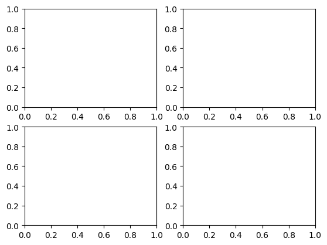
​    


### 2.3 plt.subplot函数创建坐标系

plt.subplot函数是Matplotlib库中用于创建子图的函数之一，它可以在当前图形上创建一个新的子图，并返回该子图的轴坐标系对象。

> plt.subplot(nrows, ncols, index, **kwargs)

其中，参数的含义如下：

    nrows：表示要创建的子图的行数。
    ncols：表示要创建的子图的列数。
    index：表示要创建的子图的索引号，从1开始。
    **kwargs：表示可选的关键字参数，例如projection、aspect等。


```python
import matplotlib.pyplot as plt  
  
# 创建一个空图形  
fig = plt.figure()  
# 在图形上创建一个2行1列的子图，并返回该子图的轴坐标系对象  
ax1 = plt.subplot(2, 1, 1)  
```


​    
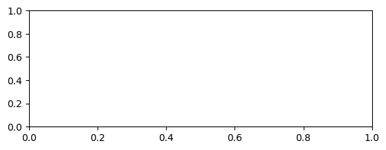
​    


```python
x = list(range(6))
y = [i ** 2 for i in x]
fig1 = plt.subplot(2,2,1)
fig2 = plt.subplot(2,2,2)
fig1.scatter(x,y)
fig2.plot(x,y)
plt.show()

```


​    
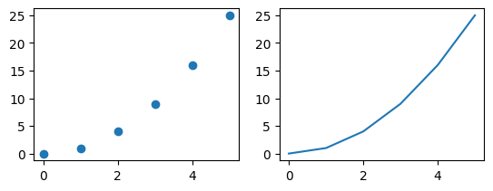
​    


### 2.4 plt.subplots()函数创建坐标系

plt.subplots()函数是Matplotlib库中用于创建图形和坐标系的便捷函数。它返回一个包含图形和坐标系的元组，可以用于创建简单的图形或作为更复杂图形的子图。

> plt.subplots(nrows, ncols)

其中，参数的含义如下：

    nrows：表示要创建的子图的行数。
    ncols：表示要创建的子图的列数。


```python
x = list(range(6))
y = [i ** 2 for i in x]

fig,ax = plt.subplots(2,2)

ax[0,0].scatter(x,y)
ax[1,0].scatter(y,x)
ax[0,1].plot(x,y)
ax[1,1].plot(x,y)
plt.show()
```


​    
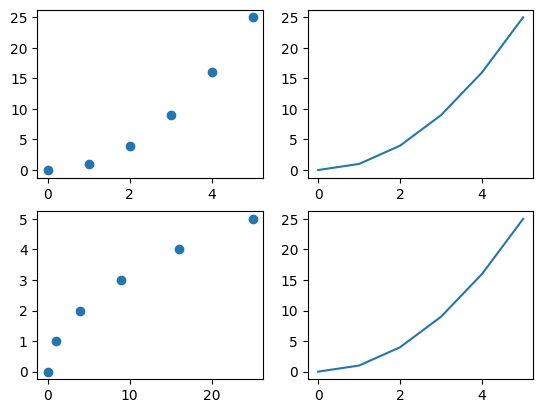
​    


### 2.5 plt.subplot2grid函数建立坐标系

plt.subplot2grid函数是Matplotlib库中用于创建子图的函数之一，它可以在给定的二维网格上创建一个子图。

函数的语法如下：

> plt.subplot2grid((m, n), (i, j), colspan=0, rowspan=0, fig=None)

其中，参数的含义如下：

    (m, n)：表示要创建的二维网格的行数和列数。
    (i, j)：表示要创建的子图在二维网格中的位置，其中i表示子图的行索引，j表示子图的列索引。
    colspan：表示子图跨越的列数，默认为0，表示不跨越。
    rowspan：表示子图跨越的行数，默认为0，表示不跨越。
    fig：表示要在哪个图形上创建子图，默认为当前图形。


​    


```python
import matplotlib.pyplot as plt
#使用 colspan指定列，使用rowspan指定行
a1 = plt.subplot2grid((3,3),(0,0),colspan = 2)
a2 = plt.subplot2grid((3,3),(0,2), rowspan = 3)
a3 = plt.subplot2grid((3,3),(1,0),rowspan = 2, colspan = 2)
import numpy as np
x = np.arange(1,10)
a2.plot(x, x*x)
a2.set_title('square')
a1.plot(x, np.exp(x))
a1.set_title('exp')
a3.plot(x, np.log(x))
a3.set_title('log')
plt.tight_layout()
plt.show()
```


​    
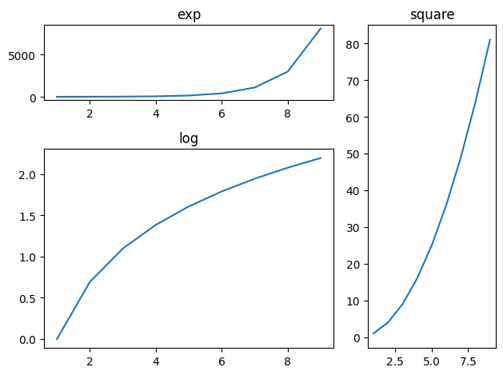
​    


plt.subplots()与plt.subplot()plt.subplot2grid()的不同之处在于plt.subplot()plt.subplot2grid()每次只返回一个坐标系。plt.subplots()每次可以返回多个左边系。

## 3. 设置坐标轴

### 3.1 设置坐标轴标题

**xlabel和ylabel方法**

plt.xlabel(label, fontsize=None, **kwargs)：

    设置x轴的标签。label是标签的文本字符串，fontsize是标签字体大小，**kwargs是可选的其他参数。

plt.ylabel(label, fontsize=None, **kwargs)：

    设置y轴的标签。同样，label是标签的文本字符串，fontsize是标签字体大小，**kwargs是可选的其他参数。


```python
month = list(range(1,13))
income = np.random.randint(5000, 10000, 12)

fig = plt.plot(month,income)

plt.xlabel("Month",fontsize = 20,color = "blue")
plt.ylabel("Income",fontsize = 10,color = "red")
```


    Text(0, 0.5, 'Income')


​    
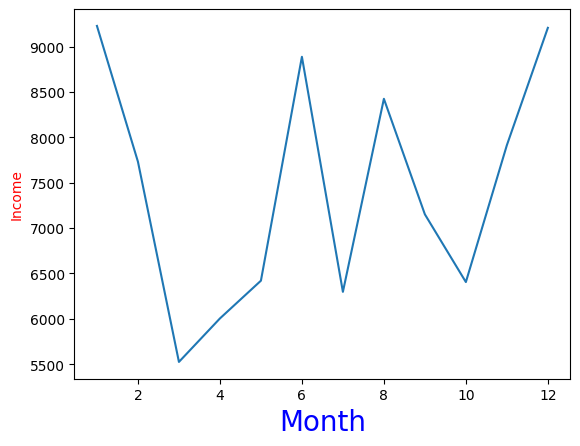
​    


颜色标签


### 3.2 设置坐标轴刻度值

在matplotlib中，可以使用xticks()和yticks()函数来设置坐标轴的刻度值。


```python
month = list(range(1,13))
income = np.random.randint(5000, 10000, 12)

fig = plt.plot(month,income)

plt.xlabel("Month",fontsize = 20,color = "blue")
plt.ylabel("Income",fontsize = 10,color = "red")
plt.xticks(month,["Jan","Feb","Mar","Apr","May","Jun","Jul","Aug","Sep","Oct","Nov","Dec"])
plt.show()
```


​    
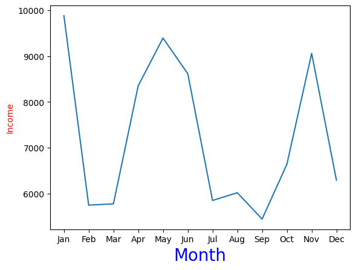
​    


### 3.3 设置坐标轴刻度值范围

在matplotlib中，可以使用xlim()和ylim()函数来设置坐标轴的刻度值范围。


```python
import matplotlib.pyplot as plt  
import numpy as np  
  
# 创建数据  
x = np.linspace(0, 10, 100)  
y = np.sin(x)  
  
# 绘制图形  
plt.plot(x, y) 

# 设置x轴和y轴的刻度范围  
plt.xlim([0, 12])  
plt.ylim([-1.5, 1.5])  
  
# 显示图形  
plt.show()
```


​    
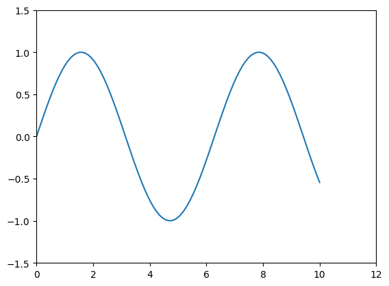
​    


## 4. 设置网格线

在matplotlib中，可以使用grid函数来控制是否显示网格线。grid函数的参数'b'表示是否打开网格线，'b'为True或False，默认False。新版本的参数b已经被替换为visible。既然是线，那么可以设置线型、线宽、颜色和透明度等。还有一个'which'参数，为'major'或'both'或'minor_major'或'minor'，表示打开哪些类型的网格线。


```python
# 创建数据  
x = np.linspace(0, 10, 100)  
y = np.sin(x)  
  
# 绘制图形  
plt.plot(x, y) 

# 设置x轴和y轴的刻度范围  
plt.xlim([0, 12])  
plt.ylim([-1.5, 1.5]) 

plt.grid(visible = True,linestyle = 'dashed',which='major',
         linewidth = 1,color = 'purple',alpha = 0.5)
# 显示图形  
plt.show()
```


​    
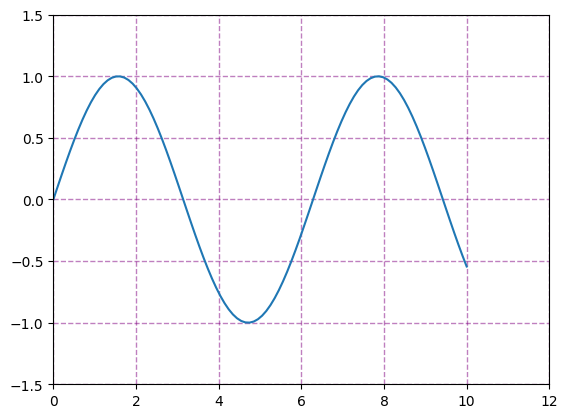
​    


## 5. 设置图例

在matplotlib中，可以使用legend函数来设置图例。legend函数接受多个参数，用于定义图例的显示方式和位置等。


(1)使用loc参数

    0: ‘best'
    1: ‘upper right'
    2: ‘upper left'
    3: ‘lower left'
    4: ‘lower right'
    5: ‘right'
    6: ‘center left'
    7: ‘center right'
    8: ‘lower center'
    9: ‘upper center'
    10: ‘center'

(2)设置图例字体：设置字体大小

    fontsize : int or float or {‘xx-small’, ‘x-small’, ‘small’, ‘medium’, ‘large’, ‘x-large’, ‘xx-large’}

(3)设置图例边框及背景

    plt.legend(loc='best',frameon=False) #去掉图例边框
    
    plt.legend(loc='best',edgecolor='blue') #设置图例边框颜色
    
    plt.legend(loc='best',facecolor='blue') #设置图例背景颜色,若无边框,参数无效


(4)设置图例标题

    plt.legend(loc='best',title='figure 1 legend') #去掉图例边框

**legend面向对象命令**

(1)获取并设置legend图例

    plt.legend(loc=0, numpoints=1)
    leg = plt.gca().get_legend() #或leg=ax.get_legend()
    ltext = leg.get_texts()
    plt.setp(ltext, fontsize=12,fontweight='bold')

(2)设置图例

    legend = ax.legend((rectsTest1, rectsTest2, rectsTest3), ('test1', 'test2', 'test3'))
    legend = ax.legend(loc='upper center', shadow=True, fontsize='x-large')
    legend.get_frame().set_facecolor('red') #设置图例legend背景为红色
    frame = legend.get_frame()
    frame.set_alpha(1)
    frame.set_facecolor('none') #设置图例legend背景透明

(3)移除图例

    ax1.legend_.remove() ##移除子图ax1中的图例
    ax2.legend_.remove() ##移除子图ax2中的图例
    ax3.legend_.remove() ##移除子图ax3中的图例

**设置图例legend到图形边界外**

主要是bbox_to_anchor的使用

    box = ax1.get_position()
    
    ax1.set_position([box.x0, box.y0, box.width , box.height* 0.8])
    
    ax1.legend(loc='center', bbox_to_anchor=(0.5, 1.2),ncol=3)


```python
import matplotlib.pyplot as plt  
  
# 创建数据  
x = [1, 2, 3, 4, 5]  
y1 = [2, 4, 6, 8, 10]  
y2 = [1, 3, 5, 7, 9]  
  
# 绘制图形  
plt.plot(x, y1, label='y1')  
plt.plot(x, y2, label='y2')  
  
# 设置图例  
plt.legend(loc='upper left')  
  
# 显示图形  
plt.show()
```


​    
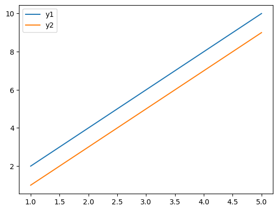
​    


```python
import matplotlib.pyplot as plt
import numpy as np
x = np.random.uniform(-1, 1, 4)
y = np.random.uniform(-1, 1, 4)
p1, = plt.plot([1,2,3])
p2, = plt.plot([3,2,1])
l1 = plt.legend([p2, p1], ["line 2", "line 1"], 
                loc='upper left')
p3 = plt.scatter(x[0:2], y[0:2],
                 marker = 'D', color='r')
p4 = plt.scatter(x[2:], y[2:], 
                 marker = 'D', color='g')
# This removes l1 from the axes.
plt.legend([p3, p4], ['label', 'label1'], 
           loc='lower right', scatterpoints=1)
# Add l1 as a separate artist to the axes
plt.gca().add_artist(l1)
```


    <matplotlib.legend.Legend at 0x2783f33f220>


​    
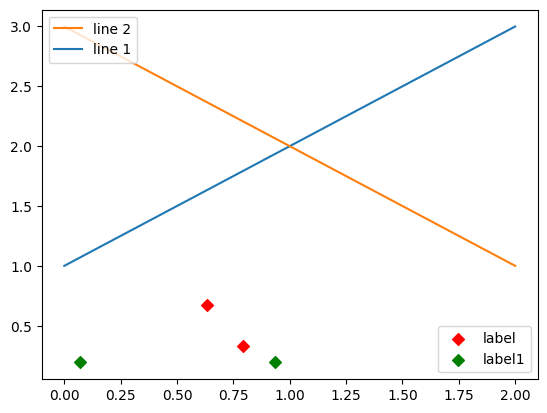
​    


## 6. 设置图表标题

在matplotlib中设置图表标题可以使用plt.title()函数。

plt.title()函数还支持一些可选的参数来自定义标题的样式。例如，可以设置标题的字体大小、字体样式、颜色等属性。

以下是一个简单的示例：


```python
month = list(range(1,13))
income = np.random.randint(5000, 10000, 12)

fig = plt.plot(month,income)

plt.xlabel("Month",fontsize = 15,color = "blue")
plt.ylabel("Income",fontsize = 15,color = "red")

plt.title("Monthly income in 2023",fontsize=16, 
          fontweight='bold', color='red')
plt.show()
```


​    
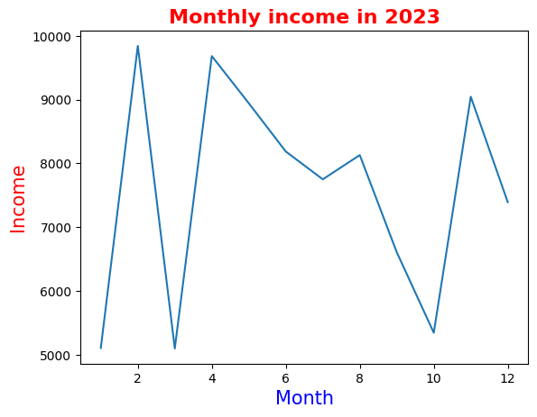
​    


## 7. 设置数据标签

在matplotlib库中，plt.text()函数用于在图形中添加文本标签。它可以在指定的位置上添加一行文本，可以用于标注数据点、添加图例、注释图形等。

以下是plt.text()函数的常用参数：

    x：文本标签的x坐标。
    y：文本标签的y坐标。
    s：要显示的文本字符串。
    c：文本的颜色。
    fontsize：文本的字体大小。
    bbox：文本标签的边框样式。


```python
month = list(range(1,13))
income = np.random.randint(5000, 10000, 12)

fig = plt.plot(month,income)

plt.xlabel("Month",fontsize = 15,color = "blue")
plt.ylabel("Income",fontsize = 15,color = "red")

plt.title("Monthly income in 2023",fontsize=16, 
          fontweight='bold', color='red')
# 添加数据标签  
plt.text(2, income[1], 'Data label', fontsize=14)  
  
# 显示图形  
plt.show()
```


​    
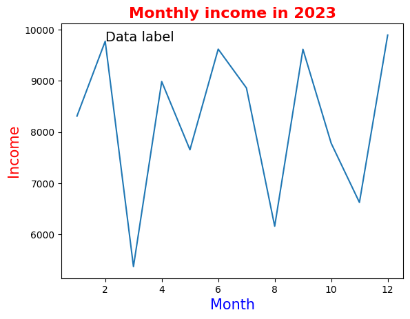
​    


plt.text()函数只针对坐标轴的具体某一点（x，y），显示字符串s，如果要对整个图表显示数据标签，可以用for循环遍历


```python
month = list(range(1,13))
income = np.random.randint(5000, 10000, 12)

fig = plt.plot(month,income)

plt.xlabel("Month",fontsize = 15,color = "blue")
plt.ylabel("Income",fontsize = 15,color = "red")

plt.title("Monthly income in 2023",fontsize=16, 
          fontweight='bold', color='red')
# 添加数据标签  
for i, j  in zip(month,income):
    plt.text(i,j, j, fontsize=14)  
  
# 显示图形  
plt.show()
```


​    
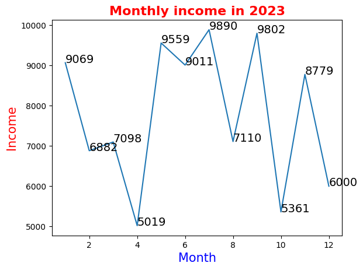
​    


## 8. 设置数据表

plt.table()函数是matplotlib库中的一个方法，用于在图形中添加一个表格。它提供了一个方便的方式来展示数据，可以将数据以表格的形式添加到图形的任意位置。

以下是plt.table()函数的常用参数：

    cellText: 表格单元格文本，字符串中的换行符暂不支持，可能导致文本超出单元格边界
    cellColours: 表格单元格背景色
    cellLoc: 表格单元格文本的对产方式，取值范围为eft，center,right”，默认值为right
    colWidths: 表格单元格宽度
    rowLabels: 表格行表头文本
    rowColours: 表格行表头背景色
    rowLoc: 表格行表头文本的对齐方式，取值范围为(full,left，right，默认值为eft!
    colLabels: 表格列表头文本
    colColours: 表格列表头背景色
    colLoc: 表格列表头文本的对产方式，取值范围为full,left，right”，默认值为'left
    loc: 单元格相对于子图的位置
    bbox:绘制表格的边界框


```python
month = list(range(1,13))
income_Li = np.random.randint(5000, 10000, 12)
income_Mi = np.random.randint(5000, 10000, 12)

fig1 = plt.plot(month,income_Li,label= 'Li')
fig2 = plt.plot(month,income_Mi,label= 'Mi')

plt.ylabel("Income",fontsize = 15,color = "red")

plt.title("Monthly income in 2023",fontsize=16, 
          fontweight='bold', color='red')

plt.legend(loc='upper left')  

row = ["Li","Mi"]
col = month 
data = [income_Li,income_Mi]
plt.table(cellText = data,rowLabels = row,colLabels= col,loc = 'bottom')
plt.xticks([])
  
# 显示图形  
plt.show()
```


​    
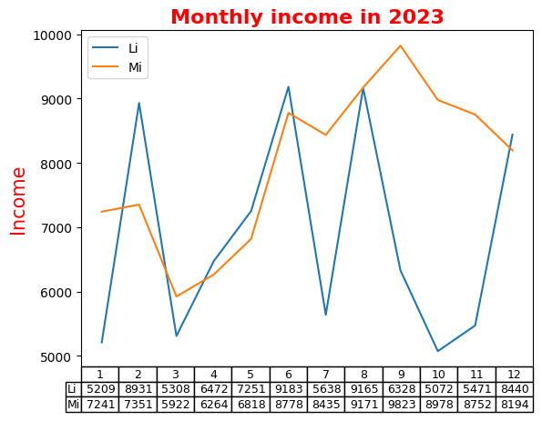
​    


## 9. 绘图风格

Matplotlib中，pyplot的style子模块里面定义了很多预设风格，方便进行风格转换。每一个预设的风格都储存在一个以.mplstyle为后缀的style文件中。读者可以在stylelib文件夹中查看，如下图所示。


使用这些预设风格非常简单，只需要调用相应的style函数即可。例如，要使用"dark_background"风格，只需在脚本中添加以下代码：


```python
import matplotlib.pyplot as plt  
plt.style.use('dark_background')
```

想查看有什么风格，可以查看下面代码。


```python
import matplotlib.pyplot as plt  
plt.style.available
```


    ['Solarize_Light2',
     '_classic_test_patch',
     '_mpl-gallery',
     '_mpl-gallery-nogrid',
     'bmh',
     'classic',
     'dark_background',
     'fast',
     'fivethirtyeight',
     'ggplot',
     'grayscale',
     'seaborn-v0_8',
     'seaborn-v0_8-bright',
     'seaborn-v0_8-colorblind',
     'seaborn-v0_8-dark',
     'seaborn-v0_8-dark-palette',
     'seaborn-v0_8-darkgrid',
     'seaborn-v0_8-deep',
     'seaborn-v0_8-muted',
     'seaborn-v0_8-notebook',
     'seaborn-v0_8-paper',
     'seaborn-v0_8-pastel',
     'seaborn-v0_8-poster',
     'seaborn-v0_8-talk',
     'seaborn-v0_8-ticks',
     'seaborn-v0_8-white',
     'seaborn-v0_8-whitegrid',
     'tableau-colorblind10']


```python
import matplotlib.pyplot as plt  
plt.style.use('grayscale')

month = list(range(1,13))
income_Li = np.random.randint(5000, 10000, 12)
income_Mi = np.random.randint(5000, 10000, 12)

fig1 = plt.plot(month,income_Li,label= 'Li')
fig2 = plt.plot(month,income_Mi,label= 'Mi')

plt.ylabel("Income",fontsize = 15,color = "red")
plt.xlabel("Month",fontsize = 15,color = "red")
plt.title("Monthly income in 2023",fontsize=16, 
          fontweight='bold', color='red')

plt.legend(loc='upper left')  
  
# 显示图形 
plt.show()
```


​    
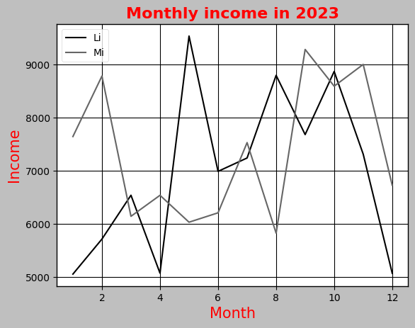
​    


## 10. 动态rc参数

pyplot模块使用rc配置文件来自定义图形的各种默认属性，称之为rc配置或rc参数。通过修改rc参数可以修改默认的属性，包括窗体大小、每英寸的点数、线条宽度、颜色、样式、坐标轴、坐标和网络属性、文本、字体等。
Matplotlib将默认参数配置保存在“matplotlibrc”文件中，通过修改配置文件，可修改图表的缺省样式。


```python
import matplotlib  
print(matplotlib.matplotlib_fname()) # 配置文件路径
print(matplotlib.get_configdir()) # 字体缓存路径
```

    D:\Program Files\Python3.10\lib\site-packages\matplotlib\mpl-data\matplotlibrc
    C:\Users\chens\.matplotlib


在Matplotlib中可以使用如下多个“matplotlibrc”配置文件，并且调用时按照该排序优先采用。

当前路径：程序的当前路径。

用户配置路径：在用户文件夹的“.matplotlib”目录下，可通过环境变量matplotlibrc修改它的位置。通过matplotlib.get_configdir()函数可以获得该路径。

系统配置路径：保存在Matplotlib的安装目录下的mpl-data文件夹中。

在Matplotlib库载入时会调用rc_params函数，并把得到的配置字典保存到rcParams变量中。通过修改字典的方式或用matplotlib.rc()函数修改rc参数。修改默认rc参数后，图形对应属性就会发生改变。此处将介绍常用的rc参数，包括线条、坐标轴、字体等。


```python
import matplotlib.pyplot as plt  
  
plt.rcParams['lines.linewidth'] = 2
```

### 10.1 线型设置

在matplotlib中，可以使用pyplot.rcParams来动态更改各种rc参数。这是一个字典，包含了所有的rc参数和它们的值。你可以通过修改这个字典来改变绘图的各种默认属性。

以下是一些可以用于更改线条属性的rc参数：

    lines.linewidth: 可以更改线条的宽度。
    lines.linestyle: 可以更改线条的样式，例如'-', '--', ':'等。
    lines.marker: 可以更改线条上的点的形状，例如'o', 'D', 'h', '^'等。
    lines.markersize: 可以更改线条上的点的尺寸。


```python
import matplotlib.pyplot as plt  
  
plt.rcParams['lines.linewidth'] = 2  
plt.rcParams['lines.linestyle'] = '--'  
plt.rcParams['lines.marker'] = 'o'  
plt.rcParams['lines.markersize'] = 10
```


```python
plt.style.use('grayscale')
month = list(range(1,13))
income_Li = np.random.randint(5000, 10000, 12)
income_Mi = np.random.randint(5000, 10000, 12)

fig1 = plt.plot(month,income_Li,label= 'Li')
fig2 = plt.plot(month,income_Mi,label= 'Mi')

plt.ylabel("Income",fontsize = 15,color = "red")
plt.xlabel("Month",fontsize = 15,color = "red")
plt.title("Monthly income in 2023",fontsize=16, 
          fontweight='bold', color='red')

plt.legend(loc='upper left')  
  
# 显示图形 
plt.show()
```


​    
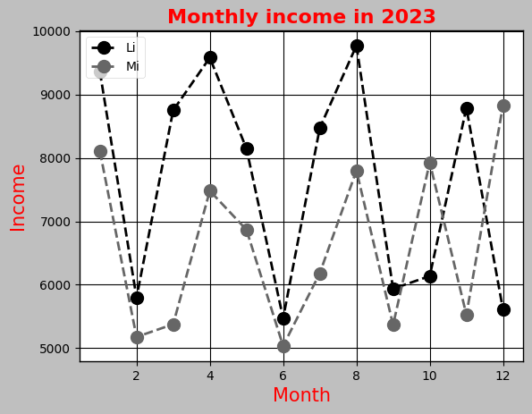
​    


### 10.2 坐标轴常用的rc参数

在matplotlib中，用于坐标轴的常用rc参数有：

 


```python
x = np.linspace(0, 10, 1000)
plt.rcParams['axes.edgecolor'] = 'b'  # 轴颜色设置为蓝色
plt.rcParams['axes.grid'] = True  # 添加网格
plt.rcParams['axes.spines.top'] = False  # 去除顶部轴
plt.rcParams['axes.spines.right'] = False  # 去除右侧轴
plt.rcParams['axes.xmargin'] = 0.1  # x轴余留为区间长度的0.1倍
plt.plot(x, np.sin(x))
plt.show()
```


​    
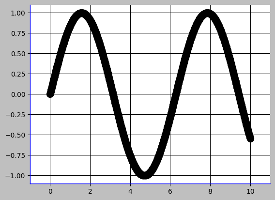
​    


### 10.3 字体常用的rc参数

由于默认的pyplot字体并不支持中文字符的显示，因此需要通过修改font.sans-serif参数来修改绘图时的字体，使得图形可以正常显示中文。同时，由于修改字体后，会导致坐标轴中负号“-”无法正常显示，因此需要同时修改axes.unicode_minus参数。

axes.unicode_minus是一个用于控制是否在坐标轴上显示Unicode的减号字符（'-'）的参数。当设置为False时，使用普通的短横线代替。这在一些包含非英语字符的字体中可能会有问题。


除字体与符号编码参数外，更多的字体常用rc参数名称、接收、取值如下表所示。


除了这些基本设置，还可以通过其他参数来调整字体的效果，比如font.weight（字体粗细）、font.style（字体风格，例如正常、倾斜、粗体等）、font.variant（字体变种，例如正常体和斜体）、font.stretch（字体伸缩度）、font.serif（正体字集）、font.sans-serif（无衬线体字集）、font.cursive（草体字集）、font.fantasy（装饰体字集）等。


```python
import matplotlib.pyplot as plt  
import matplotlib
# 设置中文字体  
plt.rcParams['font.sans-serif'] = 'SimHei'  # 指定中文字体
plt.rcParams['axes.unicode_minus'] = False # 取消使用 unicode 的负号
plt.rcParams['font.family'] = 'serif'  # 字体样式  
plt.rcParams['font.size'] = 16  # 字体大小

```


```python
# 如果plt.rcParams['font.sans-serif'] = 'SimHei' 设置后没有效果
matplotlib.rc("font", family='SimHei')
```


```python
month = list(range(1,13))
income_Li = np.random.randint(5000, 10000, 12)
income_Mi = np.random.randint(5000, 10000, 12)

fig1 = plt.plot(month,income_Li,label= 'Li')
fig2 = plt.plot(month,income_Mi,label= 'Mi')

plt.ylabel("收入金额（元）",fontsize = 15,color = "red")
plt.xlabel("月份",fontsize = 15,color = "red")
plt.title("2023年每月收入统计",fontsize=16, 
          fontweight='bold', color='red')

plt.legend(loc='upper left')  
  
# 显示图形 
plt.show()
```


​    
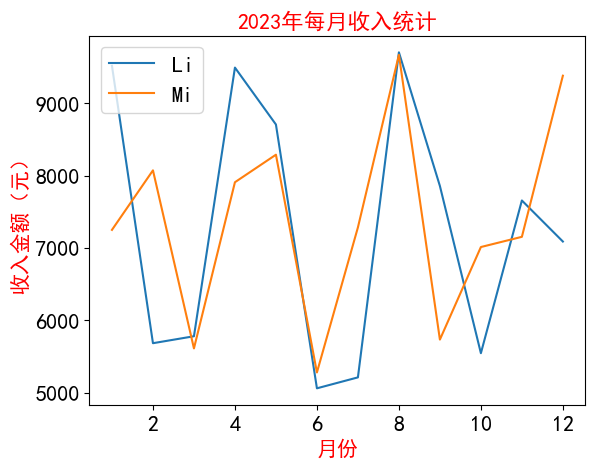
​    


## 11. Matplotlib常用函数

plot()：绘制线图。

scatter()：绘制散点图。

bar()：绘制条形图。

hist()：绘制直方图。

pie()：绘制饼图。

boxplot():箱型图

imshow()：绘制图像。

### 11.1 plot()


```python
help(matplotlib.pyplot.plot)
```

    Help on function plot in module matplotlib.pyplot:
    
    plot(*args, scalex=True, scaley=True, data=None, **kwargs)
        Plot y versus x as lines and/or markers.
        
        Call signatures::
        
            plot([x], y, [fmt], *, data=None, **kwargs)
            plot([x], y, [fmt], [x2], y2, [fmt2], ..., **kwargs)
        
        The coordinates of the points or line nodes are given by *x*, *y*.
        
        The optional parameter *fmt* is a convenient way for defining basic
        formatting like color, marker and linestyle. It's a shortcut string
        notation described in the *Notes* section below.
        
        >>> plot(x, y)        # plot x and y using default line style and color
        >>> plot(x, y, 'bo')  # plot x and y using blue circle markers
        >>> plot(y)           # plot y using x as index array 0..N-1
        >>> plot(y, 'r+')     # ditto, but with red plusses
        
        You can use `.Line2D` properties as keyword arguments for more
        control on the appearance. Line properties and *fmt* can be mixed.
        The following two calls yield identical results:
        
        >>> plot(x, y, 'go--', linewidth=2, markersize=12)
        >>> plot(x, y, color='green', marker='o', linestyle='dashed',
        ...      linewidth=2, markersize=12)
        
        When conflicting with *fmt*, keyword arguments take precedence.


​        
        **Plotting labelled data**
        
        There's a convenient way for plotting objects with labelled data (i.e.
        data that can be accessed by index ``obj['y']``). Instead of giving
        the data in *x* and *y*, you can provide the object in the *data*
        parameter and just give the labels for *x* and *y*::
        
        >>> plot('xlabel', 'ylabel', data=obj)
        
        All indexable objects are supported. This could e.g. be a `dict`, a
        `pandas.DataFrame` or a structured numpy array.


​        
        **Plotting multiple sets of data**
        
        There are various ways to plot multiple sets of data.
        
        - The most straight forward way is just to call `plot` multiple times.
          Example:
        
          >>> plot(x1, y1, 'bo')
          >>> plot(x2, y2, 'go')
        
        - If *x* and/or *y* are 2D arrays a separate data set will be drawn
          for every column. If both *x* and *y* are 2D, they must have the
          same shape. If only one of them is 2D with shape (N, m) the other
          must have length N and will be used for every data set m.
        
          Example:
        
          >>> x = [1, 2, 3]
          >>> y = np.array([[1, 2], [3, 4], [5, 6]])
          >>> plot(x, y)
        
          is equivalent to:
        
          >>> for col in range(y.shape[1]):
          ...     plot(x, y[:, col])
        
        - The third way is to specify multiple sets of *[x]*, *y*, *[fmt]*
          groups::
        
          >>> plot(x1, y1, 'g^', x2, y2, 'g-')
        
          In this case, any additional keyword argument applies to all
          datasets. Also this syntax cannot be combined with the *data*
          parameter.
        
        By default, each line is assigned a different style specified by a
        'style cycle'. The *fmt* and line property parameters are only
        necessary if you want explicit deviations from these defaults.
        Alternatively, you can also change the style cycle using
        :rc:`axes.prop_cycle`.


​        
        Parameters
        ----------
        x, y : array-like or scalar
            The horizontal / vertical coordinates of the data points.
            *x* values are optional and default to ``range(len(y))``.
        
            Commonly, these parameters are 1D arrays.
        
            They can also be scalars, or two-dimensional (in that case, the
            columns represent separate data sets).
        
            These arguments cannot be passed as keywords.
        
        fmt : str, optional
            A format string, e.g. 'ro' for red circles. See the *Notes*
            section for a full description of the format strings.
        
            Format strings are just an abbreviation for quickly setting
            basic line properties. All of these and more can also be
            controlled by keyword arguments.
        
            This argument cannot be passed as keyword.
        
        data : indexable object, optional
            An object with labelled data. If given, provide the label names to
            plot in *x* and *y*.
        
            .. note::
                Technically there's a slight ambiguity in calls where the
                second label is a valid *fmt*. ``plot('n', 'o', data=obj)``
                could be ``plt(x, y)`` or ``plt(y, fmt)``. In such cases,
                the former interpretation is chosen, but a warning is issued.
                You may suppress the warning by adding an empty format string
                ``plot('n', 'o', '', data=obj)``.
        
        Returns
        -------
        list of `.Line2D`
            A list of lines representing the plotted data.
        
        Other Parameters
        ----------------
        scalex, scaley : bool, default: True
            These parameters determine if the view limits are adapted to the
            data limits. The values are passed on to
            `~.axes.Axes.autoscale_view`.
        
        **kwargs : `.Line2D` properties, optional
            *kwargs* are used to specify properties like a line label (for
            auto legends), linewidth, antialiasing, marker face color.
            Example::
        
            >>> plot([1, 2, 3], [1, 2, 3], 'go-', label='line 1', linewidth=2)
            >>> plot([1, 2, 3], [1, 4, 9], 'rs', label='line 2')
        
            If you specify multiple lines with one plot call, the kwargs apply
            to all those lines. In case the label object is iterable, each
            element is used as labels for each set of data.
        
            Here is a list of available `.Line2D` properties:
        
            Properties:
            agg_filter: a filter function, which takes a (m, n, 3) float array and a dpi value, and returns a (m, n, 3) array and two offsets from the bottom left corner of the image
            alpha: scalar or None
            animated: bool
            antialiased or aa: bool
            clip_box: `.Bbox`
            clip_on: bool
            clip_path: Patch or (Path, Transform) or None
            color or c: color
            dash_capstyle: `.CapStyle` or {'butt', 'projecting', 'round'}
            dash_joinstyle: `.JoinStyle` or {'miter', 'round', 'bevel'}
            dashes: sequence of floats (on/off ink in points) or (None, None)
            data: (2, N) array or two 1D arrays
            drawstyle or ds: {'default', 'steps', 'steps-pre', 'steps-mid', 'steps-post'}, default: 'default'
            figure: `.Figure`
            fillstyle: {'full', 'left', 'right', 'bottom', 'top', 'none'}
            gapcolor: color or None
            gid: str
            in_layout: bool
            label: object
            linestyle or ls: {'-', '--', '-.', ':', '', (offset, on-off-seq), ...}
            linewidth or lw: float
            marker: marker style string, `~.path.Path` or `~.markers.MarkerStyle`
            markeredgecolor or mec: color
            markeredgewidth or mew: float
            markerfacecolor or mfc: color
            markerfacecoloralt or mfcalt: color
            markersize or ms: float
            markevery: None or int or (int, int) or slice or list[int] or float or (float, float) or list[bool]
            mouseover: bool
            path_effects: `.AbstractPathEffect`
            picker: float or callable[[Artist, Event], tuple[bool, dict]]
            pickradius: unknown
            rasterized: bool
            sketch_params: (scale: float, length: float, randomness: float)
            snap: bool or None
            solid_capstyle: `.CapStyle` or {'butt', 'projecting', 'round'}
            solid_joinstyle: `.JoinStyle` or {'miter', 'round', 'bevel'}
            transform: unknown
            url: str
            visible: bool
            xdata: 1D array
            ydata: 1D array
            zorder: float
        
        See Also
        --------
        scatter : XY scatter plot with markers of varying size and/or color (
            sometimes also called bubble chart).
        
        Notes
        -----
        **Format Strings**
        
        A format string consists of a part for color, marker and line::
        
            fmt = '[marker][line][color]'
        
        Each of them is optional. If not provided, the value from the style
        cycle is used. Exception: If ``line`` is given, but no ``marker``,
        the data will be a line without markers.
        
        Other combinations such as ``[color][marker][line]`` are also
        supported, but note that their parsing may be ambiguous.
        
        **Markers**
        
        =============   ===============================
        character       description
        =============   ===============================
        ``'.'``         point marker
        ``','``         pixel marker
        ``'o'``         circle marker
        ``'v'``         triangle_down marker
        ``'^'``         triangle_up marker
        ``'<'``         triangle_left marker
        ``'>'``         triangle_right marker
        ``'1'``         tri_down marker
        ``'2'``         tri_up marker
        ``'3'``         tri_left marker
        ``'4'``         tri_right marker
        ``'8'``         octagon marker
        ``'s'``         square marker
        ``'p'``         pentagon marker
        ``'P'``         plus (filled) marker
        ``'*'``         star marker
        ``'h'``         hexagon1 marker
        ``'H'``         hexagon2 marker
        ``'+'``         plus marker
        ``'x'``         x marker
        ``'X'``         x (filled) marker
        ``'D'``         diamond marker
        ``'d'``         thin_diamond marker
        ``'|'``         vline marker
        ``'_'``         hline marker
        =============   ===============================
        
        **Line Styles**
        
        =============    ===============================
        character        description
        =============    ===============================
        ``'-'``          solid line style
        ``'--'``         dashed line style
        ``'-.'``         dash-dot line style
        ``':'``          dotted line style
        =============    ===============================
        
        Example format strings::
        
            'b'    # blue markers with default shape
            'or'   # red circles
            '-g'   # green solid line
            '--'   # dashed line with default color
            '^k:'  # black triangle_up markers connected by a dotted line
        
        **Colors**
        
        The supported color abbreviations are the single letter codes
        
        =============    ===============================
        character        color
        =============    ===============================
        ``'b'``          blue
        ``'g'``          green
        ``'r'``          red
        ``'c'``          cyan
        ``'m'``          magenta
        ``'y'``          yellow
        ``'k'``          black
        ``'w'``          white
        =============    ===============================
        
        and the ``'CN'`` colors that index into the default property cycle.
        
        If the color is the only part of the format string, you can
        additionally use any  `matplotlib.colors` spec, e.g. full names
        (``'green'``) or hex strings (``'#008000'``).


​    


```python
# 假设有三个分组，每个分组有 x 和 y 数据
group1_x = np.linspace(0, 10, 10)
group1_y = np.sin(group1_x)
group2_x = np.linspace(0, 10, 10)
group2_y = np.cos(group2_x)
group3_x = np.linspace(0, 10, 10)
group3_y = np.sqrt(group3_x)
plt.figure(figsize=(8, 6))
# 绘制第一个分组的线型图，使用红色实线和圆圈标记
plt.plot(group1_x, group1_y, color='red', 
         linestyle='-', marker='o', label='Group 1')
# 绘制第二个分组的线型图，使用绿色虚线和三角形标记
plt.plot(group2_x, group2_y, color='green', 
         linestyle='--', marker='^', label='Group 2')
# 绘制第三个分组的线型图，使用蓝色点线和正方形标记
plt.plot(group3_x, group3_y, color='blue', 
         linestyle=':', marker='s', label='Group 3')
# 添加标题和标签
plt.title('Grouped Line Plot')
plt.xlabel('X-axis')
plt.ylabel('Y-axis')
# 添加图例
plt.legend()
# 显示图形
plt.show()

```


​    
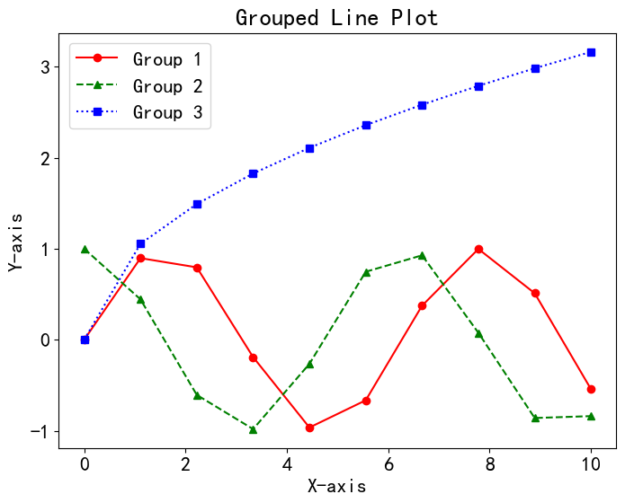
​    


### 11.2 scatter()


```python
import matplotlib.pyplot as plt  
import numpy as np  
  
# 生成随机数据  
x = np.random.rand(50)  
y = np.random.rand(50)  
  
# 绘制散点图  
plt.scatter(x, y, s=100, c='b', alpha=0.5)  
  
# 设置标题和坐标轴标签  
plt.title('Scatter Plot')  
plt.xlabel('X-axis')  
plt.ylabel('Y-axis')  
  
# 显示图形  
plt.show()
```


​    
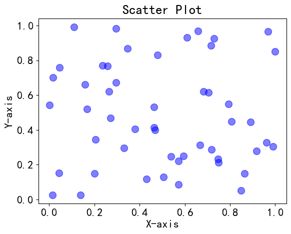
​    


```python
import matplotlib.pyplot as plt  
import numpy as np  
# 假设有三个分组，每个分组有 x 和 y 数据
group1_x = np.random.rand(10)
group1_y = np.random.rand(10)
group2_x = np.random.rand(10)
group2_y = np.random.rand(10)
group3_x = np.random.rand(10)
group3_y = np.random.rand(10)
plt.figure(figsize=(8, 6))

# 绘制第一个分组的散点图，使用红色圆圈标记
plt.scatter(group1_x, group1_y, color='red', marker='o', label='Group 1')
# 绘制第二个分组的散点图，使用绿色三角形标记
plt.scatter(group2_x, group2_y, color='green', marker='^', label='Group 2')
# 绘制第三个分组的散点图，使用蓝色正方形标记
plt.scatter(group3_x, group3_y, color='blue', marker='s', label='Group 3')
# 添加标题和标签
plt.title('Grouped Scatter Plot')
plt.xlabel('X-axis')
plt.ylabel('Y-axis')
# 添加图例
plt.legend()
# 显示图形
plt.show()
```


​    
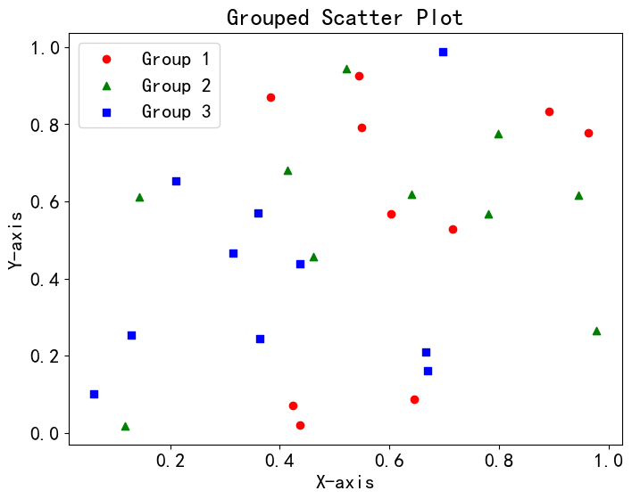
​    


### 11.3 bar()


```python
matplotlib.pyplot.bar(x, height, width=0.8, bottom=None, *, align='center', data=None, **kwargs)
```

    x: 条形图的 x 坐标，可以是一个数组或一维序列。
    height: 条形的高度，可以是一个数组或一维序列，表示每个条形的高度。
    width: 条形的宽度。默认为 0.8，表示条形之间的间距。
    bottom: 条形的底部位置，可以是一个数组或一维序列，表示每个条形的底部位置。默认为 None，即从 0 开始。
    align: 条形的对齐方式，可以是 'center'（默认）、'edge' 等。
    data: 传入一个数据源，可以是 DataFrame 或其他数据结构。
    **kwargs: 其他关键字参数，可以传递给 matplotlib.patches.Patch。


```python
# 假设有一些项目和对应的值
items = ['Item 1', 'Item 2', 'Item 3', 'Item 4', 'Item 5']
values = [15, 30, 10, 25, 20]
plt.figure(figsize=(8, 6))

# 使用 bar 函数绘制条形图
plt.bar(items, values, color='blue')

# 添加标题和标签
plt.title('Bar Chart Example')
plt.xlabel('Items')
plt.ylabel('Values')

# 显示图形
plt.show()

```


​    
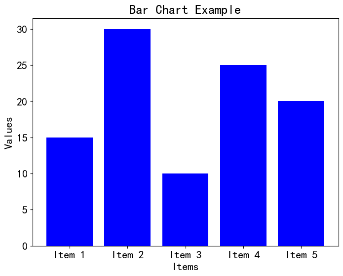
​    


```python
import matplotlib.pyplot as plt
import numpy as np

# 创建数据
categories = ['Category A', 'Category B', 'Category C']
percentages1 = [40, 20, 30]
percentages2 = [30, 50, 10]
percentages3 = [20, 15, 25]

total_percentages = [p1 + p2 + p3 for p1, p2, p3 in zip(percentages1, percentages2, percentages3)]
normalized_percentages1 = [p1 / total * 100 for p1, total in zip(percentages1, total_percentages)]
normalized_percentages2 = [p2 / total * 100 for p2, total in zip(percentages2, total_percentages)]
normalized_percentages3 = [p3 / total * 100 for p3, total in zip(percentages3, total_percentages)]

# 绘制堆叠百分比柱状图
plt.figure(figsize=(8, 6))
p1 = plt.bar(categories, normalized_percentages1)
p2 = plt.bar(categories, normalized_percentages2, bottom=normalized_percentages1)
p3 = plt.bar(categories, normalized_percentages3, bottom=[p1 + p2 for p1, p2 in zip(normalized_percentages1, normalized_percentages2)])

# 添加标题和标签
plt.title('Stacked Percentage Bar Chart')
plt.xlabel('Categories')
plt.ylabel('Percentage')

# 移动图例到图外，使用 bbox_to_anchor 参数来指定位置
plt.legend((p1[0], p2[0], p3[0]), ('Group 1', 'Group 2', 'Group 3'), loc='upper left', bbox_to_anchor=(1, 1))

# 显示图形
plt.show()

```


​    
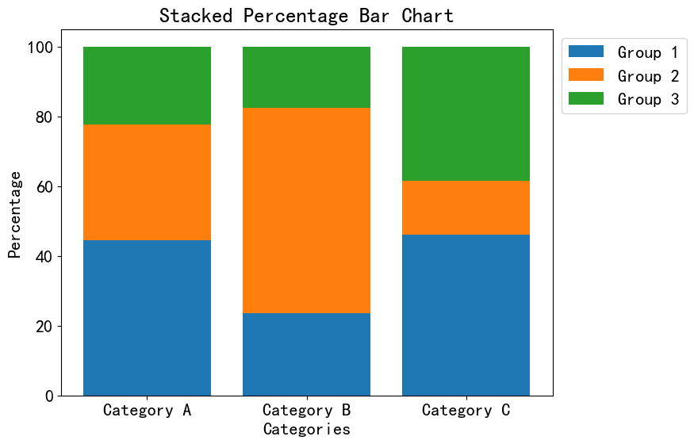
​    


### 10.4 hist()


```python
matplotlib.pyplot.hist(x, bins=None, range=None, density=False, weights=None, cumulative=False, bottom=None,
                       histtype='bar', align='mid', orientation='vertical', rwidth=None, 
                       log=False, color=None, label=None, stacked=False, *, data=None, **kwargs)
```

    x: 输入的数据，是一个数组或者一维序列。
    bins: 直方图的箱子数量（柱子的数量），或者是一个表示箱子边界的序列。默认为 None，会根据数据自动选择箱子数量。
    range: 数据的范围，用于设定直方图的横坐标范围。默认为 None，即使用数据的最小和最大值。
    density: 如果为 True，则将直方图归一化为概率密度。默认为 False。
    weights: 数据点的权重，可以为每个数据点指定一个权重，以产生加权的直方图。
    cumulative: 如果为 True，则绘制累积直方图。默认为 False。
    bottom: 直方图的底部高度，可以用于堆叠直方图。
    histtype: 直方图类型，可以是 'bar'（默认）、'step'、'stepfilled'。
    align: 指定箱子的对齐方式，可以是 'left'、'mid'（默认）、'right'。
    orientation: 直方图的方向，可以是 'vertical'（默认）或 'horizontal'。
    rwidth: 条形宽度的相对宽度，作为箱子宽度的比例。
    log: 如果为 True，则在 y 轴上使用对数刻度。
    color: 直方图的颜色。
    label: 图例标签，用于区分不同的数据集。
    stacked: 如果为 True，则绘制堆叠直方图。
    data: 传入一个数据源，可以是 DataFrame 或其他数据结构。
    **kwargs: 其他关键字参数，可以传递给 matplotlib.patches.Patch。


```python
import matplotlib.pyplot as plt
import numpy as np

# 生成随机数据
data = np.random.randn(1000)

# 设置画布大小
plt.figure(figsize=(8, 6))

# 使用 hist 绘制柱形图，设置边框颜色和颜色
plt.hist(data, bins=20, edgecolor='black', color='blue', alpha=0.7)

# 添加标题和标签
plt.title('Histogram with Bar Borders')
plt.xlabel('Value')
plt.ylabel('Frequency')

# 显示图形
plt.show()
```


​    
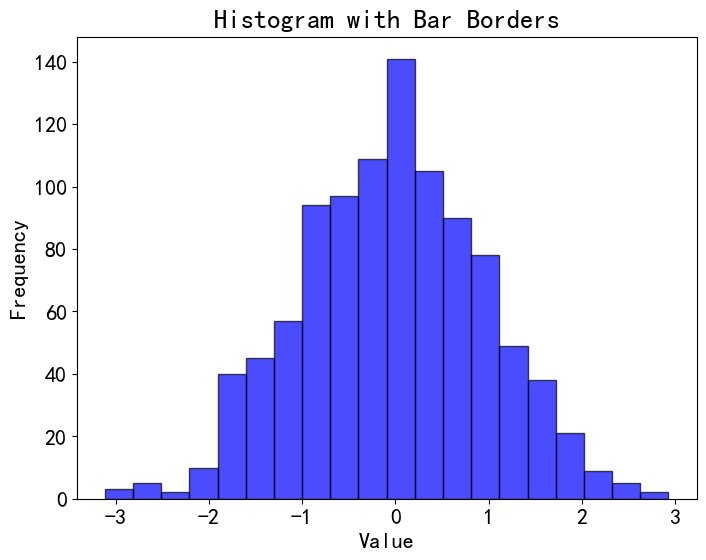
​    


### 10.5 bie()


```python
matplotlib.pyplot.pie(x, explode=None, labels=None, colors=None, autopct=None, pctdistance=0.6, shadow=False, labeldistance=1.1, 
                      startangle=0, radius=1, counterclock=True, wedgeprops=None, textprops=None, center=(0, 0), 
                      frame=False, rotatelabels=False, *, normalize=True, data=None))
```

    x: 输入的数据，是一个数组或一维序列，表示每个扇形的数值。
    explode: 用于突出显示某些扇形的偏移量。默认为 None，即不突出任何扇形。
    labels: 饼图的标签，是一个字符串列表，用于标记每个扇形。默认为 None。
    colors: 饼图的颜色列表，用于为每个扇形指定颜色。
    autopct: 控制每个扇形内显示的百分比格式化字符串。默认为 None，即不显示百分比。
    pctdistance: 百分比标签与圆心的距离，作为半径的倍数。默认为 0.6。
    shadow: 是否在饼图下绘制阴影。默认为 False。
    labeldistance: 标签与圆心的距离，作为半径的倍数。默认为 1.1。
    startangle: 起始角度，即饼图的旋转角度。默认为 0，表示从水平方向开始。
    radius: 饼图的半径。默认为 1。
    counterclock: 是否逆时针绘制饼图。默认为 True。
    wedgeprops: 用于设置每个扇形的属性，如颜色、边界等。
    textprops: 用于设置百分比标签的属性，如颜色、大小等。
    center: 饼图的中心坐标。默认为 (0, 0)，即原点。
    frame: 是否绘制饼图的边框。默认为 False。
    rotatelabels: 是否旋转标签，使其始终在扇形中心。默认为 False。
    normalize: 是否将输入数据规范化为百分比。默认为 True。
    data: 传入一个数据源，可以是 DataFrame 或其他数据结构。


```python
import matplotlib.pyplot as plt

# 创建数据
categories = ['Category A', 'Category B', 'Category C', 'Category D']
values = [30, 20, 15, 35]

# 绘制饼图
plt.figure(figsize=(8, 8))
wedges, texts, autotexts = plt.pie(values, labels=categories, autopct='%1.1f%%', 
                                   startangle=140, colors=['red', 'green', 'blue', 'purple'])

# 添加标题
plt.title('Pie Chart Example')

# 显示图形
plt.show()

```


​    
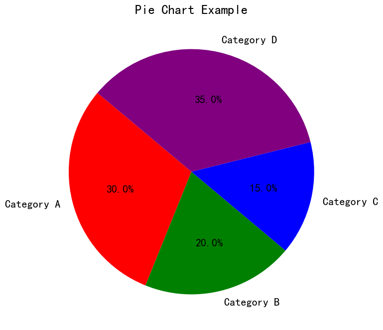
​    


### 10.6 boxplot


```python
matplotlib.pyplot.boxplot(x, notch=None, sym=None, vert=None, whis=None, positions=None, widths=None, 
                          patch_artist=None, bootstrap=None, usermedians=None, conf_intervals=None, 
                          meanline=None, showmeans=None, showcaps=None, showbox=None, showfliers=None, 
                          boxprops=None, labels=None, flierprops=None, medianprops=None, meanprops=None, 
                          capprops=None, whiskerprops=None, manage_ticks=True, autorange=False, 
                          zorder=None, capwidths=None, *, data=None)
```

    x: 输入的数据，可以是一个数组或多个数组（多列数据），或者是一个类似 DataFrame 的数据结构。
    notch: 是否在箱体上绘制缺口，以指示中位数的置信区间。默认为 None，表示不绘制缺口。
    sym: 指定异常值的符号，默认为 None，表示使用圆圈 'o'。也可以是一个字符或字符串，表示其他符号。
    vert: 箱线图的方向，可以是 True（默认，竖直方向）或 False（水平方向）。
    whis: 确定异常值范围的百分位数范围，默认为 1.5。
    positions: 箱线图的位置，可以是一个数组，指定每个箱体的位置。默认为 None，表示平均分布。
    widths: 箱体的宽度，可以是一个数值或数组。默认为 0.5。
    patch_artist: 是否将箱体绘制为填充的图形对象（True）或线条（False）。默认为 None，表示不填充。
    bootstrap: 是否使用自助法来计算置信区间。默认为 None，表示不使用自助法。

其他参数：用于设置图表的各种属性，如颜色、线型、标签等。


```python
import matplotlib.pyplot as plt
import numpy as np

# 生成随机数据，分别表示不同类别的观测值
data1 = np.random.normal(0, 1, 100)
data2 = np.random.normal(2, 1, 100)
data3 = np.random.normal(-2, 1, 100)

# 数据集合，用于绘制多个箱线图
dataset = [data1, data2, data3]

# 设置画布大小
plt.figure(figsize=(8, 6))

# 使用 boxplot 绘制箱线图
plt.boxplot(dataset, labels=['Group 1', 'Group 2', 'Group 3'])

# 添加标题和标签
plt.title('Boxplot Example')
plt.xlabel('Groups')
plt.ylabel('Values')

# 显示图形
plt.show()

```


​    
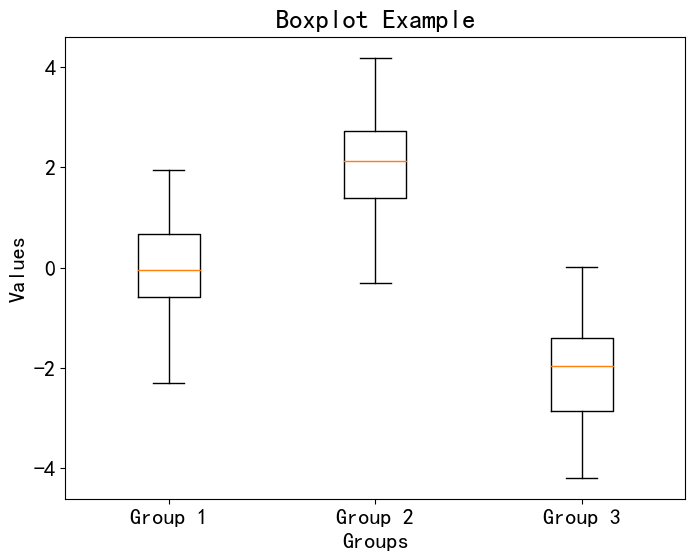
​    


 ## 12. 基于Matplotlib 的其他可视化库


 Matplotlib 是一个广泛用于绘制各种类型图表的 Python 库。除了 Matplotlib 本身，还有一些基于 Matplotlib 的扩展库，提供了更高级的功能和更方便的接口。以下是一些基于 Matplotlib 的扩展库：

    Seaborn： Seaborn 是一个基于 Matplotlib 的高级数据可视化库，提供了更美观的默认样式、统计图表和复杂的数据可视化功能。
    
    Plotly： Plotly 是一个交互式可视化库，可以用于创建各种交互式图表，支持在线共享和部署。
    
    Bokeh： Bokeh 是一个用于创建交互式数据可视化的库，支持在 Web 浏览器中展示图表，并提供丰富的交互功能。
    
    Holoviews： Holoviews 是一个建立在 Matplotlib、Bokeh 和其他可视化后端之上的库，用于创建复杂、交互式和可视化丰富的数据可视化。
    
    Basemap： Basemap 是一个 Matplotlib 扩展库，用于绘制地图和地理空间数据可视化，支持各种投影和地理特征。
    
    Cartopy： Cartopy 是一个专注于地理空间数据可视化的库，提供地图绘制和投影等功能。
    
    mplleaflet： mplleaflet 可以将 Matplotlib 图表转换为 Leaflet Web 地图，用于在 Web 页面上展示地理数据图表。
    
    mplcursors： mplcursors 是一个库，为 Matplotlib 图表提供了鼠标悬停交互，可以显示数据点的信息。
    
    mplfinance： mplfinance 是一个用于金融数据可视化的库，可以创建股票价格图表和金融时间序列图表。
    
    Wordcloud： Wordcloud 是一个用于创建词云图的库，可以根据文本数据生成艺术性的词云图。

以上列出的扩展库可以扩展 Matplotlib 的功能，使其更适用于特定领域的数据可视化需求。你可以根据自己的项目需求选择合适的扩展库。


 ### 12.1 seaborn

Seaborn 是一个基于 Matplotlib 的数据可视化库，它提供了一组高级的数据可视化工具，能够使你更轻松地创建漂亮且具有信息密度的统计图表。Seaborn 旨在使数据可视化变得简单，同时还具备灵活性和强大的定制能力。

以下是 Seaborn 的一些特点和功能：

内置的主题和颜色调色板： Seaborn 提供了多种内置的主题和颜色调色板，能够快速地改变图表的样式。这些主题和调色板都经过精心设计，可以使图表更具吸引力。

统计图表的绘制： Seaborn 提供了一系列用于绘制统计图表的高级函数，如热图、条形图、箱线图、散点图、密度图等。这些函数能够自动地进行数据整理和计算，使你能够更专注于数据分析而不是绘图的细节。

分组数据可视化： Seaborn 支持通过分组数据绘制复杂的图表，例如分组的条形图、折线图和箱线图等。

对时间序列数据的支持： Seaborn 提供了对时间序列数据可视化的工具，包括绘制时间序列线图、时间序列热图等。

数据集可视化： Seaborn 内置了一些示例数据集，使你能够更轻松地进行数据可视化和探索。

与 Pandas 集成： Seaborn 与 Pandas 库无缝集成，能够直接从 Pandas 数据框中绘制图表。

自定义能力： 尽管 Seaborn 提供了内置的样式和功能，但它也允许你进行高度定制，以满足特定需求。你可以控制颜色、样式、标签、刻度等各个方面。


Seaborn 提供了许多绘图函数，用于绘制各种类型的统计图表。以下是一些常用的 Seaborn 绘图函数：

    seaborn.barplot： 绘制条形图，显示不同类别的值之间的关系。
    seaborn.countplot： 绘制计数条形图，用于显示各个类别的频数。
    seaborn.boxplot： 绘制箱线图，用于显示数据的分布和离群值。
    seaborn.violinplot： 绘制小提琴图，结合了箱线图和核密度估计，能够显示分布的形状。
    seaborn.stripplot： 绘制散点图，用于显示数据的分布。
    seaborn.swarmplot： 绘制蜂群图，与散点图类似，但能够避免数据的重叠。
    seaborn.lineplot： 绘制折线图，用于显示数据随时间或其他连续变量的变化趋势。
    seaborn.pointplot： 绘制点图，类似于折线图，但是展示的是点的估计值。
    seaborn.heatmap： 绘制热图，用于显示矩阵数据的颜色映射。
    seaborn.pairplot： 绘制成对关系图，用于展示多个变量之间的关系。
    seaborn.scatterplot： 绘制散点图，用于展示两个变量之间的关系。
    seaborn.distplot： 绘制分布图，用于显示单变量数据的分布情况。

除了上述这些函数，Seaborn 还提供了其他许多函数，用于绘制不同类型的图表，例如多变量分布图、分类图、回归图等。你可以在 Seaborn 官方文档中找到更详细的函数列表和使用说明。

#### （1）seaborn.heatmap


seaborn.heatmap 函数用于绘制热图，用颜色表示数据矩阵中的值。以下是 seaborn.heatmap 函数的一些主要参数的详细介绍：

    data： 二维数组、DataFrame 或类似的数据结构，表示要绘制的数据矩阵。
    
    cmap： 颜色映射，用于将数据值映射到颜色。例如，'viridis'、'YlGnBu'、'RdBu_r' 等。更多可用的颜色映射可在 Seaborn 文档中找到。
    
    annot： 是否在热图上显示数值。默认为 False。设置为 True 时，会在每个热图单元格中显示对应的数值。
    
    fmt： 数值显示格式字符串。例如，".2f" 表示显示两位小数。
    
    linewidths： 单元格之间的线宽。
    
    linecolor： 单元格之间的线颜色。
    
    xticklabels、yticklabels： 设置 x 和 y 轴上的刻度标签。可以设置为布尔值、标签列表、标签值、DataFrame 列名等。
    
    cbar： 是否显示颜色条。默认为 True。
    
    cbar_kws： 颜色条参数的字典。
    
    square： 控制单元格的宽度与高度是否相等。默认为 False。
    
    ax： 要绘制热图的轴对象。如果为 None，则使用当前轴对象。
    
    mask： 与数据矩阵形状相同的布尔数组，用于指示要掩盖的单元格。
    
    center： 是否将数据相对于其均值居中。默认为 None。
    
    robust： 是否使用数据的中位数和四分位数来计算颜色映射范围。默认为 False。
    
    vmin、vmax： 颜色映射的数据值范围。
    
    cbar_ax： 颜色条轴对象。
    
    square： 是否将单元格的高度设置为等于宽度。
    
    annot_kws： 字典，用于设置在单元格上显示数值时的文本属性。
    
    mask： 布尔数组，用于掩盖数据矩阵中的特定单元格。
    
    ax： 绘制热图的轴对象。如果为 None，则使用当前轴对象。
    
    linewidths： 单元格之间的线宽。
    
    linecolor： 单元格之间的线颜色。


```python
import matplotlib.pyplot as plt
import seaborn as sns
import numpy as np

# 创建示例基因表达数据矩阵
genes = ['Gene1', 'Gene2', 'Gene3', 'Gene4', 'Gene5']
samples = ['Sample1', 'Sample2', 'Sample3', 'Sample4']
expression_data = np.random.rand(len(genes), len(samples))

# 设置画布大小
plt.figure(figsize=(10, 6))

# 使用 seaborn 库绘制热图
sns.heatmap(expression_data, cmap='viridis', annot=True, fmt=".2f", xticklabels=samples, yticklabels=genes)

# 添加标题和标签
plt.title('Gene Expression Heatmap')
plt.xlabel('Samples')
plt.ylabel('Genes')

# 显示图形
plt.show()

```


​    
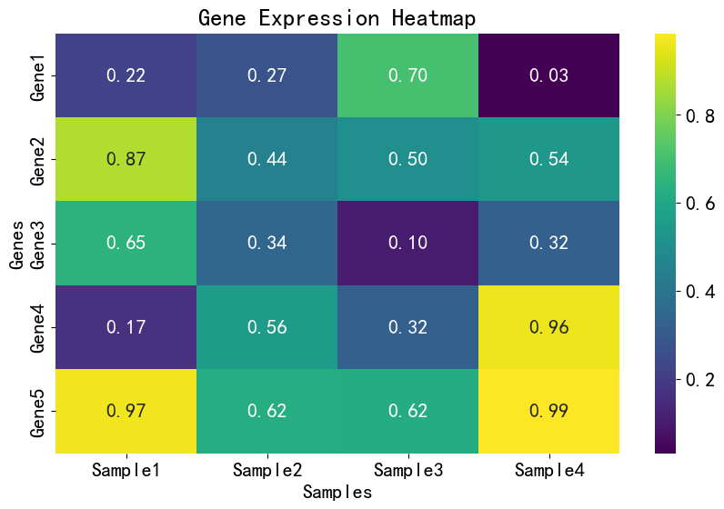
​    


```python
import seaborn as sns
import numpy as np
import matplotlib.pyplot as plt

# 创建示例数据
data = np.random.rand(10, 10)

# 设置画布大小
plt.figure(figsize=(8, 6))

# 使用 seaborn 绘制热图
sns.heatmap(data, cmap='YlGnBu', annot=True, fmt=".2f")

# 添加标题和标签
plt.title('Heatmap Example')
plt.xlabel('X-axis')
plt.ylabel('Y-axis')

# 显示图形
plt.show()

```


​    
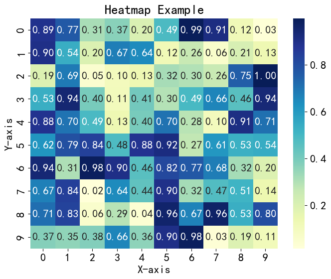
​    


```python
import seaborn as sns
import numpy as np
import matplotlib.pyplot as plt
from scipy.cluster import hierarchy

# 创建示例数据
data = np.random.rand(10, 10)

# 使用 seaborn 绘制带有聚类树的热图
sns.clustermap(data, cmap='YlGnBu', annot=False)

# 添加标题
plt.title('Clustered Heatmap with Dendrogram Example')

# 显示图形
plt.show()

```


​    
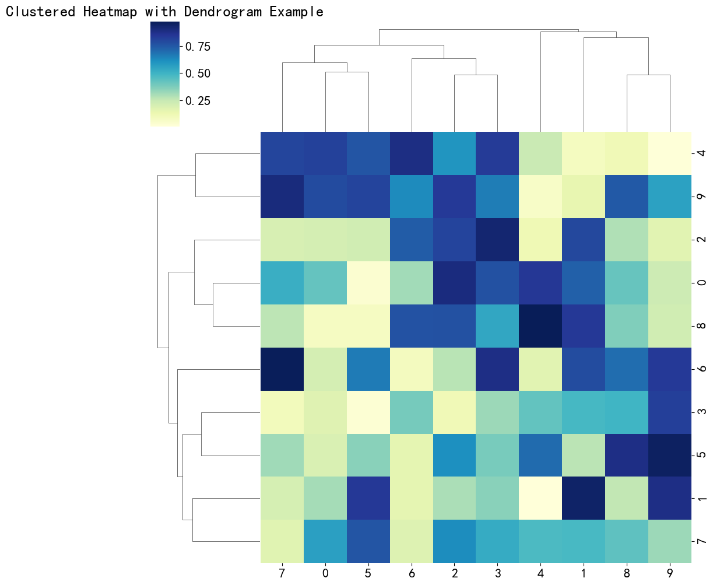
​    


#### （2）seaborn.barplot


```python
import seaborn as sns
import matplotlib.pyplot as plt
from scipy.stats import ttest_ind

# Load the "tips" dataset from Seaborn
tips = sns.load_dataset("tips")

# Set the figure size
plt.figure(figsize=(10, 6))

# Use seaborn to plot the bar plot
ax = sns.barplot(x="day", y="total_bill", data=tips, ci=None, palette="Set2")

# Perform t-tests and annotate significance levels in the plot
days = tips['day'].unique()
for i in range(len(days) - 1):
    for j in range(i + 1, len(days)):
        day1 = days[i]
        day2 = days[j]
        data_day1 = tips[tips['day'] == day1]['total_bill']
        data_day2 = tips[tips['day'] == day2]['total_bill']
        _, p_value = ttest_ind(data_day1, data_day2)
        if p_value < 0.05:
            y_value = max(tips['total_bill']) + 2
            x_center = (i + j) / 2
            ax.annotate('*', xy=(x_center, y_value), ha='center', fontsize=16)

# Add title and labels
plt.title('Total Bill by Day with Group Comparisons')
plt.xlabel('Day of the Week')
plt.ylabel('Total Bill')

# Show the plot
plt.show()

```

    C:\Users\chens\AppData\Local\Temp\ipykernel_10476\532864970.py:12: FutureWarning: 
    
    The `ci` parameter is deprecated. Use `errorbar=None` for the same effect.
    
      ax = sns.barplot(x="day", y="total_bill", data=tips, ci=None, palette="Set2")


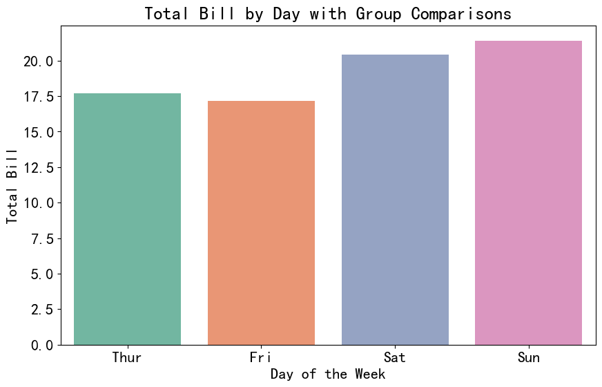
    


